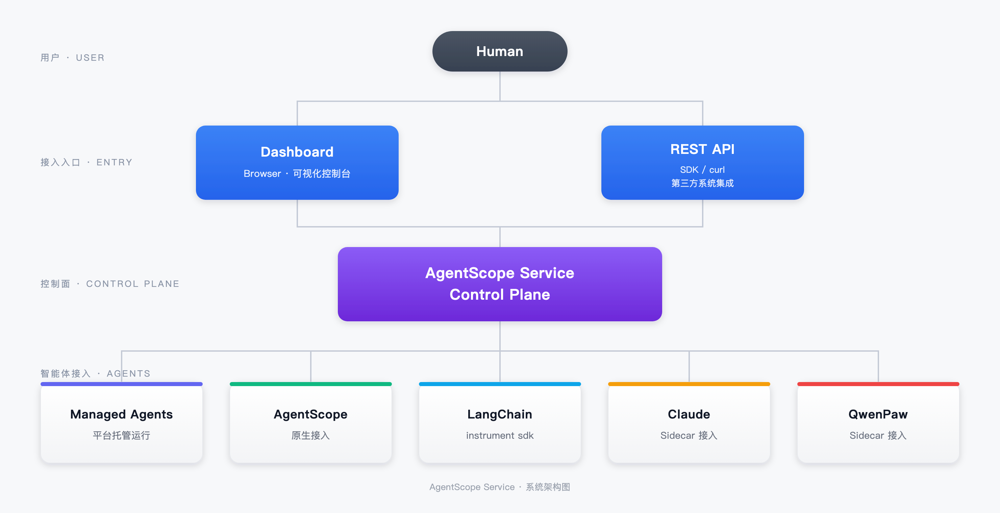

<p align="center">
  
</p>

<span align="center">

[**English Homepage**](https://github.com/agentscope-ai/agentscope-java/blob/main/README.md) | [**文档**](https://java.agentscope.io/v2/zh/intro.html)

</span>

<p align="center">
    <a href="https://discord.gg/eYMpfnkG8h">
        
    </a>
    <a href="https://java.agentscope.io/">
        
    </a>
    <a href="https://img.shields.io/maven-central/v/io.agentscope/agentscope">
        
    </a>
    <a href="#">
        
    </a>
    <a href="./LICENSE">
        
    </a>
    <a href="https://deepwiki.com/agentscope-ai/agentscope-java">
        
    </a>
</p>

## 什么是 AgentScope Java 2.0？

AgentScope Java 2.0 是面向企业级、分布式、生产环境的智能体框架，提供与模型能力相匹配的核心 Harness 抽象，可支持长期、稳定、安全可控的智能体任务执行。

- [**事件系统** →](https://java.agentscope.io/v2/zh/docs/building-blocks/message-and-event.html) 统一的事件流，31 种类型化事件，服务于前端实时渲染与 human-in-the-loop。
- [**权限系统** →](https://java.agentscope.io/v2/zh/docs/building-blocks/permission-system.html) 工具调用决策机制：允许 / 用户审批 / 拒绝。
- [**Middleware** →](https://java.agentscope.io/v2/zh/docs/building-blocks/middleware.html) 基于 AOP 模式的 hook 事件拦截机制，灵活扩展推理-行动循环。
- [**Workspace 与沙箱** →](https://java.agentscope.io/v2/zh/docs/harness/workspace.html) 在隔离环境中执行工具 —— 本地、Docker、Kubernetes 或 AgentRun 云沙箱。
- [**多智能体编排** →](https://java.agentscope.io/v2/zh/docs/harness/subagent.html) 多种子智能体定义模式，`agent_spawn` / `agent_send` + 事件流实时转发。
- [**分布式部署** →](https://java.agentscope.io/v2/zh/docs/others/going-to-production.html) 真正的分布式 session 与 memory 管理（Redis / MySQL / PostgreSQL / OSS / COS），跨副本 session 恢复。
- [**智能体进化** →](https://help.aliyun.com/zh/document_detail/3042583.html) 提供 Agent 全栈观测与审计、Agent 评估与实验、Agent 资产管理与持续优化等能力。


## 新闻
<!-- BEGIN NEWS -->
- **[2026-08] [AgentScope Service](./agentscope-service)：** Agent 控制面与 Dashboard，面向 Agent 观测、注册与编排，兼容 AgentScope、LangChain、ADK、Claude / Qoder 等。
- **[2026-07] `v2.0.0 GA`：** 首个正式版本发布！双层 Agent 架构、事件流、权限系统、Middleware、Workspace 沙箱、多智能体编排、分布式部署全面就绪。 [文档](https://java.agentscope.io/) | [Release Notes](https://github.com/agentscope-ai/agentscope-java/releases/tag/v2.0.0)
- **[2026-07] `v2.0.0-RC5`：** 模型提供商模块化拆分；统一 DataBlock 多模态支持；原生结构化输出；Channel IM 平台接入；腾讯云 COS 状态持久化。 [Release Notes](https://github.com/agentscope-ai/agentscope-java/releases/tag/v2.0.0-RC5)
- **[2026-06] `v2.0.0-RC4`：** 异步工具执行与定时唤醒调度；子 agent 跨副本路由与 session 恢复。 [Release Notes](https://github.com/agentscope-ai/agentscope-java/releases/tag/v2.0.0-RC4)
- **[2026-06] `v2.0.0-RC3`：** `call()` / `streamEvents()` 共享执行核心；`AgentResultEvent`、`CustomEvent`、`HintBlockEvent` 新事件类型。 [Release Notes](https://github.com/agentscope-ai/agentscope-java/releases/tag/v2.0.0-RC3)
- **[2026-06] `v2.0.0-RC2`：** Agent 完全无状态改造；DistributedBackend 一键配置；子 agent 事件流转发；Channel 模块（钉钉、飞书、企业微信）；A2A / AG-UI 协议支持。 [Release Notes](https://github.com/agentscope-ai/agentscope-java/releases/tag/v2.0.0-RC2)
- **[2026-05] `v2.0.0-RC1`：** 首个 2.0 RC 版本，包含 Harness 工程化、企业级分布式部署、事件流 / 消息模型 / Middleware / HITL 全面重构。 [Release Notes](https://github.com/agentscope-ai/agentscope-java/releases/tag/v2.0.0-RC1)
- **[2026-05] `v1.1.0`：** 引入 `agentscope-harness` 与 `HarnessAgent`；Workspace 工作区（人格 / 记忆 / 技能 / 子 agent）；可插拔文件系统（本地 / 共享存储 / 沙箱）；Session 持久化与跨进程恢复；分层记忆与上下文压缩；声明式子 agent 编排。 [Release Notes](https://github.com/agentscope-ai/agentscope-java/releases/tag/v1.1.0-RC1)
<!-- END NEWS -->

## 社区

欢迎加入我们的社区

| [Discord](https://discord.gg/eYMpfnkG8h)                     | 钉钉                                                                    | 微信                                                           |
|--------------------------------------------------------------|-----------------------------------------------------------------------|--------------------------------------------------------------|
|  |  |  |

## 快速开始

### 安装

> AgentScope Java 需要 **JDK 17** 及以上版本。

#### Maven

```xml
<dependency>
    <groupId>io.agentscope</groupId>
    <artifactId>agentscope-harness</artifactId>
    <version>2.0.3</version>
</dependency>
```

2.0 中模型提供商已拆分为独立扩展模块，需额外引入所需的模型依赖。例如使用 DashScope：

```xml
<dependency>
    <groupId>io.agentscope</groupId>
    <artifactId>agentscope-extensions-model-dashscope</artifactId>
    <version>2.0.3</version>
</dependency>
```

其他可选：`agentscope-extensions-model-openai`、`agentscope-extensions-model-anthropic`、`agentscope-extensions-model-gemini`、`agentscope-extensions-model-ollama`。详见[模型文档](https://java.agentscope.io/v2/zh/docs/building-blocks/model.html)。

如果希望直接使用 `ReActAgent` 的推理和工具 API、自行组合工程能力，可依赖 `agentscope-core` 和所需模型扩展。

## Hello AgentScope!

推荐在应用启动时定义共享 Builder，每次请求用 `builder.build()` 创建新 Agent，执行结束后关闭。新实例通过相同的身份和持久化配置延续会话。运行前设置 `DASHSCOPE_API_KEY`：

```java
import io.agentscope.core.agent.RuntimeContext;
import io.agentscope.core.event.TextBlockDeltaEvent;
import io.agentscope.core.event.ToolCallStartEvent;
import io.agentscope.core.message.UserMessage;
import io.agentscope.harness.agent.HarnessAgent;
import java.nio.file.Paths;

public class FirstAgent {
    // 应用启动时配置共享 Builder；请求期间只调用 build()。
    private static final HarnessAgent.Builder AGENT_BUILDER = HarnessAgent.builder()
            .name("assistant")
            .agentId("assistant")
            .sysPrompt("你是一个有用的 AI 助手。")
            .model("dashscope:qwen-plus")
            .workspace(Paths.get(".agentscope/workspace"));

    public static void main(String[] args) {
        try (HarnessAgent agent = AGENT_BUILDER.build()) {
            RuntimeContext ctx = RuntimeContext.builder()
                    .sessionId("demo").userId("alice").build();
            agent.call(new UserMessage("你好！"), ctx).block();
        }

        // COMMENT_帮我把今天的关键点列三条。
        try (HarnessAgent agent = AGENT_BUILDER.build()) {
            RuntimeContext ctx = RuntimeContext.builder()
                    .sessionId("demo").userId("alice").build();
            agent.streamEvents(new UserMessage("帮我把今天的关键点列三条。"), ctx)
                    .doOnNext(event -> {
                        switch (event.getType()) {
                            case TEXT_BLOCK_DELTA -> System.out.print(
                                    ((TextBlockDeltaEvent) event).getDelta());
                            case TOOL_CALL_START -> System.out.println(
                                    "\n[tool] " + ((ToolCallStartEvent) event).getToolCallName());
                            default -> { }
                        }
                    })
                    .blockLast();
        }
    }
}
```

普通问答、多轮对话和工作流节点从 `call` / `streamEvents` 开始，详见[快速开始](https://java.agentscope.io/v2/zh/docs/quickstart)。两者默认也会记录 Harness 会话历史。需要关闭页面后继续执行、任务排队或中断后续做时，再引入 [AgentSession](https://java.agentscope.io/v2/zh/docs/harness/session-log)；[可恢复聊天示例](./agentscope-examples/agents/agentscope-chat/README_zh.md)提供完整接入流程。

## AgentScope Service

**[AgentScope Service](./agentscope-service)** — 面向业务应用的 Agent as a Service 平台，将生成方案、核验文档、调查异常等 Agent 能力发布为 API。用户在原有产品中发起工作、参与确认并检查交付。

+ **接入业务。** 用 Endpoint 提供后台任务、交互式助手或流程中的专业处理节点；应用保留自己的界面、数据授权与验收规则。
+ **持续执行与交付。** 围绕 Invocation 跟踪状态、快照与事件，处理人工交互，获取结果和文件，再接回业务流程。
+ **按需组织执行。** 托管 AgentScope Harness、接入已有 Agent 应用，或复用 Coding Agent；按任务需要组合 Team 与 Workflow。

从[场景案例](https://java.agentscope.io/v2/zh/service/usecases)选择接入方式，再按 [API 快速开始](https://java.agentscope.io/v2/zh/service/first-session)完成一次调用。



## 核心设计

AgentScope Java 2.0 从"构建一个智能体"的工具箱，迈向**面向生产环境运行智能体**的完整平台。升级围绕三大主题展开：

### 1 · Harness 工程化 —— 长期运行、复杂任务的工程底座

裸的 ReAct 循环只解决"一次推理"。**HarnessAgent** 在 ReActAgent 之上通过 Middleware 与 Toolkit 叠加工程基础设施，核心推理循环原样保留，能力按需叠加：

- **自进化与技能仓库** —— 成功模式自动沉淀为 Markdown 技能，跨会话共享、按需加载
- **分层记忆** —— 上下文对话 + agent 自维护的 `MEMORY.md` + 磁盘事实流水账，自动压缩控制 prompt 体量
- **子智能体** —— Markdown 声明子 agent 规格，`agent_spawn` / `agent_send` 按需启动，同步与后台委派两种模式
- **上下文自动管理** —— 结构化压缩保留目标 / 状态 / 关键发现 / 下一步；超大工具结果落盘只留占位符
- **Plan Mode** —— 只读规划态编排长任务，计划文件持久化并驱动执行

### 2 · 企业级分布式部署

生产环境的智能体要服务多租户、安全执行不可信代码、滚动发布不丢上下文。AgentScope 2.0 天然面向无状态水平扩展：

- **多租户隔离** —— `session` / `user` / `agent` / `org` 多维度状态隔离，`RuntimeContext` 键贯穿工作区、KV 命名空间、沙箱状态槽
- **安全沙箱** —— 本地子进程 / Docker / Kubernetes / E2B 云沙箱任选，支持快照恢复
- **权限管控** —— 三态决策（允许 / 审批 / 拒绝），敏感操作强制 HITL 审批
- **会话恢复** —— `AgentStateStore`（内存 / JSON 文件 / MySQL / Redis / PostgreSQL）支撑零停机滚动发布

### 3 · 底层框架升级 —— 更轻、更顺手的核心抽象

消息、事件、扩展机制更小、更正交；HITL 与事件流式是框架运行的一部分，不是外挂层：

- **事件流** —— 31 种类型化事件，模型调用、文本增量、工具执行、用户确认全部实时流出
- **消息模型** —— 文本 / 文件 / 图片 / 音视频 / 工具结果统一收敛到 `ContentBlock`，按 role 严格校验
- **Middleware** —— `onAgent` / `onReasoning` / `onActing` / `onModelCall` / `onSystemPrompt` / `onAgentStateReady` 六阶段取代 v1 扁平 hook
- **HITL 一等公民** —— 确认工具参数、审批敏感操作、交给外部系统执行，智能体在暂停点精确恢复

完整架构概览请参阅[文档](https://java.agentscope.io/v2/zh/docs/index.html)。

## 贡献

我们欢迎社区的贡献！请参阅 [CONTRIBUTING_zh.md](./CONTRIBUTING_zh.md) 了解详情。

## 许可

AgentScope 基于 Apache License 2.0 发布。


## 贡献者

感谢所有贡献者：

<a href="https://github.com/agentscope-ai/agentscope-java/graphs/contributors">
  
</a>
