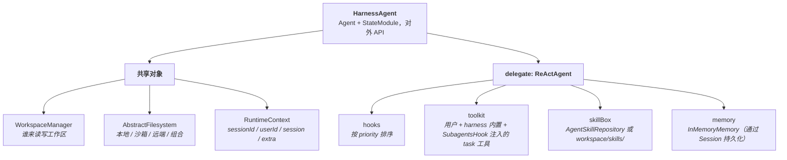
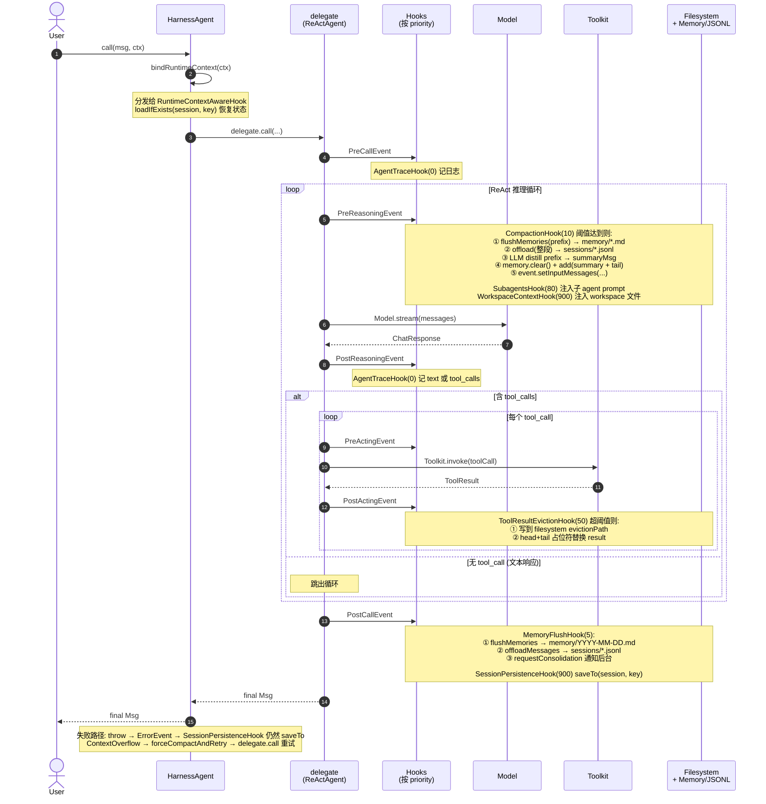
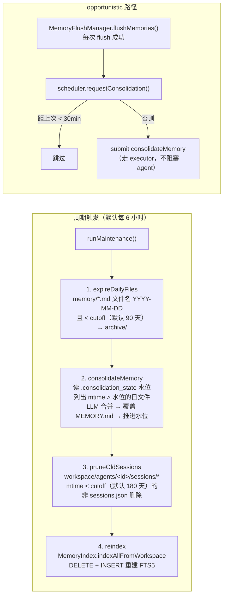
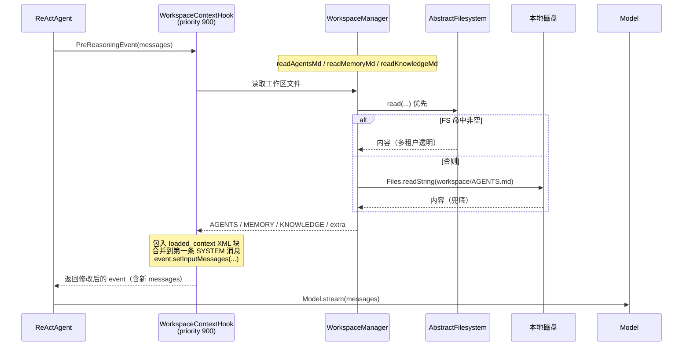
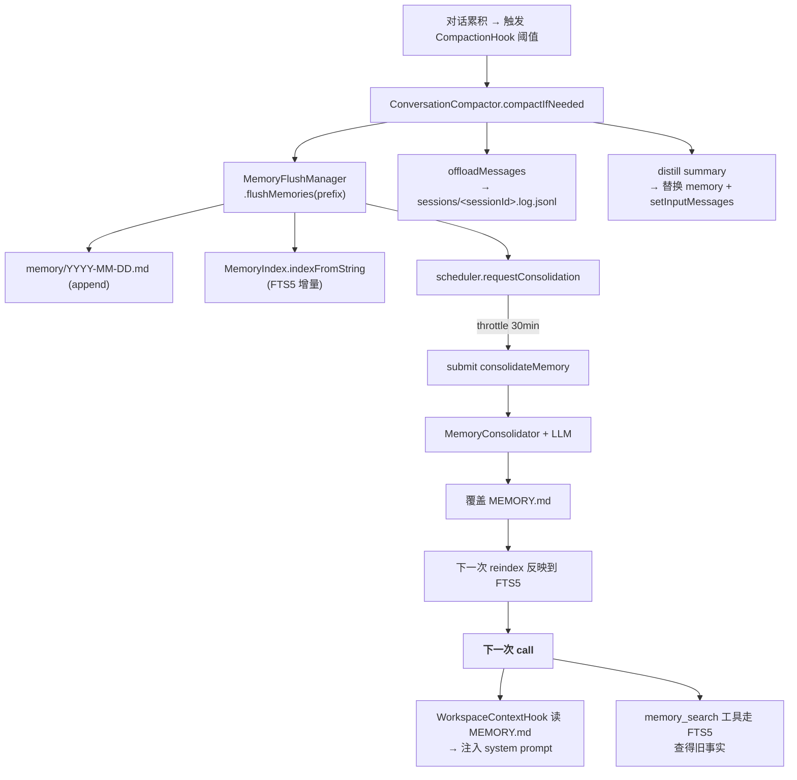
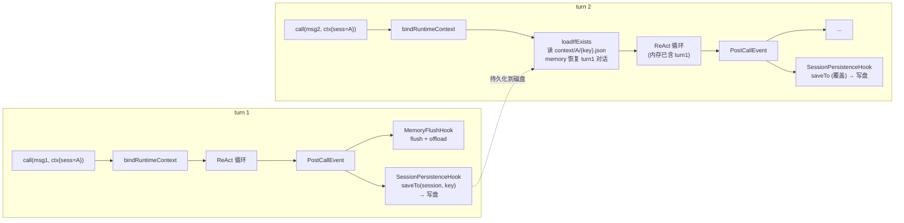
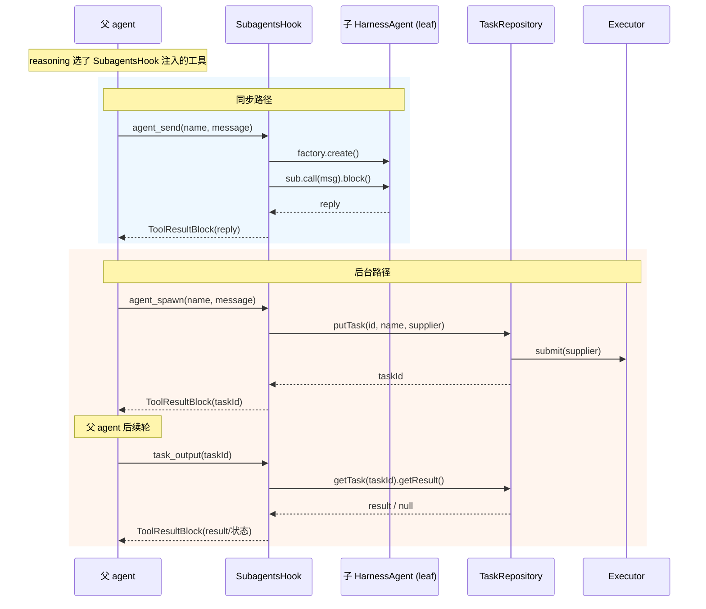

# Harness 架构

[Overview](./overview.md) 把 harness 的能力按"解决了什么问题"组织。本文换一个视角：把每个组件的**定义、行为、触发时机、协作对象**讲清楚，最后用时序图说明这些组件在一次 `call()` 里如何协同。

> 本文聚焦使用者视角的中粒度——讲清"是谁、什么时候、做什么、跟谁协作"，不展开调用栈与实现细节；那些放在各子文档（[memory](./memory.md)、[workspace](./workspace.md)、[filesystem](./filesystem.md)、[sandbox](./sandbox/index.md)、[subagent](./subagent.md)、[session](./session.md)、[tool](./tool.md)）。

## 1. 顶层结构

`HarnessAgent` 不是一个新的推理循环，它是 `Agent` + `StateModule` 的薄包装，内部持有一个 `ReActAgent delegate`，所有 `call` / `stream` / `observe` / `saveTo` / `loadFrom` 都转发过去。所有 harness 能力都通过 `ReActAgent` 已有的三个扩展点装配：



**注入发生在 `HarnessAgent.Builder.build()`**：构造完三个共享对象后，按固定顺序串好 hook 列表、向用户 toolkit 追加内置工具、根据工作区/repo 装配 skillBox，最后交给 `ReActAgent.builder()`。

每次 `agent.call(msg, ctx)` 开头由 `HarnessAgent.bindRuntimeContext(ctx)` 把当次的 `RuntimeContext` 分发给所有实现了 `RuntimeContextAwareHook` 的 hook（workspace context、memory flush、compaction、session persistence），并按需从 `Session` 自动恢复状态。

## 2. 三个共享对象

这三个对象是 hook 之间协作的通用语言。理解它们就理解了 harness 的"耦合方式"。

### 2.1 RuntimeContext

当次 `call()` 的身份载体：不持久化，每次 `call` 重新分发给 `RuntimeContextAwareHook`。

- **`sessionId`** —— 决定持久化路径、JSONL 文件名
- **`userId`** —— 透传 `AbstractFilesystem.NamespaceFactory` 实现多租户隔离
- **`session` + `sessionKey`** —— 显式指定或默认 `WorkspaceSession + SimpleSessionKey.of(sessionId)`
- **`extra`** —— 自定义键值，工具/hook 通过 `ctx.get(key)` 读取

### 2.2 WorkspaceManager

工作区无状态访问器。**两层语义**：读优先 filesystem 命中、否则回退本地；写一律走 filesystem；列表合并去重。期望布局：

```
workspace/
├── AGENTS.md / MEMORY.md
├── memory/YYYY-MM-DD.md / .consolidation_state / archive/
├── memory_index.db                # SQLite FTS5
├── knowledge/KNOWLEDGE.md / **/*
├── skills/<skill>/SKILL.md
├── subagents/*.md                 # YAML front matter + body
└── agents/<agentId>/
    ├── context/<sessionId>/{key}.json     # WorkspaceSession 写入
    └── sessions/<sessionId>.log.jsonl     # MemoryFlushManager 卸载
```

### 2.3 AbstractFilesystem

工作区的物理后端，可插拔。基础接口 `ls/read/write/edit/grep/glob/upload/download`；继承接口 `AbstractSandboxFilesystem` 追加 `execute/id`。

| 实现 | 用途 | 关键特性 |
|---|---|---|
| `LocalFilesystem` | 本地磁盘 | `virtualMode` 锚定 `rootDir` 阻止穿越；无 shell |
| `LocalFilesystemWithShell` | 本地 + 宿主 shell | 声明式下对应 `LocalFilesystemSpec` 与**无 `filesystem` 的默认**；`instanceof AbstractSandboxFilesystem` 时注册 `shell_execute` |
| `BaseSandboxFilesystem` / `SandboxBackedFilesystem` | 沙箱后端 | 文件与命令在沙箱内；见 [Sandbox](./sandbox/index.md) |
| `RemoteFilesystem` | KV store | 在 `RemoteFilesystemSpec` 下与 `LocalFilesystem` 经 `CompositeFilesystem` 路由；无 shell |
| `CompositeFilesystem` | 按前缀路由 | 仅实现 `AbstractFilesystem`（**不**实现 `AbstractSandboxFilesystem`），**不**触发 `ShellExecuteTool`；最长前缀优先 |

> **多租户与隔离**：`NamespaceFactory` 在每次操作时被调用；`RemoteFilesystemSpec` / `SandboxFilesystemSpec` 还可配 `IsolationScope`（与沙箱/共享存储命名一致）。**三种声明式模式**以何者注册 `ShellExecuteTool` 为准，见 [filesystem](./filesystem.md#三种声明式模式)。

## 3. Hook 列表

下列为 `Builder.build()` 中常见的 harness 内置 hook（**沙箱模式**下会加入 `SandboxLifecycleHook`，见 [Sandbox](./sandbox/index.md)）。`ReActAgent` 按 `priority()` **升序**执行，同优先级时保留装配顺序。

| Hook | 优先级 | 监听事件 | 默认开启 | 关键依赖 |
|------|--------|----------|---------|----------|
| `AgentTraceHook` | 0 | 全部 | ✓（默认；可 `.agentTracing(false)` 关闭）| — |
| `MemoryFlushHook` | 5 | `PostCallEvent` | ✓（需 `model`）| `WorkspaceManager`、`Model`、`MemoryFlushManager` |
| `MemoryMaintenanceHook` | 6 | `PostCallEvent`（有节流） | ✓（需 `model`）| `MemoryConsolidator`、`WorkspaceManager` |
| `CompactionHook` | 10 | `PreReasoningEvent` | ✗（需显式 `.compaction(...)`）| `WorkspaceManager`、`Model`、`CompactionConfig`、`MemoryFlushManager` |
| `SandboxLifecycleHook` | 50 | `PreCall` / `PostCall` / `Error` | 仅当 `filesystem(SandboxFilesystemSpec)` | `SandboxManager`、`SandboxBackedFilesystem` |
| `ToolResultEvictionHook` | 50 | `PostActingEvent` | ✗（需显式 `.toolResultEviction(...)`）| `AbstractFilesystem`、`ToolResultEvictionConfig` |
| `SubagentsHook` | 80 | `PreReasoningEvent` + `tools()` | ✓（非 leaf 且有 `model`）| 子 agent 列表、`TaskRepository` |
| `WorkspaceContextHook` | 900 | `PreReasoningEvent` | ✓ | `WorkspaceManager`、`RuntimeContext`、token 预算 |
| `SessionPersistenceHook` | 900 | `PostCallEvent` + `ErrorEvent` | ✓ | `RuntimeContext` |

> 实现 `RuntimeContextAwareHook` 接口的 hook（workspace context、memory flush、compaction、session persistence）会在每次 `call()` 通过 `bindRuntimeContext` 被重新注入当次的 `RuntimeContext`。

下面分组详解每个 hook 在它的事件回调里**做了什么**。

### 3.1 上下文注入：`WorkspaceContextHook`（priority 900）

**作用**：每轮推理前把工作区文件以 `<loaded_context>` XML 块合并进第一条 SYSTEM 消息。

**触发**：`PreReasoningEvent`。优先级 900 让它跑在压缩、子 agent 之后，叠加在最终 system prompt 上。

**关键逻辑**：读 AGENTS / MEMORY / KNOWLEDGE（含目录列表）+ 用户指定的 `additionalContextFiles` → 估 token（chars/4）后按 `maxContextTokens` 预算保留固定区段、剩余给 `MEMORY.md` 并在超额时尾部截断 + 提示 `memory_search`。

### 3.2 记忆管理：`MemoryFlushHook` + 后台

**作用**：`MemoryFlushHook`（priority 5）在 `PostCallEvent` 把当前 memory 全量交给 `MemoryFlushManager`，做两件事：

- **flushMemories**：LLM 提炼事实 → append 到 `memory/YYYY-MM-DD.md`（日流水账）→ 增量更新 FTS5
- **offloadMessages**：原始消息序列写到 `agents/<id>/sessions/<sessionId>.log.jsonl`

整体由四个组件分工：

| 组件 | 负责 | 频率 |
|---|---|---|
| `MemoryFlushManager` | 第一层：日流水账 + JSONL | 每次 `call()` 末尾 + 每次压缩前 |
| `MemoryConsolidator` | 第二层：curated `MEMORY.md` | 6 小时周期 / opportunistic（30min 节流） |
| `MemoryIndex` | SQLite FTS5 索引 `memory_index.db` | 增量（写入时）+ 全量（维护周期） |
| `MemoryMaintenanceScheduler` | 调度 + 旧文件归档/清理 | 守护线程 6 小时周期 |

> **双层语义**：日流水账只 append、永不修改；`MEMORY.md` 由 consolidator 整体重写（输出完整新版本，不是 diff）。第一层是事实流，第二层是 curated 视图。与 `CompactionHook` 不重叠：压缩管被压缩的 prefix，本 hook 管保留尾部。

### 3.3 上下文长度控制：`CompactionHook` + 溢出兜底

**作用**：`CompactionHook`（priority 10）在 `PreReasoningEvent` 委托 `ConversationCompactor.compactIfNeeded` 压缩对话。

**触发条件**：消息数 ≥ `triggerMessages` 或 token 数 ≥ `triggerTokens`（默认 50 / 80K）。

**触发后**：先 `flushMemories(prefix)` 提炼事实、`offloadMessages(整段)` 卸载 JSONL，再用结构化 prompt（SESSION INTENT / SUMMARY / ARTIFACTS / NEXT STEPS）让 LLM distill 成 summary，得到 `[summaryMsg + tail]` 同时写回 `Memory` 与 `event.setInputMessages`。`tail` 长度由 `keepMessages` / `keepTokens` 控制（默认 20 条）。

**溢出兜底**：`HarnessAgent.call()` 捕获模型 `ContextOverflow` 类异常 → `forceCompactAndRetry` 强制最激进压缩 → 重试一次 `delegate.call()`。这是阈值配置不当时的最后防线。

### 3.4 工具结果卸载：`ToolResultEvictionHook`（priority 50）

**作用**：单条工具结果太大时落盘，上下文里只留 head+tail 预览 + 占位符。

**触发**：`PostActingEvent`（先于 memory 写入，下游只看到占位符）。

**关键逻辑**：超过 `maxResultChars`（默认 80K chars ≈ 20K tokens）→ 写到 `{evictionPath}/{agent}/{toolCallId}` → 用 `Tool output too large, saved to ...` + head 2K + tail 2K 替换。`excludedToolNames`（read/write/edit、grep/glob/ls、memory/session 搜索）跳过卸载——这些工具自带分页或回读会循环。

> 与压缩独立：压缩管深度（消息累计长度），卸载管宽度（单条消息长度）。

### 3.5 会话持久化：`SessionPersistenceHook` + `WorkspaceSession`

**作用**：`SessionPersistenceHook`（priority 900）在 `PostCallEvent` 与 `ErrorEvent` 都尝试 `agent.saveTo(session, sessionKey)`（`HarnessAgent` 实现 `StateModule`）。优先级 900 让 `MemoryFlushHook` (5) 先把记忆写完再快照。

**`WorkspaceSession`** 是 `JsonSession` 子类，把 baseDir 锁到 `<workspace>/agents/<agentId>/context/`，最终落盘 `<workspace>/agents/<agentId>/context/<sessionId>/{key}.json`。

下次 `call()` 开头 `bindRuntimeContext` 调 `loadIfExists` 还原 memory——这就是"同一 sessionId 跨调用记忆"的来源。

### 3.6 子 agent 编排：`SubagentsHook` + `TaskRepository`

**作用**：`SubagentsHook`（priority 80）双角色——通过 `tools()` 注册 `agent_spawn / agent_send / agent_list / task_output / task_cancel / task_list`，并在 `PreReasoningEvent` 注入子 agent 名+描述列表的 system prompt 段。

- **同步路径** `agent_send`：阻塞执行子 agent 并回填结果
- **后台路径** `agent_spawn`：通过 `TaskRepository.putTask` 提交到 executor 拿 `taskId`；父 agent 后续轮用 `task_output(taskId)` 拉结果

**子 agent 来源**（`Builder.buildSubagentEntries`）：工作区 `subagents/*.md`（`AgentSpecLoader` 解析为 `SubagentDeclaration`）/ 编程式 `.subagent(SubagentDeclaration)` / 自定义 `.subagentFactory`。每个子 agent 都是 leaf `HarnessAgent`（`asLeafSubagent()`，不注册 `SubagentsHook`）；workspace / filesystem / sysPrompt 由声明与五行判定表决定，见 [子 Agent](./subagent.md)。

**`TaskRepository`** 是任务编排接口（`putTask` / `getTask` / `listTasks(filter)` / `cancelTask`）；默认 `DefaultTaskRepository` 内部用线程池 + `CompletableFuture<String>` + `BackgroundTask` 包装状态机（PENDING/RUNNING/COMPLETED/FAILED/CANCELLED）。

### 3.7 追踪日志：`AgentTraceHook`（priority 0）

监听全部事件，输出 `[<agent>] PRE_REASONING | model=..., messages=...` 风格 INFO 日志（DEBUG 打详细内容）；不修改事件。

## 4. `call()` 生命周期时序

下图展示一次完整 `agent.call(msg, ctx)` 中各组件的协作顺序。**hook 在同一事件上按 priority 升序触发**——这就是它们能彼此叠加而不打架的原因。



## 5. 后台维护时序

`MemoryMaintenanceScheduler.start()` 在 `Builder.build()` 末尾被触发；它持有一个守护线程的 `ScheduledExecutorService`。



## 6. 几个典型协作场景

最后用四个具体路径把组件串起来，看它们是怎么真正协作的。

### 场景 A — 工作区文件变成模型看到的 system prompt



### 场景 B — 长会话里事实如何沉淀进 `MEMORY.md`



### 场景 C — 第二轮 `call` 如何"想起"第一轮



### 场景 D — 子 agent 的同步与后台两条委派路径



## 延伸阅读

- [Workspace](./workspace.md) — 工作区目录结构、`WorkspaceManager` 两层读取细节
- [Memory](./memory.md) — 双层记忆模型、压缩配置、FTS5 检索、消息格式细节
- [Filesystem](./filesystem.md) — `AbstractFilesystem` 各实现的取舍与组合方式
- [Subagent](./subagent.md) — 子 agent 规格格式、`TaskRepository` 自定义、嵌套 harness 的注意事项
- [Session](./session.md) — `WorkspaceSession` / `JsonSession` 的序列化协议与版本兼容
- [Tool](./tool.md) — 内置工具参考与自定义工具的注册方式
- [Roadmap](./roadmap.md) — 已识别的设计权衡与待改进项
