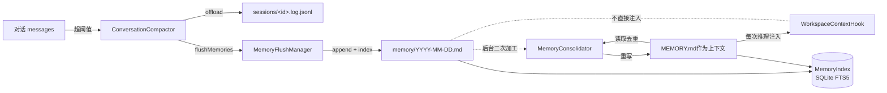

# 记忆（Memory）

## 作用

让 agent 能“记住跨会话的事实”，同时避免对话上下文无限增长。harness 把记忆拆成两层：高频低质量的“流水账” + 低频高质量的“策划后长期记忆”，并补上一套 FTS5 检索 + 后台维护。

## 触发

| 时机 | 动作 |
|------|------|
| 推理前（`PreReasoningEvent`）| `CompactionHook` 检查对话阈值；超阈则调 `ConversationCompactor` |
| `call()` 结束（`PostCallEvent`）| `MemoryFlushHook` 调 `MemoryFlushManager` 提取记忆 + offload |
| 上下文溢出（`ContextLengthExceeded`）| `HarnessAgent.forceCompactAndRetry` 以 `triggerMessages=1` 强制压缩并重试 |
| 工具返回超大（`PostActingEvent`）| `ToolResultEvictionHook` 卸载到 filesystem |
| 后台调度 | `MemoryMaintenanceScheduler` 默认每 6h 跑一轮；flush 后会“机会主义”传一个信号（30 分钟级节流） |

## 关键逻辑

### 双层记忆模型



- **第一层·流水账 `memory/YYYY-MM-DD.md`**：`MemoryFlushManager` 专属，**只追加**，不去重；是“刚刚在说什么”的原始记录。
- **第二层·策划后长期记忆 `MEMORY.md`**：`MemoryConsolidator` 专属，**整体重写**；MemoryFlushManager 不会去动它。每次推理都走 `WorkspaceContextHook` 注入到 system prompt。
- **索引 `MemoryIndex`**：启动时 `indexAllFromWorkspace` 一次；每次 flush 写今日流水账后增量重建该文件索引；SQLite 文件位于 `<workspace_parent>/memory_index.db`。

### 对话压缩（`ConversationCompactor`）

```
检查阈值 → 找 cutoff（不切开 ASSISTANT/TOOL 对）
        → (可选) flushMemories(prefix)
        → (可选) offloadMessages(messages → sessions/.../<id>.jsonl)
        → LLM 提炼 summary
        → [summaryUserMsg] + tail 返回给 hook重装 memory
```

默认值（全部可调）：

| 参数 | 默认 | 说明 |
|------|------|------|
| `triggerMessages` | `50` | 按条数触发（`0` = 关闭） |
| `triggerTokens` | `80_000` | 按 token 估算触发（`0` = 关闭） |
| `keepMessages` | `20` | 保留尾部条数 |
| `keepTokens` | `0` | 非 0 时按 token 预算从后往前扫描，覆盖 `keepMessages` |
| `flushBeforeCompact` | **`true`** | 压缩前提取记忆到今日流水账 |
| `offloadBeforeCompact` | **`true`** | 压缩前将原始消息追写到会话 `.log.jsonl` |
| `summaryPrompt` | 内置模板 | 包含 `SESSION INTENT / SUMMARY / ARTIFACTS / NEXT STEPS` 四段式 |

```java
CompactionConfig.builder()
    .triggerMessages(30)
    .keepMessages(10)
    .build();   // flush/offload 默认都是 true
```

#### `TruncateArgsConfig`—轻量预处理（可选）

在 LLM 摘要之前，可以先走一个**不走 LLM** 的干预：对老消息里不那么重要的 `ToolUseBlock` 参数做字符串截断（默认阈值 25 条 / 40k tokens，参数超 2000 字符被裁揉）。适合 `write_file` 这种入参体量大、后期不需要原貌的场景。

```java
CompactionConfig.builder()
    .triggerMessages(80)
    .truncateArgs(TruncateArgsConfig.builder().build())
    .build();
```

#### 上下文溢出自动恢复

当模型返回 `context_length_exceeded` / `maximum context` 之类错误，`HarnessAgent.recoverFromOverflow` → `forceCompactAndRetry` 会拼一个临时 `triggerMessages=1` 的 `CompactionConfig` 走一轮压缩，清空 `Memory` 后重试；**前提是配置了 `compaction(...)`**，否则直接抛错。

### 记忆提取（`MemoryFlushManager`）

- `flushMemories(messages)`：拿当前 `MEMORY.md` 和今日流水账作为“去重参考”丢给 LLM，要求输出 **仅新增的** bullet；“NO_REPLY” 表示什么都不写。
- 写入位置固定是 `memory/YYYY-MM-DD.md`，**不会动 `MEMORY.md`**（以防二层被一层覆写）。
- 写完后立刻 `indexFromString` 重建该文件索引，并调 `MemoryMaintenanceScheduler.requestConsolidation()` 提示“能合并了合并下”。

### 二次合并（`MemoryConsolidator`）

- 读 mtime 超过 watermark 的日流水账 + 当前 `MEMORY.md`，调 LLM 合并、去重、裁剪。
- 输出限制：默认 `maxMemoryTokens=4000`（约 16k 字符），prompt 会以字符预算的形式告诉 LLM。
- 写后推进 watermark，存于 `memory/.consolidation_state`；下次只看 mtime 超 watermark 的日文件。
- 合并仅在后台 executor 跳：定期 tick 或 `requestConsolidation()` 发起，永不阻塞推理循环。

### 后台维护（`MemoryMaintenanceScheduler`）

`HarnessAgent.build()` 中自动创建并 `start()`，每个 tick 顺序跑：

1. `expireDailyFiles` — 超过 `dailyFileRetentionDays` 的日文件归档到 `memory/archive/`（**默认 90 天**）
2. `consolidateMemory` — 调 `MemoryConsolidator.consolidate()`
3. `pruneOldSessions` — 删除 mtime 超 `sessionRetentionDays` 的会话文件（**默认 180 天**）
4. `reindex` — `MemoryIndex.indexAllFromWorkspace`

默认间隔 `Duration.ofHours(6)`；opportunistic 调用实际节流间隔 30 分钟，避免频繁 flush 打爆 LLM。

### 工具结果卸载（`ToolResultEvictionConfig`）

与压缩独立。某次 `tool_call` 返回的文本超过阈值时，全文写到 `evictionPath` 下的文件，原位置只留一个“首尾预览 + 路径”的占位符，agent 需要完整内容时走 `read_file`。

| 参数 | 默认 | 说明 |
|------|------|------|
| `maxResultChars` | `80_000` | 超过则卸载 |
| `previewChars` | `2_000` | 首尾预览字符数 |
| `evictionPath` | `/large_tool_results` | 卸载文件根路径 |
| `excludedToolNames` | 内置集（含 `read_file` 等） | 不参与卸载的工具 |

```java
HarnessAgent.builder()
    ...
    .toolResultEviction(ToolResultEvictionConfig.defaults())
    .build();
```

## 配置与代码示例

```java
HarnessAgent agent = HarnessAgent.builder()
    .name("MyAgent")
    .model(model)
    .workspace(workspace)
    .compaction(CompactionConfig.builder()
        .triggerMessages(30)
        .keepMessages(10)
        .build())
    .toolResultEviction(ToolResultEvictionConfig.defaults())
    .build();

// agent 可随时调用 memory_search
MemoryIndex index = new MemoryIndex(workspaceAgentScopeDir);
index.open();
List<MemoryIndex.SearchHit> hits = index.search("数据库迁移", 10);
// hit: { path, lineNumber, content, rank }
```

## 相关文档

- [工具](./tool.md) — `memory_search` / `memory_get` 的参数与调用例
- [工作区](./workspace.md) — `MEMORY.md` / `memory/*.md` 在工作区的位置
- [会话](./session.md) — `.log.jsonl` / `.jsonl` 怎么反过来被记忆提取使用
- [架构](./architecture.md) — CompactionHook / MemoryFlushHook / ToolResultEvictionHook 在生命周期中的位置
