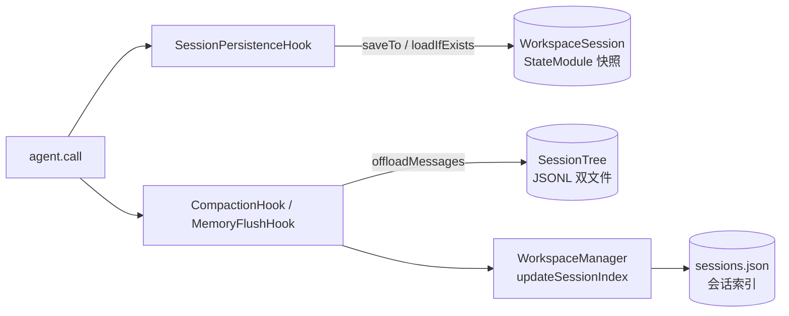

# 会话（Session）

## 作用

让 agent 能在跨请求、跨进程、多用户场景下恢复状态。一次 `call()` 结束后自动落盘两路产出：

- **StateModule 快照**（`Memory`、`ToolExecutionContext` 等可序列化状态）——默认走 `WorkspaceSession`
- **对话 JSONL**（LLM 上下文 + 完整历史）——走 `SessionTree`，由 `MemoryFlushManager.offloadMessages` 触发

两者是**两个并行路径

## 触发

| 时机 | 动作 |
|------|------|
| `agent.call(msg, ctx)` | `bindRuntimeContext` 以 `ctx.session/sessionKey` 交给 `delegate.loadIfExists` 恢复 StateModule |
| `PostCallEvent` / `ErrorEvent` | `SessionPersistenceHook`（priority 900）调 `agent.saveTo(session, sessionKey)`，成功 / 失败都保一份 |
| 压缩 / `PostCallEvent` flush | `MemoryFlushManager.offloadMessages` 追写到 `<sessionId>.jsonl` + `.log.jsonl` |
| 会话结束 | `WorkspaceManager.updateSessionIndex` 更新 `sessions.json` 供 `session_list` 查 |

## 关键逻辑

### 双轨存储布局



```
workspace/agents/<agentId>/
├── context/                          ← WorkspaceSession 负责
│   └── <sessionId>/
│       ├── memory.json               ← ReActAgent.memory 快照
│       └── *.json                    ← 其他 StateModule 序列化产物
└── sessions/                         ← SessionTree + WorkspaceManager 负责
    ├── sessions.json                 ← 会话索引 (sessionId / summary / updatedAt)
    ├── <sessionId>.jsonl             ← LLM 可见的压缩上下文
    └── <sessionId>.log.jsonl         ← 完整对话日志（append-only，不被压缩）
```

- **`context/`**：`WorkspaceSession` 继承 `JsonSession`，base 在 `agents/<agentId>/context/`；sessionId 子目录里按 `SessionKey → {key}.json` 存每个 `StateModule`。
- **`sessions/`**：`SessionTree` 在一个 JSONL 里按 `id/parentId` 组成一棵树；另一份同名的 `<sessionId>.log.jsonl` **从不被压缩**，供审计和 `session_search` 使用。

### `RuntimeContext` 怎么让二者对齐

```java
RuntimeContext ctx = RuntimeContext.builder()
    .sessionId("sess-001")
    .userId("alice")
    .build();

agent.call(msg, ctx).block();
```

`HarnessAgent.bindRuntimeContext` 会做几件事：

1. **补默认**：`session` 为空时使用构建时的 `defaultSession`（默认是 `WorkspaceSession(workspace, agentId)`）；`sessionKey` 为空时依次试 `SimpleSessionKey.of(sessionId)` → `SimpleSessionKey.of(agentName)`。
2. **传递到 hooks**：`workspaceContextHook`、`memoryFlushHook`、`sessionPersistenceHook`、`compactionHook` 都会同步该 ctx，他们在 offload / saveTo 时都能读到 `sessionId`。
3. **联动 `userIdRef`**：`AtomicReference<String>` 被顶下 `userId`，默认 `NamespaceFactory → List.of(userId)` 会以该 userId 作为路径前缀，从而多租户透明隔离。
4. **预加载状态**：若 `session && sessionKey` 都有，调用 `delegate.loadIfExists` 覆盖当前 Memory。不存在则什么都不动。

### 默认与自定义 Session

```java
// 1. 默认：什么都不传 → WorkspaceSession(workspace, agentId)
HarnessAgent.builder()
    .name("MyAgent").model(model).workspace(workspace).build();

// 2. 使用任意指定路径的 JsonSession
HarnessAgent.builder()
    ...
    .session(new JsonSession(Path.of("/custom/sessions")))
    .build();

// 3. 调用时临时覆盖
agent.call(msg, RuntimeContext.builder()
        .sessionId("sess-001")
        .session(customSession)
        .sessionKey(SimpleSessionKey.of("sess-001"))
        .build())
    .block();
```

### 多用户隔离的两个层面

- **会话层**：`sessionId` 决定 `context/<sessionId>/` 与 `sessions/<sessionId>.jsonl` 独立。
- **文件层**：`userId` + `NamespaceFactory` 决定文件操作路径前缀（默认 `LocalFilesystemWithShell` 会读 `userIdRef`）。

```java
// 同一 agent 实例服务 alice / bob
agent.call(msg, RuntimeContext.builder().sessionId("alice-1").userId("alice").build()).block();
agent.call(msg, RuntimeContext.builder().sessionId("bob-1").userId("bob").build()).block();
// 两个会话状态、文件路径都互不干扰
```

### 会话索引

`MemoryFlushManager.offloadMessages` 调完后，`WorkspaceManager.updateSessionIndex(agentId, sessionId, summary)` 会合并写 `sessions/sessions.json`，agent 在另一轮可以走 `session_list` 工具查看“该 agent 历史上都跟谁聊过”。

## 相关文档

- [工具](./tool.md) — `session_search` / `session_list` / `session_history` 的入参
- [记忆](./memory.md) — `offloadMessages` 什么时候被调，怎么反过来被 `memory_search` 利用
- [文件系统](./filesystem.md) — `userIdRef` + `NamespaceFactory` 的多租户路径隔离
- [架构](./architecture.md) — `SessionPersistenceHook` 在 PostCallEvent / ErrorEvent 中的位置
