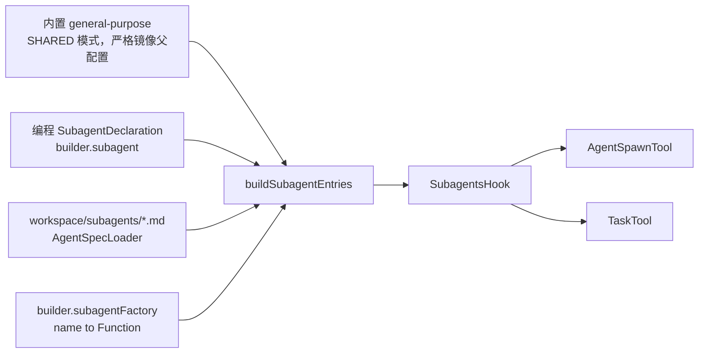

# 子 Agent（Subagent）

## 作用

让父 agent 能把"独立、重上下文、可并行"的子任务交出去，不打扰主线。子 agent 是**临时**的 `HarnessAgent` 实例：独立会话、不共享父对话历史，仅返回一条结果作为 `tool_result`；同时支持同步 / 异步两种调用。

## 声明 / 定义 / 运行时三层模型

```
声明（Declaration）          定义（Definition）              运行时（Runtime root）
─────────────────────        ────────────────────────        ────────────────────────────
mainWorkspace/               一个普通 workspace 目录          subagent 实际工作的目录根
  subagents/<id>.md          （含 AGENTS.md 等）               由五行判定表确定
（front matter + 可选 body） 可在仓库内/外/独立项目          ├─ 可以是 defWorkspace
                             多个声明可指向同一 definition     ├─ 可以是 mainWorkspace
                                                             └─ 可以是自动创建的隔离目录
```

**声明**负责"父 agent 需要知道什么"（名字、描述、调度参数）；**定义**是 subagent 的能力来源；**运行时**是 subagent 实际读写的目录。

## 触发

| 时机 | 动作 |
|------|------|
| `HarnessAgent.build()` | 非 leaf 且有 model 时注册 `SubagentsHook`（priority 80）与 `AgentSpawnTool` / `TaskTool` |
| `PreReasoningEvent` | `SubagentsHook` 拼的"Subagents"指南段 + 所有可用 agent_id + **当前 session 最近 async task 摘要** 注入每轮 SYSTEM 消息 |
| reasoning 选中子 agent 工具 | `agent_spawn` / `agent_send` / `agent_list` 走同步路径；`timeout_seconds=0` 走异步，写 `TaskRecord` + 返 `task_id` |
| 后续轮次 | `task_output` / `task_cancel` / `task_list` 优先读 workspace `TaskRecord`（真源），本节点 in-memory future 作加速层 |

## 声明来源



## 五行判定表

workspace 根与 sysPrompt 来源由以下规则确定：

| 情形 | sysPrompt 来源 | 运行时 workspace 根 |
|---|---|---|
| 内置 `general-purpose`（强制 SHARED） | mainWorkspace 的 `AGENTS.md` | mainWorkspace |
| 声明含 `workspace.path` + ISOLATED | 外部 def 的 `AGENTS.md` | 该外部 path |
| 声明含 `workspace.path` + SHARED | 外部 def 的 `AGENTS.md` | mainWorkspace |
| 无 `workspace.path` + ISOLATED（默认） | 声明 body（内联 sysPrompt） | `mainWorkspace/agents/<id>/workspace/`（自动创建） |
| 无 `workspace.path` + SHARED | 声明 body（内联 sysPrompt） | mainWorkspace |

补充约束：
- **SHARED 模式**下 definition workspace 自带的 `skills/` / `knowledge/` / `MEMORY.md` **一律忽略**
- `tools` 是 **allowlist 过滤器**，只能收窄父 toolkit，不能扩权
- `workspace.path` 相对路径相对于 mainWorkspace；不允许 `..` 跳出（绝对路径开发者自负）
- 同一 definition workspace 允许被多个声明引用

## 声明文件（`workspace/subagents/<id>.md`）

文件名（去 `.md`）= subagent `name` / agent-id，不在 front matter 里写 `name`。

```markdown
---
description: 代码评审专家，识别安全/性能/可读性问题。
workspace:
  mode: isolated          # isolated | shared，默认 isolated
  path: ./defs/code-reviewer   # 可选；相对 mainWorkspace 或绝对路径
model: qwen3-max          # 可选覆写
maxIters: 12              # 可选（默认 10）
tools: [read_file, grep_files, edit_file]   # 可选 allowlist
---

仅在 front matter 不含 workspace.path 时，本 body 作为 sysPrompt（轻量内联模式）。
```

**规则**：
- `workspace.path` 有值时 body **必须为空**，sysPrompt 从 `workspace.path/AGENTS.md` 读取
- `workspace.path` 为空时 body 作为 inline sysPrompt（轻量内联模式）

## 编程式 API

```java
HarnessAgent.builder()
    .subagent(SubagentDeclaration.builder()
        .name("code-reviewer")
        .description("审查安全、性能和可读性问题")
        .workspace(Path.of("./defs/code-reviewer"))   // 与 inlineAgentsBody 互斥
        // 或者：.inlineAgentsBody("你是代码评审专家……")
        .workspaceMode(WorkspaceMode.ISOLATED)         // 默认
        .model("qwen3-max")
        .maxIters(12)
        .tools(List.of("read_file", "grep_files"))
        .build())
    .build();
```

- `.workspace(Path)` 对应声明 `workspace.path`
- `.inlineAgentsBody(...)` 对应轻量内联模式（body 当 sysPrompt）
- 两者互斥；`builder.build()` 阶段校验

## 内置 `general-purpose`

- 不写入 `subagents/` 目录，由 `HarnessAgent.Builder` 内部自动注册
- 等价于"SHARED 模式 + 无外部 definition"的内置声明
- **完全镜像** main agent 的 hooks / 工具启用/禁用 / skills / workspace context / execution config / compaction / tool-result-eviction / additionalContextFiles
- 仅保留两个必要差异：
  1. `asLeafSubagent()` — 禁止递归 spawn
  2. 独立 child sessionId
- sysPrompt = Subagent Context 段（identity + rules）；`AGENTS.md` 通过 `WorkspaceContextHook` 自动注入

## 防递归 + 防超深

- 所有 subagent（无论来源）都调了 `Builder.asLeafSubagent()`：`leafSubagent=true` 时 `build()` 不注册 `SubagentsHook`，因此子 agent 无法再 spawn
- `AgentSpawnTool` 额外限制：`MAX_SPAWN_DEPTH = 3` 作为动态保险

## RuntimeContext 透传

`AgentSpawnTool` 在生成子 agent 时会从父 agent 的 `userIdRef` 读取当前 `userId`，并通过 `DefaultAgentManager.invokeAgent(agent, sessionId, userId, prompt)` 传递给子 agent 的 `RuntimeContext`。子 agent 获得独立 `sessionId`（`sub-<uuid>`），但 `userId` 与父一致，确保 `USER` 作用域的 isolation key 一致。

## Async Task 生命周期

```
putTask()
  │  1. 写 TaskRecord(PENDING) → workspace (agents/<agentId>/tasks/<sessionId>.json)
  │  2. supplyAsync → executor thread
  │  3. 存 BackgroundTask → localTasks["<sessionId>:<taskId>"]
  │
  ▼  executor thread
  [check cancelRequested flag]
  → updateStatus(RUNNING) → workspace
  → taskExecution.get()
  → updateStatus(COMPLETED/FAILED) → workspace
```

**存储层次**

| 层次 | 载体 | 作用域 | 持久化 |
|------|------|--------|--------|
| `localTasks` Map | `WorkspaceTaskRepository` | 单 JVM 进程 | ✗ 重启丢失 |
| `agents/<agentId>/tasks/<sessionId>.json` | `WorkspaceManager` → `AbstractFilesystem` | 所有节点 | ✔ |

**分布式行为**

- 任务执行 sticky 在创建节点；任何节点均可通过 workspace 读取状态
- `task_output(block=true)` 在非原始节点降级为"读 workspace 终态"，返回 `note: possibly on another node`
- `task_cancel` 同步写 `cancelRequested=true` 到 workspace；原始节点执行器在下一次入口检查此 flag 并中止

**与 Filesystem 模式的关系**

| 模式 | `agents/<agentId>/tasks/` 路由 | 分布式可见性 |
|------|-------------------------------|-------------|
| `RemoteFilesystemSpec`（Mode 1） | 自动路由到 `RemoteFilesystem`（BaseStore） | ✔ 全节点可见 |
| `SandboxFilesystemSpec`（Mode 2） | 写入沙箱 VFS，通过 `SandboxStateStore` 跨调用持久化 | 单沙箱可见 |
| `LocalFilesystemSpec`（Mode 3） | 写本地磁盘 | 单机可见 |

**模型使用 async task 的关键规则**

1. 启动后立即返回给用户，**不要**立刻调 `task_output` 轮询
2. 对话历史里的任务状态是**过时的**，必须用 `task_output(block=false)` 或 `task_list()` 获取最新状态
3. compaction 后先调 `task_list()` 恢复所有任务 ID 和状态
4. `SubagentsHook` 每轮把当前 session 的 async task 摘要注入 SYSTEM，模型无需记忆 task_id

## 调用工具

| 工具 | 作用 | 关键参数 |
|------|------|---------|
| `agent_spawn` | 生成一个子 agent 跑一件任务 | `agent_id`（必填）、`task`（可选）、`label`（可选别名）、`timeout_seconds` 默认 30s，`0` 走后台 |
| `agent_send` | 给已存在的子 agent 补一条话 | `agent_key`（spawn 返回的句柄）或 `label`；`message`；`timeout_seconds` |
| `agent_list` | 列当前活跃子 agent | 无 |
| `task_output` | 取后台任务结果（优先读 live future，否则读 workspace 终态） | `task_id`、`block`（**推荐 false**）、`timeout` 默认 30s |
| `task_cancel` | 取消任务（写 cancelRequested flag 到 workspace） | `task_id` |
| `task_list` | 列当前 session 全量任务（从 workspace 读，compaction 后仍准确） | `status_filter` |

## 配置示例

```java
HarnessAgent orchestrator = HarnessAgent.builder()
    .name("orchestrator").model(model).workspace(workspace)
    // (1) 编程声明（isolated + 外部 def workspace）
    .subagent(SubagentDeclaration.builder()
        .name("code-reviewer")
        .description("代码审查专家")
        .workspace(Path.of("./defs/reviewer"))
        .workspaceMode(WorkspaceMode.ISOLATED)
        .build())
    // (2) 编程声明（shared + 内联）
    .subagent(SubagentDeclaration.builder()
        .name("analyst")
        .description("数据分析，与主 agent 共享 workspace")
        .workspaceMode(WorkspaceMode.SHARED)
        .inlineAgentsBody("你是数据分析师...")
        .tools(List.of("read_file", "memory_search"))
        .build())
    // (3) 自定义工厂
    .subagentFactory("my-specialist", id ->
        HarnessAgent.builder().name(id).model(specialModel)
            .workspace(Path.of("./specialist-workspace"))
            .build())
    // 默认使用 WorkspaceTaskRepository（workspace 存储 + in-memory 加速层）
    // 无 workspace 时自动降级为 DefaultTaskRepository（in-memory）
    // 自定义：.taskRepository(new DefaultTaskRepository())   // 纯内存，仅限单机测试
    .build();
// (4) workspace/subagents/*.md 会被自动扫描（文件名=agent_id）
// (5) 内置 general-purpose 总是在位
```

编排 prompt 中子 agent 如何被选中完全依赖 `description`，尽量明确"何时用 / 何时不用 / 输出形式"。同时 `maxIters` 宜比父 agent 小，避免子任务贪吃 token。

## 相关文档

- [工具](./tool.md) — `agent_spawn` / `agent_send` / `agent_list` / `task_*` 的完整参数表
- [工作区](./workspace.md) — `workspace/subagents/` 与自动发现
- [架构](./architecture.md) — SubagentsHook 在生命周期中的位置与同步 / 后台两条委派路径的时序图
- [流式输出](./streaming.md) — `stream()` 模式下子 agent 事件实时转发与 `EventSource` 字段说明
