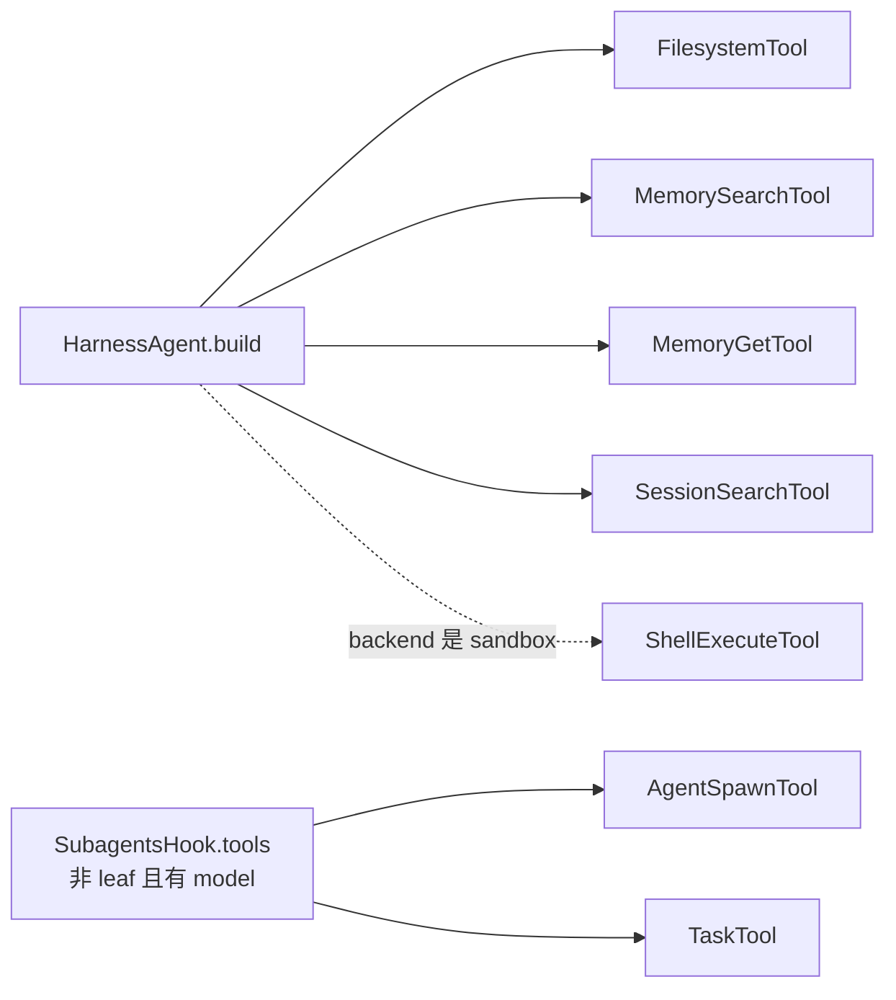

# 工具（Tool）

## 作用

harness 层默认为 agent 提供一套“足够走完一个闭环”的内置工具：读写文件、检索记忆与会话、委派子 agent、可选走 shell。不需手动注册，`HarnessAgent.build()` 与 `SubagentsHook` 会一起装好。

## 注册路径



- **直接 register**：`FilesystemTool` / `MemorySearchTool` / `MemoryGetTool` / `SessionSearchTool` 必装；`ShellExecuteTool` 仅在 `backend instanceof AbstractSandboxFilesystem` 时装。
- **间接 register**：`AgentSpawnTool` 与 `TaskTool` 是 `SubagentsHook.tools()` 返回的，仅在非 leaf 且配了 `model` 时出现；在 session mode 下 `agent_*` 会被 `sessions_*` 替换。

## 文件系统·`FilesystemTool`

包装 `AbstractFilesystem`；路径是后端本地路径。

| 工具 | 作用 | 参数 |
|------|------|------|
| `read_file` | 读文件内容 | `path`, `offset`（0-indexed）, `limit`（0 = 读全） |
| `write_file` | 创建新文件 | `path`, `content`（已存在会报错） |
| `edit_file` | 精确字符串替换 | `path`, `old_string`（默认唯一）, `new_string`, `replace_all`（默认 false） |
| `grep_files` | 指定路径中搜字符串（非正则）| `pattern`, `path`, `glob`（如 `*.java`） |
| `glob_files` | 按 glob 查文件 | `pattern`（如 `**/*.md`）, `path` |
| `list_files` | 列目录 | `path` |

## 记忆·`MemorySearchTool` / `MemoryGetTool`

| 工具 | 作用 | 参数 |
|------|------|------|
| `memory_search` | FTS5 全文检索，最多返 30 条；MemoryIndex 不可用时 fallback 到关键字扫 | `query` |
| `memory_get` | 读记忆文件中指定行范围，输出带行号 | `path`（工作区相对）, `startLine`, `endLine`（1-based）|

> 参数名是驼峰（`startLine` / `endLine`），与 filesystem 的 snake_case 不一致。

## 会话·`SessionSearchTool`

| 工具 | 作用 | 参数 |
|------|------|------|
| `session_search` | 在会话 JSONL 中扫关键词 | `query`, `agentId`（可选）, `maxResults`（默认 10） |
| `session_list` | 列某个 agent 的会话，优先读 `sessions.json` | `agentId` |
| `session_history` | 返某个会话最近 N 条消息 | `agentId`, `sessionId`, `lastN`（默认 20）|

> 参数名都是驼峰，且 `session_search` 返回结果是扫全部 `agents/<agentId>/sessions/*.jsonl` 后的“首次命中 10 条”，**不是**按相关性排序。

## 子 Agent·`AgentSpawnTool`

| 工具 | 作用 | 参数 |
|------|------|------|
| `agent_spawn` | 创建临时子 agent、可选走任务 | `agent_id`（必填）, `task`（可选，留空仅建 session）, `label`（可选别名）, `timeout_seconds`（默认 30，`0`=后台，上限 600） |
| `agent_send` | 向已存在子 agent 补一条 | `agent_key` 或 `label`（二选一）, `message`, `timeout_seconds` |
| `agent_list` | 列当前子 agent | 无 |

```
agent_spawn agent_id="research-analyst"
            task="调研主题 X"
            timeout_seconds=60

# 异步
agent_spawn agent_id="research-analyst" task="全库安全审计" timeout_seconds=0
# → agent_key + task_id
```

Session mode 下，这三个名会变为 `sessions_spawn` / `sessions_send` / `sessions_list`。

## 后台任务·`TaskTool`

| 工具 | 作用 | 参数 |
|------|------|------|
| `task_output` | 拿后台任务结果 | `task_id`, `block`（默认 true）, `timeout` 默认 30000ms，上限 600000ms |
| `task_cancel` | 取消任务；终态不生效 | `task_id` |
| `task_list` | 列任务 | `status_filter`：running / completed / failed / cancelled / all |

## Shell·`ShellExecuteTool`（条件性装）

仅在后端是 `AbstractSandboxFilesystem`（包含 `LocalFilesystemWithShell`）时才被注册。如果你用的是纯 `LocalFilesystem` 或 `RemoteFilesystem`，子工具不出现。

| 工具 | 作用 | 参数 |
|------|------|------|
| `execute` | 走后端 `execute()`，返 stdout + exit code | `command`, `working_directory`（可选，实际拼接为 `cd <dir> && <cmd>`）, `timeout`（秒，默认 30）|

> **注意**：@Tool 未显式设 `name`，默认取方法名，所以 LLM 看到的工具名是 `execute`。如果后续统一为 `shell_execute` 是个小重构，参见 [roadmap](./roadmap.md)。

```
execute command="find . -name '*.java' | wc -l"
execute command="mvn test" timeout=300
execute command="git status" working_directory="app"   # 拼为 cd app && git status
```

## 相关文档

- [文件系统](./filesystem.md) — 后端实现与沙箱接口
- [记忆](./memory.md) — `memory_search` / `memory_get` 背后的 FTS5 与双层记忆
- [会话](./session.md) — `session_*` 系列背后的 `WorkspaceSession` / `SessionTree` 双轨
- [子 Agent](./subagent.md) — `agent_spawn` / `agent_send` / `task_*` 的调度与生命周期
