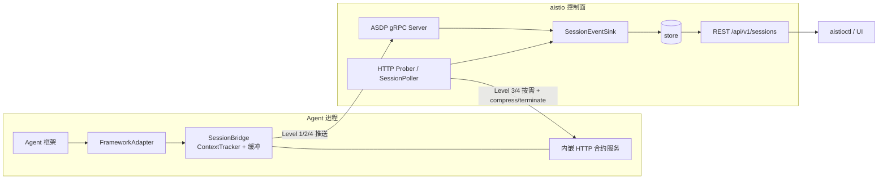

# aistio SDK 适配设计（支撑控制面 Runtime 能力）

> 状态：**已落地**（协议扩展、控制面接收路径、Go connector、Python SDK 与 5 个框架适配器均已实现并通过测试；本文保留为设计说明）
> 关联文档：
> - [framework-integration.md](./framework-integration.md) — 异构框架适配总览（本文是其实施细化）
> - [storage-design.md](./storage-design.md) — 运行时 Store 已落地
> - [storage-followups.md](./storage-followups.md) — 控制面侧待办（AgentInstance、事件流写入方等）
> - [contract.md](./contract.md) — 现有 HTTP 数据面契约
> - [sdk-testing.md](./sdk-testing.md) — 源码部署、自动化测试与手工联调步骤

---

## 0. 一句话结论

存储层与 REST 读路径已就绪（`session_events` / `context_snapshots` 表、`/api/v1/sessions/{id}/events|context`），**唯一缺口是数据面生产者**。SDK 的职责是：

1. 旁路拦截各框架 Session / Context / Subagent / Workspace 数据；
2. 经 **混合通道**（gRPC ASDP 上行推送 + 内嵌 HTTP 合约承接按需拉取与命令）送到控制面；
3. 控制面写入已有 Store，供 Dashboard / CLI / 治理策略消费。

控制面主动发起聊天**本期不做**，见 §8 预留。

---

## 1. 定位与能力映射

### 1.1 控制面两层能力

| 层面 | 能力 | 承载 | SDK 是否参与 |
|------|------|------|--------------|
| **声明式** | Agent 定义、AgentTeam 编排、异步调度任务 | Agent / AgentTeam CRD + Store 中的 `team_tasks` | 否（控制面自洽；任务结果可由数据面经 TeamEvent 上报） |
| **Runtime** | 应用/实例/会话/历史/上下文/workspace/subagent | Store + REST + ASDP/HTTP | **是（本文重点）** |

SDK 只承载 **runtime 数据面**：观测、按需查询、响应控制命令。不负责写 CRD、不负责 Team 编排逻辑。

### 1.2 Runtime 能力 ↔ SDK / 协议映射

| 控制面 Runtime 能力 | 现状承载 | 缺口 | SDK / 协议机制 |
|---------------------|----------|------|----------------|
| Agent 应用管理 | Agent CRD + discovery（`/agentscope/info`） | 无硬缺口 | 握手 `ConnectRequest` + HTTP `info` 自报 runtime / capabilities |
| Agent 实例管理 | ASDP 握手带 `instance_id`，仅在连接注册表 | 实例清单/生命周期未持久化（见 [storage-followups §3](./storage-followups.md)） | `InventoryReport` + 未来 AgentInstance CRD；SDK 上报 `instance_id` / 健康 / 能力 |
| 活跃 Session 管理 | Level 1 快照（HTTP 轮询 + ASDP `SessionReport`）→ Store | 快照缺 `framework` / `context_hash` / `is_compacted` 等 | 扩展 `SessionSnapshot`；SDK `SessionBridge` 定期批量上报 |
| 会话历史 | `session_events` 表 + REST 已建，**无写入方** | ASDP 无 `EventReport` | 新上行 `EventReport`；SDK Level 2 缓冲批量上报 |
| 活跃上下文查看 | `context_snapshots` 表 + REST 已建，**无写入方** | ASDP 无 `ContextReport`；HTTP 无 `/context` | 新上行 `ContextReport` + HTTP `GET .../context`；`extract_context()` |
| 聊天发起 | 无 | 本期不做 | §8 预留 |
| Workspace 管理 | 仅 `SubagentSpec.WorkspaceMode` 声明字段 | 运行时观测/操作协议缺失 | `InventoryReport.workspaces` + HTTP `GET /agentscope/workspaces` |
| Subagent 管理 | Agent CRD `spec.subagents` 声明式定义 | 运行时清单/调用观测缺失 | `InventoryReport.subagents` + HTTP `GET /agentscope/subagents` |

### 1.3 与现有代码的对齐关系

```
已就绪（控制面）                    待补齐（数据面 + 协议）
─────────────────                  ──────────────────────
internal/store                     ASDP: EventReport / ContextReport / InventoryReport
  sessions / snapshots               SessionSnapshot 扩展字段
  session_events                     HTTP: /context /messages /subagents /workspaces
  context_snapshots                  SDK: FrameworkAdapter + SessionBridge + 内嵌合约服务
REST /api/v1/sessions/{id}/...
SessionEventSink（仅写 session 摘要）
connector/（Go 侧雏形，能力不完整）
```

---

## 2. 通道选型：混合模式

### 2.1 原则

| 方向 | 通道 | 理由 |
|------|------|------|
| 数据面 → 控制面（推送） | **ASDP gRPC 双向流** | 实时、批量、NAT/外部 agent 友好；已有 `SessionReport` / 心跳 / 配置 ACK |
| 控制面 → 数据面（按需拉取 / 命令） | **SDK 内嵌 HTTP 合约服务** | 完全兼容现有 `SessionPoller` / `http_prober`；无需立刻解决多副本 ASDP 转发 |

两条通道通过握手 `capabilities` 声明；控制面按能力自动降级（与 [contract.md](./contract.md) Level 1–3 逻辑一致）。

### 2.2 四级上报如何落通道

| 层级 | 内容 | 通道 | 频率 / 触发 |
|------|------|------|-------------|
| Level 1 | Session 摘要快照 | ASDP `SessionReport`（主） / HTTP `GET /sessions`（兜底） | ~10s 批量 |
| Level 2 | 事件流（摘要） | ASDP `EventReport` | 可选；~5s 或满 20 条批量 |
| Level 3 | 完整消息内容 | HTTP `GET /sessions/{id}/messages` | **按需拉取，不主动上报** |
| Level 4 | 生效 Context | ASDP `ContextReport`（hash 变更 / compaction）+ HTTP `GET .../context`（UI 实时） | 关键变更推送 + 按需 |

### 2.3 数据流总览



### 2.4 Capabilities 声明

SDK 在 ASDP `ConnectRequest.capabilities` 与 HTTP `/agentscope/info.capabilities` 中声明，例如：

```text
session-reporting          # Level 1
event-reporting            # Level 2
context-reporting          # Context 推送（capability 门控，非 contractLevel 4）
context-query              # HTTP GET .../context
message-query              # HTTP GET .../messages
session-command            # compress / terminate
session-abort              # abort 当前 turn（HTTP POST .../abort；ASDP command=abort）
task-query                 # HTTP GET .../tasks
subagent-task-query        # HTTP GET .../subagent-tasks
subagent-task-command      # HTTP DELETE .../subagent-tasks/{id}
session-undo / session-redo / plan-mode / export-transcript   # 可选
subagent-inventory
workspace-inventory
```

冻结规则见 [contract.md Capabilities 词汇表](./contract.md#capabilities-词汇表冻结)：**禁止 `contractLevel: 4`**；未知 capability 由控制面忽略；过度声明（声明了但端点 501）视为数据面 bug。

控制面未看到对应 capability 时：跳过轮询/推送处理，REST 返回明确「数据面不支持」错误，而不是空数据。

---

## 3. ASDP 协议扩展

本节消息已落地于 `internal/asdp/asdp.proto` 并 regenerate（Go stubs：`internal/asdp/asdp.pb.go`；Python stubs：`sdk/python/aistio/proto/`）。字段编号以 proto 为准。

### 3.1 `SessionSnapshot` 扩展（Level 1）

在现有字段（`session_id` … `team_role`）上增加：

```protobuf
message SessionSnapshot {
  // ... 既有 1–9 ...
  string framework               = 10;  // "claude-agent-sdk" | "langchain" | "adk" | ...
  string framework_version       = 11;
  string context_hash            = 12;  // 生效 Context SHA-256 前 16 hex
  bool   is_compacted            = 13;
  int32  effective_message_count = 14;  // 压缩后生效条数，≠ message_count
}
```

与 Store 的 `SessionSnapshot` / `Session.Framework*` 字段对齐（见 `internal/store/types.go`）。

**`context_hash` 用途**：控制面无需拉全文即可判断 Context 是否变化；hash 变且 `is_compacted=true` 时可触发 Level 4 拉取或等待 `ContextReport`。

### 3.2 `Upstream` 扩展

```protobuf
message Upstream {
  UpstreamMeta meta = 1;
  oneof payload {
    ConnectRequest   connect        = 10;
    ConfigAck        config_ack     = 11;
    SessionReport    session_report = 12;
    TeamEventReport  team_event     = 13;
    Heartbeat        heartbeat      = 14;
    EventReport      event_report   = 15;  // NEW Level 2
    ContextReport    context_report = 16;  // NEW Level 4
    InventoryReport  inventory      = 17;  // NEW 实例清单
  }
}
```

### 3.3 `EventReport`（Level 2 → `session_events`）

```protobuf
message EventReport {
  repeated SessionEventMsg events = 1;
}

message SessionEventMsg {
  string session_id     = 1;
  int32  seq            = 2;   // 会话内单调递增，幂等去重键
  string event_type     = 3;   // session_start | message | tool_call | tool_result | session_end | compaction
  int64  occurred_at    = 4;   // unix ms
  string role           = 5;   // user | assistant | system | tool
  string content        = 6;   // 摘要，建议 ≤ 500 字符
  string tool_name      = 7;
  bytes  tool_input     = 8;   // JSON，可截断
  string tool_output    = 9;   // 摘要
  int32  tokens_in      = 10;
  int32  tokens_out     = 11;
  int32  duration_ms    = 12;
  bytes  framework_meta = 13;  // 框架私有 JSON
}
```

控制面写入：`store.Events().Append`（`(session_fk, seq)` 唯一约束，冲突视为幂等成功）。

### 3.4 `ContextReport`（Level 4 → `context_snapshots`）

```protobuf
message ContextReport {
  string session_id              = 1;
  string context_hash            = 2;
  int64  captured_at             = 3;
  string system_prompt           = 4;
  bytes  messages                = 5;  // JSON array of {role, content, is_compaction?}
  bytes  tools                   = 6;  // JSON array of ToolInfo
  bool   is_compacted            = 7;
  string compaction_summary      = 8;
  int32  original_message_count  = 9;
  int64  compacted_at            = 10;
  int32  total_tokens            = 11;
  int32  max_tokens              = 12;
  string framework               = 13;
  bytes  framework_state         = 14;
}
```

控制面写入：`store.Contexts().PutIfChanged`（同 `context_hash` 跳过）。

**推送时机**（SDK）：

1. Compaction 完成（`event_type=compaction` 之后立刻推一次）；
2. Level 1 中 `context_hash` 相对上次已上报值发生变化，且距上次 ContextReport ≥ 冷却时间（建议 30s，防抖）；
3. 不在每次 message 后推送（流量过大）。

### 3.5 `InventoryReport`（实例清单）

支撑 **subagent 管理** 与 **workspace 管理** 的观测面；与 [storage-followups §3 AgentInstance](./storage-followups.md) 衔接——运行时字段写 Store / 连接注册表，声明式拓扑仍走未来 AgentInstance CRD。

```protobuf
message InventoryReport {
  repeated SubagentInfo  subagents  = 1;
  repeated WorkspaceInfo workspaces = 2;
  InstanceHealth         health     = 3;  // 复用已有 InstanceHealth 消息
}

message SubagentInfo {
  string name            = 1;
  string description     = 2;
  repeated string tools  = 3;
  string workspace_mode  = 4;  // isolated | shared
  string url             = 5;  // 远端 subagent（若有）
  int64  invoke_count    = 6;
  int64  last_invoked_at = 7;
}

message WorkspaceInfo {
  string path       = 1;
  string mode       = 2;  // isolated | shared | readonly
  int64  size_bytes = 3;
  string owner_ref  = 4;  // session_id 或 subagent name
}
```

上报频率：连接建立后立即一次；之后变更时或与 Level 1 同周期（~10–30s）轻量刷新。

---

## 4. HTTP 合约扩展

在 [contract.md](./contract.md) Level 2/3 基础上增量；由 capability 门控。SDK 内嵌轻量 HTTP 服务（默认与应用共用端口或独立 `AISTIO_CONTRACT_PORT`）。

### 4.1 新增端点

| 端点 | 方法 | Capability | 说明 |
|------|------|------------|------|
| `/agentscope/sessions/{id}/context` | GET | `context-query` | 实时生效 Context（与 `ContextReport` 同构 JSON） |
| `/agentscope/sessions/{id}/messages` | GET | `message-query` | 完整历史；`?offset=&limit=` 分页 |
| `/agentscope/subagents` | GET | `subagent-inventory` | 当前实例 subagent 清单 |
| `/agentscope/workspaces` | GET | `workspace-inventory` | 当前实例 workspace 清单 |
| `/agentscope/sessions/{id}/abort` | POST | `session-abort` | 中止当前 turn（与 ASDP `command=abort` 对等） |
| `/agentscope/sessions/{id}/tasks` | GET | `task-query` | 会话任务明细 |
| `/agentscope/sessions/{id}/subagent-tasks` | GET | `subagent-task-query` | 子代理任务列表 |
| `/agentscope/sessions/{id}/subagent-tasks/{taskId}` | DELETE | `subagent-task-command` | 取消子代理任务 |
| `/agentscope/sessions/{id}/undo` | POST | `session-undo` | （可选）撤销 |
| `/agentscope/sessions/{id}/redo` | POST | `session-redo` | （可选）重做 |
| `/agentscope/sessions/{id}/plan-mode` | POST | `plan-mode` | （可选）Plan mode |
| `/agentscope/sessions/{id}/export-transcript` | GET | `export-transcript` | （可选）导出 transcript |

已有端点不变：`info` / `health` / `sessions` / `sessions/{id}/state` / `compress` / `terminate`。`state` 规范响应与 Command 错误语义已冻结，见 [contract.md](./contract.md)。

### 4.2 响应形状（摘要）

**`GET .../context`** — 与 `ContextReport` / Store `ContextSnapshot` 对齐的 JSON。

**`GET .../messages`**：

```json
{
  "sessionId": "sess-abc",
  "offset": 0,
  "limit": 50,
  "total": 120,
  "messages": [
    {
      "seq": 1,
      "role": "user",
      "content": "...完整内容...",
      "toolName": null,
      "occurredAt": "2026-07-28T10:00:00Z"
    }
  ]
}
```

注意：Level 2 事件流存的是**摘要**；Level 3 才是全文。控制面 UI「查看历史」优先走 Level 3 按需拉取，可选地把结果缓存进 Store（后续增强，非必须）。

**`GET /agentscope/subagents` / `workspaces`**：数组字段同 `SubagentInfo` / `WorkspaceInfo`。

### 4.3 Contract Level 建议演进

| 等级 | 含义（演进后） |
|------|----------------|
| 1 | 发现 + 健康（不变） |
| 2 | + Session 列表/状态（不变） |
| 3 | + compress/terminate（不变） |

**冻结：不引入 `contractLevel: 4`。** context / messages / tasks / abort / inventory 等一律用 `capabilities` 细粒度门控，避免破坏现有 `contractLevel < 2` 跳过轮询逻辑。完整词汇与门控规则见 [contract.md](./contract.md#capabilities-词汇表冻结)。

---

## 5. SDK 架构与接口

### 5.1 项目结构

沿用 [framework-integration.md §8](./framework-integration.md)：

```text
aistio-sdk-python/
├── aistio/
│   ├── __init__.py          # instrument(), register_adapter()
│   ├── bridge.py            # SessionBridge
│   ├── events.py            # SessionEvent
│   ├── context.py           # ContextSnapshot + ContextTracker
│   ├── inventory.py         # SubagentInfo / WorkspaceInfo
│   ├── transport/
│   │   ├── grpc.py          # ASDP 客户端（上报 + 收 Config/SessionCommand）
│   │   └── http_server.py   # 内嵌合约 HTTP 服务
│   └── adapters/
│       ├── base.py          # FrameworkAdapter
│       ├── registry.py
│       ├── claude.py        # 优先实现
│       ├── langchain.py
│       ├── adk.py
│       └── openclaw.py      # Plugin / Gateway 变体
└── pyproject.toml
```

Go 侧已有 `connector/` 可作为同构传输层参考；Python SDK 为主力（多数框架生态在 Python）。OpenClaw 可另出 TypeScript Plugin。

### 5.2 `FrameworkAdapter` 接口（扩展）

相对 framework-integration §3.3，新增**可选**方法；未实现则不声明对应 capability：

```python
from abc import ABC, abstractmethod
from typing import Any, Callable, Optional

class FrameworkAdapter(ABC):
    @abstractmethod
    def framework_name(self) -> str: ...

    @abstractmethod
    def can_handle(self, target: Any) -> bool: ...

    @abstractmethod
    def attach(self, target: Any, emit: Callable[["SessionEvent"], None]) -> None: ...

    @abstractmethod
    def detach(self) -> None: ...

    @abstractmethod
    async def extract_context(self, session_id: str) -> "ContextSnapshot": ...

    # ─── 可选扩展（默认 NotImplemented → 不声明 capability）───

    async def list_messages(self, session_id: str, *, offset: int = 0, limit: int = 50) -> "MessagePage":
        """Level 3 完整历史。"""
        raise NotImplementedError

    async def list_subagents(self) -> list["SubagentInfo"]:
        raise NotImplementedError

    async def workspace_info(self) -> list["WorkspaceInfo"]:
        raise NotImplementedError

    async def handle_command(self, session_id: str, command: str, params: bytes | None = None) -> None:
        """compress | terminate | abort（及 undo/redo 等可选扩展）。"""
        raise NotImplementedError
```

**旁路原则不变**（framework-integration §3.4）：主路径先成功，上报失败静默忽略。

### 5.3 `SessionBridge` 职责

| 职责 | 说明 |
|------|------|
| 适配器挂载 | `instrument()` → 选 adapter → `attach(emit=bridge.on_event)` |
| 事件缓冲 | Level 2 队列：按 session 聚合，定时/满批 flush → `EventReport` |
| ContextTracker | 增量维护生效 messages + `context_hash`；compaction 时重置视图 |
| Level 1 聚合 | 从 tracker / 适配器统计生成 `SessionSnapshot`，周期 `UpdateSessions` / `SessionReport` |
| Level 4 推送 | hash 变更防抖 → `ContextReport`；HTTP handler 调 `extract_context` |
| Inventory | 周期或变更时调 `list_subagents` / `workspace_info` → `InventoryReport` |
| 命令分发 | ASDP `OnSessionCommand` 与 HTTP compress/terminate → `handle_command` |
| 本地降级 | 断线时缓冲有界队列；溢出丢弃最旧 Level 2（保证进程内存安全）；Level 1 重连后全量补报 |
| 合约 HTTP | 启动内嵌服务，路由委托 Bridge / Adapter |

### 5.4 用户 API（不变心智模型）

```python
import aistio
from claude_agent_sdk import ClaudeSDKClient, ClaudeAgentOptions

client = ClaudeSDKClient(ClaudeAgentOptions(...))
aistio.instrument(
    client,
    control_plane="aistiod.aistio-system:9090",
    agent_name="my-claude-agent",
    namespace="default",          # 或从 Downward API / env 注入
    instance_id=os.environ.get("HOSTNAME"),
    enable_events=False,          # Level 2 默认关
    contract_http_port=8080,      # 与应用共用或独立
)
```

### 5.5 首批适配器优先级

| 优先级 | 适配器 | 拦截点 | 首期必做 |
|--------|--------|--------|----------|
| P0 | Claude Agent SDK | 装饰 `SessionStore` | Level 1 + Level 4 + compress/terminate |
| P1 | LangChain / LangGraph | CallbackHandler + Checkpointer | 同上 |
| P1 | Google ADK | 装饰 `SessionService.append_event` | 同上 |
| P2 | OpenClaw | Plugin SDK 或 Gateway WS | Level 1 + context；inventory 视平台能力 |
| P3 | OpenAI Agents SDK | Session backend | 按需 |

各框架 Context 提取细节见 [framework-integration.md §5.3](./framework-integration.md)，本文不重复。

---

## 6. 控制面侧配套改动清单（已全部完成）

以下各项已随协议与 SDK 一并落地：

| 组件 | 改动 |
|------|------|
| `internal/asdp/asdp.proto` | §3 消息扩展 + regenerate |
| `internal/asdp/service.go` / connect handler | 分发 `EventReport` / `ContextReport` / `InventoryReport` |
| `internal/controller/asdp_sink.go`（`SessionEventSink`） | 写 `Events().Append`、`Contexts().PutIfChanged`；Session 摘要补齐新字段；inventory 写入点（连接注册表或未来实例表） |
| `cmd/aistiod/main.go` `sessionSinkAdapter` | 字段映射补齐 `Framework` / `ContextHash` / `IsCompacted` / `EffectiveMessageCount` |
| `internal/prober` | 新增 `GetContext` / `ListMessages` / `ListSubagents` / `ListWorkspaces` |
| `internal/controller/session_poller.go` | 可选：hash 变更时主动拉 context 并 `PutIfChanged`（若未收到 ASDP ContextReport） |
| `internal/httpapi` | REST 已具备读路径；必要时增加「转发到数据面实时拉」的 fallback（当 Store 无 context 时） |
| `connector/`（Go） | 与 Python SDK 对齐：支持新 Upstream 类型、HTTP 合约服务可选 |
| Capabilities / contractLevel | discovery 与 SessionPoller gate 识别新 capabilities |
| 文档 | 更新 `contract.md`、`framework-integration.md` Phase 状态 |

**不需要改**：`internal/store` schema（首轮已覆盖 events/contexts）、`aistioctl session get --context`（已读 Store）。

与 [storage-followups §5](./storage-followups.md) 条目一一对应；AgentInstance 持久化仍按 followups §3 单独排期。

数据面侧落地位置：Go connector（`connector/`，`Report*` API + 内嵌 HTTP 合约服务）；Python SDK（`sdk/python/aistio/`，含 `instrument()` / `SessionBridge` / gRPC+HTTP 传输 / Claude·LangChain·ADK·OpenClaw·OpenAI Agents 5 个适配器；测试见 `sdk/python/tests/`）。

---

## 7. 流量与默认策略

| 层级 | 默认 | 说明 |
|------|------|------|
| Level 1 | **开** | ~200B/session / 10s；与现网 SessionPoller 同量级 |
| Level 2 | **关** | 注解或 `instrument(enable_events=True)` / 控制面 ConfigPush 打开 |
| Level 3 | 按需 | 不推送；UI/CLI 触发 HTTP 拉取 |
| Level 4 推送 | **开（仅 hash 变更）** | 防抖；UI 实时查看走 HTTP |
| Inventory | **开（低频）** | 与 Level 1 同周期或更慢 |

500 Agent × 5 Session 粗算仍参考 framework-integration §7：默认模式约数十 KB/s，可接受。

---

## 8. 预留：控制面发起聊天（本期不做）

目标能力：运维/平台从控制面（或 Dashboard）向指定 Session **注入用户消息**并流式收回助理回复，用于人工介入、联调、客服接管等。

### 8.1 候选路径

| 方案 | 形态 | 优点 | 风险 |
|------|------|------|------|
| **A. HTTP 合约 + SSE** | `POST /agentscope/sessions/{id}/messages`，body `{content}`，响应 `text/event-stream` | 实现直观；与按需拉取同通道；鉴权可复用现有 prober TLS/网络策略 | 控制面多副本需选对实例 endpoint；长连接占 prober 资源 |
| **B. ASDP 请求/响应** | Downstream `ChatRequest{request_id, session_id, content}` → Upstream `ChatChunk{request_id, delta, done}` | 单通道；外部/NAT agent 可达 | 多副本下连接粘滞：需跨副本转发或 sticky；流式多路复用复杂度高 |

推荐演进顺序：先 **A**（集群内 Pod IP 可达场景），再按需补 **B** 作为外部 agent / 无 HTTP 合约时的回退。

### 8.2 待解问题（落地前必须设计）

1. **多副本转发**：聊天请求落到无该实例 ASDP 连接的 aistiod 副本时如何路由（与 [storage-followups §4](./storage-followups.md) 同类问题）。
2. **鉴权与审计**：谁可以代发消息？是否写入 `session_events`（`role=user, framework_meta.source=control-plane`）？
3. **与框架主路径关系**：注入消息必须走框架官方「继续对话」API，禁止 SDK 私自改 SessionStore 导致状态分裂。
4. **超时与取消**：SSE / chunk 流的取消语义、控制面客户端断开时数据面行为。
5. **只读 vs 可写 Session**：某些 session（team 子会话、已 terminate）应拒绝聊天。

本期 SDK / 协议**不预留字段编号占用**；正式做时再扩展 proto 与合约，避免半成品进入主路径。

---

## 9. 分阶段路线图

| 阶段 | 内容 | 产出 | 状态 |
|------|------|------|------|
| **Phase A** | 协议扩展 + 控制面接收路径 | `asdp.proto` 扩展；Sink 写 events/contexts；prober 新方法；contract.md 更新 | ✅ 已完成 |
| **Phase B** | Python SDK 骨架 + Claude 适配器 | `aistio-sdk-python`：instrument / Bridge / gRPC+HTTP；Level 1+4；compress/terminate | ✅ 已完成 |
| **Phase C** | Level 2 事件流 + LangChain / ADK | `EventReport` 端到端；`enable_events`；第二、三适配器 | ✅ 已完成 |
| **Phase D** | Inventory + OpenClaw | `InventoryReport` / HTTP inventory；OpenClaw Plugin；与 AgentInstance 设计对齐 | ✅ 已完成（OpenClaw 走 Gateway WS RPC 路径；AgentInstance 持久化仍按 storage-followups §3 排期） |
| **Phase E（预留）** | 控制面发起聊天 | §8 方案 A 先行 | 未启动 |

验收锚点（Phase B 完成即具备最小闭环）：

1. 嵌入 Claude Agent SDK 的 Agent 进程连接 aistiod，Store 中出现带 `framework` / `context_hash` 的 session；
2. Compaction 后 Store 有新 `context_snapshots` 行，或 `aistioctl session get --context` 能展示生效 Context；
3. `aistioctl session compress|terminate` 经 HTTP 合约生效；
4. 旁路故障（断网）不阻断 Agent 主对话路径。

以上锚点均已由端到端测试覆盖：Go 侧（`internal/controller` envtest、`internal/prober`、`connector` 测试）与 Python 侧（`sdk/python/tests/`，45 项，含 fake 控制面 gRPC 双向流 + 真实 HTTP 合约服务）。

---

## 10. 非目标（明确不做）

- 用 SDK 替换框架原有 Session 存储（只旁路复制）。
- 在 SDK 内实现 Team 编排 / 任务调度（属控制面声明式层）。
- 本期实现 Sidecar 代理模式（仍见 framework-integration §4，排在 SDK 之后）。
- 本期实现控制面发起聊天（§8）。
- 把完整 Level 3 全文默认入库（流量与隐私成本高；按需拉取即可）。

---

## 11. 参考

- 现有 ASDP：`internal/asdp/asdp.proto`、`connector/connector.go`
- Store 类型：`internal/store/types.go`（`SessionEvent` / `ContextSnapshot` 已对齐本文字段）
- HTTP 合约：`docs/zh/controlplane/contract.md`
- 框架适配总览：`docs/zh/controlplane/framework-integration.md`
