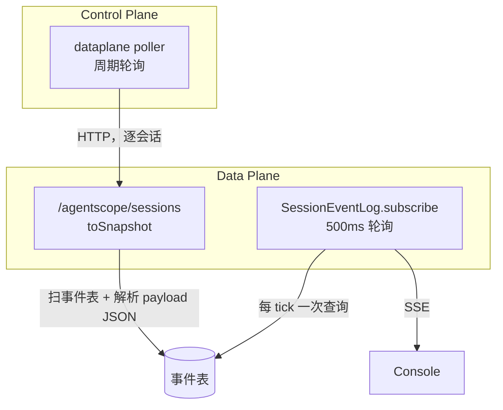

# 会话读路径成本：轮询与聚合重算

> 状态：待实施
> 问题域：**怎么读**——周期性轮询、聚合重算与实时订阅的开销
> 关联文档：[session-storage-topology.md](./session-storage-topology.md)（存在哪）、[transport-vs-storage.md](./transport-vs-storage.md)（怎么传）、[storage-followups.md](./storage-followups.md)

---

## 1. 问题概述

写入不是瓶颈，**读取模式才是**。当前有三条独立的周期性读路径，都在反复读取本可增量维护的数据。



---

## 2. 三条读路径

### 2.1 控制面轮询数据面快照

控制面的 poller 周期性调用数据面的 `/agentscope/sessions`，数据面在 `toSnapshot` 中为**每个会话**扫描事件表，并逐条调用 `extractUsage(payloadJson)` 解析 JSON 取 `usage.inputTokens` / `usage.outputTokens` 累加。

```java
private long[] extractUsage(String payloadJson) {
    Map<String, Object> payload = jsonHelper.readMap(payloadJson);
    Object usage = payload.get("usage");
    ...
}
```

这意味着：**每个轮询周期，每个活跃会话的全部历史事件都要被读出并反序列化一次**，只为算出几个累加值。会话越长，单次轮询越慢；会话越多，倍数放大。

信封型 + LOB 的表结构（见 [session-storage-topology.md §1.3](./session-storage-topology.md)）让这个问题无法用索引缓解——聚合必须解 JSON。

> 轮询间隔与单次返回上限的具体常量需在实施时复核。早前分析中提到的「返回上限截断导致 `ArchiveMissing` 误归档」需一并验证：如果快照列表被静默截断，未被返回的会话会被误判为消失。

### 2.2 实时订阅也是数据库轮询

`SessionEventLog.subscribe` 的实现是按游标轮询数据库：

```java
public Flux<SessionEventDto> subscribe(String sessionId, long afterSeq) {
    AtomicLong cursor = new AtomicLong(Math.max(0L, afterSeq));
    return Flux.interval(Duration.ofMillis(pollIntervalMs))
            .concatMap(tick -> Mono.fromCallable(() -> listAfter(sessionId, cursor.get()))
                    .subscribeOn(Schedulers.boundedElastic()))
            ...
}
```

默认间隔 500ms（`builder.session-event.poll-interval-ms`）。**每个打开的会话页面 = 每秒两次数据库查询**，与在线会话数成正比。

注释说明了这样做的原因：跨控制面/数据面、跨副本可见，不依赖进程内 sink。这个约束是真实的，但代价是把广播问题变成了轮询问题。

### 2.3 归属与实例解析

Managed 场景下所有会话共享同一批数据面实例，按 agent 查实例的路径需要额外处理（`ListBySource` 等）。这部分属于 Managed / Operate 融合的工作，不在本文档范围，详见对应计划。

---

## 3. 方案：窄索引表 + 增量维护

### 3.1 核心思路

聚合值在**写入时增量维护**，而不是在读取时重算。

索引表字段大致为：

```
session_id / agent_id / tenant / phase
object_prefix        ← transcript 分段位置（若走对象存储）
seq_high             ← 已写入的最大 seq
message_count
prompt_tokens / completion_tokens
last_event_at
```

行很小、可索引，且**这恰好就是 poller 现在每周期重算的那些值**。改为增量维护后：

- 控制面直接查索引表，不再逐会话回源数据面
- `toSnapshot` 不再扫事件表
- 列表、排序、过滤（「哪些会话超了 10 万 token」）变成一条 SQL

### 3.2 放弃 SSE，改显式自适应轮询（已决策）

**现有的「实时 SSE」本来就是轮询穿了层外壳**——§2.2 已说明服务端每 500ms 查库再套 SSE 帧。改为客户端每秒拉一次，平均延迟从约 250ms 变成约 500ms，用户无感。

而逐 token 打字机效果 `ChatPanel` 现在压根没有（从不传 `event_deltas`），加上已决策不持久化 delta，这部分成本早已付出，不是本次新放弃的能力。

换来的是三个最贵的问题一次性消失：

| 原问题 | 状态 |
|--------|------|
| 跨副本可见性 | 消失——共享存储任意副本可读，不需要实例亲和、SSE 代理或 Redis 广播 |
| 历史与实时的游标交接 | 消失——只剩一个数据源一个游标，重复渲染在结构上不可能发生 |
| 按 seq 索引的有界重放缓冲 | 不需要 |

**附带收益：轮询能退避，SSE 不能。** 挂着 SSE 的空闲页面永远是每秒两次数据库查询；客户端轮询可指数退避，空闲页面可降到十秒一次。会话大部分时间空闲时，轮询反而更便宜。

**唯一有功能代价的是工具确认**：`session.requires_action` 晚到几秒会让 agent 多阻塞几秒。用自适应间隔解决——用户发消息或确认工具后的数秒内收紧到约 300ms，之后退避。这正是用户注意力在页面上的时刻，收紧代价很小。

### 3.3 关键约束：不要直接轮询对象存储

若热数据也放在对象存储上，**延迟下限由 flush 节奏决定而非轮询间隔**：每秒拉一次但数据面 5 秒才 flush 一个分段，延迟就是 5 秒起。若把 flush 压到 1 秒，一个 5 分钟的 turn 会产生约 300 个小对象，compaction 从可选变成必需。

正确分层是**热尾留关系库，冷体进对象存储**：

| 层 | 位置 | 用途 | 保留 |
|---|---|---|---|
| 热尾 | Postgres，即现有 `builder_session_event` | 客户端自适应轮询，秒级新鲜度 | 短（如 24 小时） |
| 冷体 | 对象存储 JSONL 分段 | 历史回看、分页、审计 | 长期 |
| 索引 | Postgres 窄表 | 列表、聚合、定位分段 | 长期 |

### 3.4 与 transcript 方案的关系

`builder_session_event` 因此**不退役，而是降级为短保留的热尾表**——顺带解决它「没有保留策略、无限增长」的缺口（见 [session-event-completeness.md §3](./session-event-completeness.md)）。关系库负责热尾、查询与聚合，对象存储负责冷体正文。

---

## 4. 消费端：会话详情页的真实需求

会话详情页是读路径最硬的验收标准。当前存在两套完全不同的取数路径。

| | Build / ChatPanel | Operate / SessionDetailPage |
|---|---|---|
| 历史 | `listEvents(sessionId)` 拉全量事件 → `eventsToMessages` | `/api/v1/sessions/{id}/messages`,**实时转发给数据面**,`message-query` capability 门控 |
| 实时 | SSE `/events/stream`,可选 `event_deltas` 合并预览帧 | 5 秒 `refetchInterval` 轮询,且默认为空（事件上报默认关闭） |

改造后两者应收敛到同一份数据源。以下是设计必须满足的要求。

### 4.1 重复渲染的 bug 与单游标模型

后端两个端点都支持 `?after=` 游标（`DataSessionApiController.listEvents` / `streamEvents`，后者 `afterSeq` 默认 0）。但前端没有使用：`ChatPanel` 先 `listEvents(sessionId)` 拉全量，再 `streamEvents(sessionId, ...)` 且不传 `after`（该函数签名里根本没有这个参数），于是 SSE 从 seq 0 重放全部历史。

而 `handleManagedEvent` 只对 `user.message` 按 id 去重，`agent.message` 与 `agent.tool_use` 都是无条件 append。**结果：恢复已有会话时，助手消息与工具调用在界面上翻倍。**

采用 §3.2 的轮询模型后，这个类别的问题从根上消失：只有一个数据源、一个游标，不存在两条流需要合并。要求简化为两条：

1. 前端维护单一 `lastSeq`，每次 `GET /events?after=lastSeq` 后前移。
2. 渲染层按 `eventId` 幂等，作为重试与重复投递的兜底。

### 4.2 长会话需要倒序分页

`listEvents(sessionId)` 目前一次拉全量。改为对象存储后，打开长会话等于「列分段 + 拉 K 个分段」，K 大时首屏明显变慢。

分段 key 已编码 seq 区间，支持范围读，但需要：API 增加 `before` / `limit`（现仅有 `after`）；前端改为先加载最近 N 条、向上懒加载；compaction 控制 K。

### 4.3 自适应轮询间隔

固定间隔无法同时满足「工具确认要快」和「空闲页面要省」。建议按会话状态分档：

| 状态 | 间隔 | 理由 |
|------|------|------|
| 用户刚发消息 / 刚确认工具后的数秒 | ~300ms | 交互闭环期，`session.requires_action` 延迟直接阻塞 agent |
| turn 进行中 | ~1s | 观感上等同实时 |
| 会话空闲 | 指数退避至 ~10s | 空闲是常态，这里省下的是主要成本 |
| 页面不可见（`visibilitychange`） | 暂停 | 后台标签页不应产生查询 |

退避需在收到任意新事件时立即重置。

### 4.4 跨副本可见性（已消解）

此前将其列为阻塞项：内存总线是进程内的，若 SSE 连接落在未运行该会话的副本上会收不到事件，因而需要实例亲和或跨副本广播。

采用轮询模型后该问题不复存在——数据在共享存储里，任意副本都能读到。相应地，原先设想的「把 `ControlPlaneSessionTurnGate` 的 `holder` 从随机 UUID 改成 instanceId 以支撑 SSE 亲和」也不再需要，turn lock 保持其原有的并发互斥职责。

### 4.5 待确认的产品行为

已决策不持久化 delta，因此 turn 进行中刷新页面时，正在生成的半截回复会消失，需等 `agent.message` 落库后才出现。当前行为相同（delta 本就不落库），不构成回退。

长工具执行期间（如一条跑 60 秒的命令）界面会显得没有动静，因为 `agent.tool_use` 与 `agent.tool_result` 之间不产生事件。这是「只记录语义事件」这一粒度决策的后果，与是否使用 SSE 无关；若需改善，应考虑补充轻量的进度类语义事件。

> **去掉 SSE 前必须核实**：`event_deltas` 参数与 `SessionEventPreviewBus` 是否还有 `ChatPanel` 之外的消费方（如 paw 前端）。若有，移除 SSE 会一并干掉它们的流式帧。
>
> 附带发现：`ChatPanel` 从不传 `event_deltas`，因此当前 Build 侧**收不到任何流式帧**，回复一次性出现；`handleManagedEvent` 中的 `agent.token` 分支对应的事件类型也不由 `SessionEventMapper` 产生。

---

## 5. 实施要点

1. **先核实 `event_deltas` / `SessionEventPreviewBus` 的其它消费方**（§4.5），确认后再动 SSE。
2. 定义索引表 schema 与迁移。
3. 在事件写入路径上增量维护计数与 token 聚合（注意幂等：重放同一 seq 不应重复累加）。
4. 控制面读路径切到索引表；poller 停止逐会话回源计算指标。
5. 复核并修复快照列表截断导致的误归档。
6. 热尾/冷体分层：`builder_session_event` 降级为短保留热尾表并补上时间保留策略；对象存储承载冷体。
7. 退役 `SessionEventLog.subscribe` 的服务端轮询与 SSE 端点；前端改为 `GET /events?after=lastSeq` 显式轮询。
8. 前端实现自适应轮询间隔与页面不可见时暂停（§4.3）。
9. 事件读取 API 增加 `before` / `limit`；前端改为倒序分页加载。
10. 渲染层按 `eventId` 幂等去重。
11. Operate 的 messages 由「实时转发数据面」改为读 transcript，移除 `message-query` capability 门控。

## 6. 验收标准

- [ ] 轮询周期内的数据库查询量不再随「会话历史长度」增长
- [ ] 会话列表与 token 聚合可由单条 SQL 得到
- [ ] 增量聚合在事件重放 / 重试下保持幂等
- [ ] 快照列表不会因截断导致活跃会话被误归档
- [ ] 恢复已有会话时消息与工具调用不重复渲染
- [ ] 空闲会话页面的查询频率显著低于当前的 2 QPS，且有新事件时能及时恢复
- [ ] 后台标签页不产生查询
- [ ] 工具确认弹窗在用户发起操作后的交互闭环期内及时出现
- [ ] 数据面实例回收后，会话历史仍可完整查看
- [ ] 长会话首屏加载时间不随会话总长度线性增长
