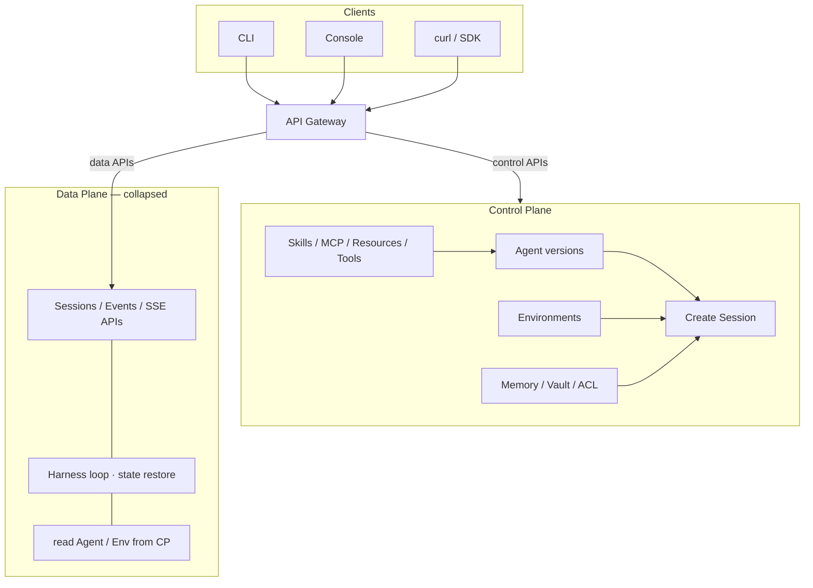
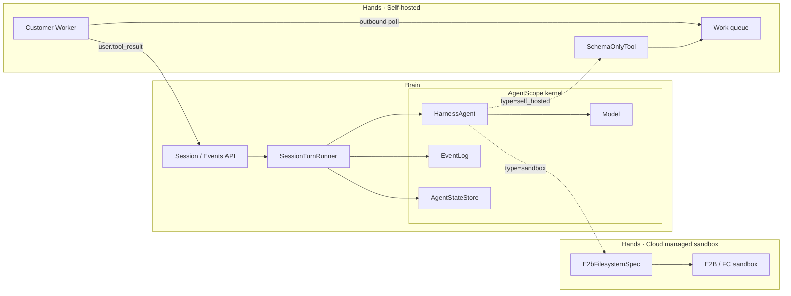
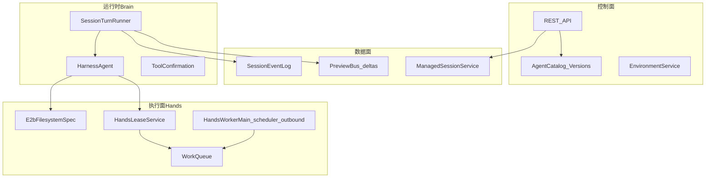

# Architecture · 架构与流程

[← Overview](01-overview.md) · [回目录](README.md) · [下一页：Quickstart →](03-quickstart.md)

---

AgentScope Service 采用与 Claude MA 类似的 **Brain（推理编排）与 Hands（工具执行）分离**：控制面定义资源，数据面持久化会话与事件，运行时在 Brain 侧跑 Harness；Hands 按 Environment 类型落在本机、E2B 云，或客户出站 Worker。

## 图 1 · 控制面

CLI / Console / curl → **API Gateway** → 按 API 面路由到控制面或数据面。本图展开控制面（Skills / MCP / Resources / Agent / Environment / Session 创建）；数据面同样对外暴露 API，此处折叠。

## 图 2 · 数据面（Brain / Hands）

Brain 负责推理与事件；Hands 分 Cloud managed sandbox（Brain 发起）与 Self-hosted Worker（出站续跑）。`HarnessAgent` / Model / EventLog / AgentStateStore 属 **AgentScope 内核**。

## 分层

| 层 | 职责 | 关键实现 |
|---|---|---|
| 控制面 | Agent / Environment / Memory / Vault / Deployment CRUD | Catalog、EnvironmentService |
| 数据面 | Session 状态、事件落库、SSE 扇出 | ManagedSessionService、SessionEventLog、PreviewBus |
| 运行时 | 抢租约、跑 turn、映射 AgentEvent → 会话事件 | SessionTurnRunner、SessionEventMapper |
| Hands | `sandbox`=E2B；`self_hosted`=出站 Worker 执行外化工具 | EnvironmentSpecFactory、HandsLeaseService、HandsWorkerMain |

## 一次 turn 的路径

1. 客户端 `POST /api/sessions/{id}/events`，`type=user.message`。
2. 事件落库；`SessionTurnRunner` 抢 **turn 租约**（冲突 → 409）。
3. Session 变为 `running`，发出 `session.status_running`。
4. 按 Session 绑定的 Agent 版本 + Environment + Memory/Vault 挂载解析/构建 HarnessAgent。
5. `HarnessAgent.streamEvents`；`SessionEventMapper` 将 harness 事件写成持久化类型（如 `agent.message`、`agent.tool_use`、`span.model_request_*`），流式增量走 PreviewBus（不落库）。
6. 正常结束 → `session.status_idle`；`self_hosted` 工具挂起 → `requires_action` + `agent.tool_use`，等 Worker `user.tool_result` 续跑；失败 → `session.error` + `session.status_terminated`。
7. 非挂起路径释放 Hands 租约与 turn 租约。

## Brain vs Hands

- **Brain**：持有模型上下文、工具决策、事件日志；可多副本，靠 JPA + `CoordinationStore` 协调 turn / HITL / work 队列。
- **Hands（按 Environment）**：
  - `local` — Brain 宿主进程内 FS（开发）
  - `sandbox` — **E2B 云沙箱**（`E2bFilesystemSpec`）；Brain 调 E2B API，不跑本机 Docker
  - `self_hosted` — 内置 shell/FS **外化为 SchemaOnlyTool**；纯出站 Worker（`HandsWorkerMain`，随 service-scheduler 发布）执行并回 `user.tool_result`

流式 `event_deltas` **仅 best-effort**，粘在持有 turn 的实例上；权威状态以落库事件为准。多副本 interrupt 等限制见 [Limitations](12-limitations.md) 与 [FOLLOW_UP_PRODUCTION.md](../WIP/FOLLOW_UP_PRODUCTION.md)。

## Environment 如何进入运行时

`EnvironmentSpecFactory` 按 `type` 把模板落到 Harness filesystem / sandbox 规格：

- `local` → 宿主机隔离 FS  
- `sandbox` → **E2B**（`agentscope-extensions-sandbox-e2b`）  
- `remote` → 分布式 KV FS（无 shell）  
- `self_hosted` → 禁用 Brain 本地 shell/FS 工具，注册外化 schema，入队 work 供 Worker 发现  

细节见 [Environments](05-environments.md)。实操验收见 [产品验证清单](14-validation.md)。
