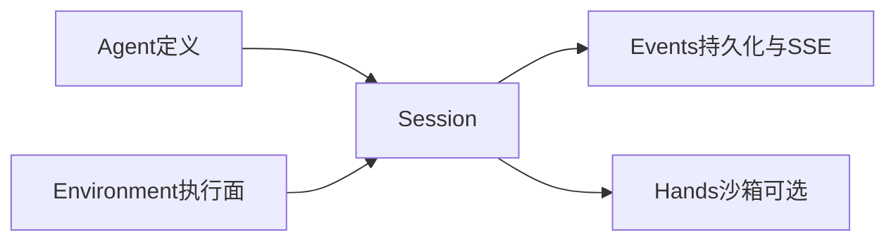

# AgentScope Service · Managed Agents 产品指南

面向开发者的产品说明：能力、架构与用法。结构对齐 Claude Managed Agents 概念（Agent / Environment / Session / Events），实现基于 AgentScope Harness。

| 文档 | 用途 |
|---|---|
| **本指南** | 叙事型产品说明与 curl 示例 |
| [MANAGED_AGENTS_API.md](../WIP/MANAGED_AGENTS_API.md) | HTTP 路由对照与缺口表 |
| [events/](../events/README.md) | 事件类型与错误契约 |
| [DATA_PLANE_CONTRACT.md](../WIP/DATA_PLANE_CONTRACT.md) | 数据面设计说明 |
| [FOLLOW_UP_PRODUCTION.md](../WIP/FOLLOW_UP_PRODUCTION.md) | 生产债与多副本限制 |
| [SELF_HOSTED_GAPS.md](../WIP/SELF_HOSTED_GAPS.md) | self_hosted Hands 待完善清单 |
| [SANDBOX_GAPS.md](../WIP/SANDBOX_GAPS.md) | Managed sandbox（E2B）待完善清单 |

## 核心概念

| 概念 | 含义 |
|---|---|
| **Agent** | 可版本化的配置：模型、`system`、tools / MCP / skills |
| **Environment** | 会话跑在哪里：`local` / `sandbox` / `remote` / `self_hosted` |
| **Session** | Agent × Environment 的一次有状态运行，事件落库可重放 |
| **Events** | 入站驱动 turn；出站描述进度；可选 SSE `event_deltas` 流式预览 |

## 章节导航

1. [Overview · 产品能力](01-overview.md)
2. [Architecture · 架构与流程](02-architecture.md)
3. [Quickstart · 第一个会话](03-quickstart.md)
4. [Agents · 控制面定义](04-agents.md)
5. [Environments · 执行面模式](05-environments.md)
6. [Sessions · 会话生命周期](06-sessions.md)
7. [Events · SSE 与 HITL](07-events.md)
8. [Hands / Worker · self_hosted](08-hands-worker.md)
9. [Memory & Vault](09-memory-vault.md)
10. [Deployments](10-deployments.md)（产品资源：cron / webhook）
11. [Auth & Sharing](11-auth-sharing.md)
12. [Limitations · 能力边界](12-limitations.md)
13. [部署运维 · 把服务跑起来](13-operations.md)
14. [产品验证清单 · 实操验收](14-validation.md)

建议阅读顺序：Overview → Quickstart → [产品验证清单](14-validation.md) → 按需深入；上线前必读 [部署运维](13-operations.md)。
