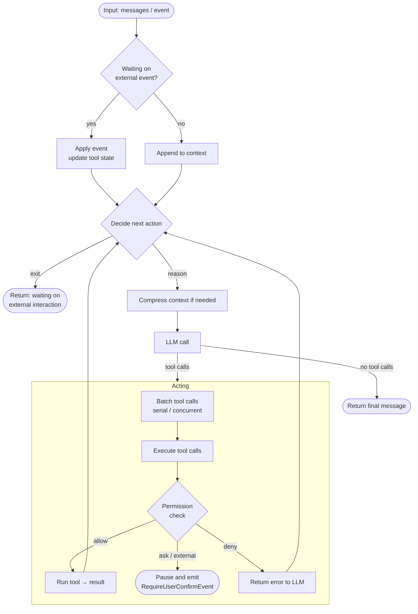

## Overview

`Agent` (`io.agentscope.core.agent.Agent`) is the common interface for agent execution. `ReActAgent` implements the fundamental reasoning-acting loop: the model reasons, calls tools and uses their results to continue until it can respond. This loop is the foundation of AgentScope Harness.

`HarnessAgent` wraps a `ReActAgent`, keeping that loop unchanged while adding built-in workspace, long-term memory, context compaction, skills, subagents, sandboxes, and session logging and recovery. **Start with `HarnessAgent` for most business applications.** Use `ReActAgent` directly when you need the underlying engine or want to compose these capabilities yourself. See [Quickstart](/v2/en/docs/quickstart) to get started and [Harness architecture](/v2/en/docs/harness/architecture) for the available capabilities.

This page explains the common underlying APIs using `ReActAgent` examples. For both agent types, share a configured Builder, build an instance for each direct request, and close it after execution; see [Instance lifecycle](#instance-lifecycle) for details.

### Core interface

The `Agent` interface composes three capability interfaces: `CallableAgent`, `StreamableAgent`, `ObservableAgent`. The most commonly used methods:

| Method | Description |
|--------|-------------|
| `call(List<Msg>)` / `call(List<Msg>, RuntimeContext)` | Run the reasoning-acting loop and return `Mono<Msg>` |
| `streamEvents(List<Msg>)` / `streamEvents(Msg)` | Same loop, but emits `AgentEvent`s incrementally |
| `observe(Msg)` / `observe(List<Msg>)` | Append messages to context without triggering reasoning (returns `Mono<Void>`) |

Both `ReActAgent` and `HarnessAgent` support structured output (`call(msgs, structuredOutputClass, runtimeContext)`) and convenient per-call metadata via `RuntimeContext`.

### Choose an invocation style for your application

| What you want to build | Use |
| --- | --- |
| Replies, structured extraction or one step in a workflow | `agent.call(input, ctx)` |
| Incremental text and tool progress within the current request | `agent.streamEvents(input, ctx)` |
| Background execution, durable queueing, guidance during work or interrupted-task continuation | Session operations from `agent.session(ctx)`, available on HarnessAgent |

Both `call` and `streamEvents` support ongoing conversations, and each call can include multiple reasoning steps and tool calls. With the default HarnessAgent configuration, both also save Session Log and checkpoints. Continue using direct calls if you only need conversation memory or history queries.

Start with direct calls below. For background task management, read [Session operations, events and recovery](/v2/en/docs/harness/session-log). To use hosted agents over HTTP, read the [Service Agent API](/v2/en/service/session-event-log).

### Main loop

Both `ReActAgent` and `HarnessAgent` run the same reasoning-acting loop for each `call`. The diagram below shows the main control flow:



## Instance lifecycle

**Share a configured Builder, call `builder.build()` for each request, and close that Agent when execution ends.** Configure the Builder at application startup and only build from it in handlers. Pass request identity and parameters in a fresh `RuntimeContext` instead of changing the shared Builder.

Use try-with-resources around synchronous execution and its wait. For reactive calls, use `Mono.using` / `Flux.using` to close on completion, error or cancellation. The application can manage shared model clients, pools, stores and skill repositories until shutdown. Shared tools and middleware must be thread-safe and must not store the current user or context in instance fields.

A new instance does not mean a new conversation. Harness restores committed state using stable `agentId`, `userId`, `sessionId` and storage configuration. A plain ReActAgent without a session log or `stateStore` cannot transfer history held only in the old instance to a new one.

**Sharing an Agent instance is also supported.** The execution engine is stateless, with session state addressed by identity. The application closes a shared instance at shutdown. Within one instance, the execution gate serializes direct calls for the same user/session while different sessions can run concurrently. Instances still own caches, execution gates and background resources; stateless does not mean lifecycle-free. The examples below use the recommended per-request pattern.

Background `AgentSession`, Channel and hosted runtimes are owned by their managers. Do not close their Agent when a submission request returns. Interrupting a direct call also requires its running instance; constructing another Agent cannot interrupt the old instance's execution.

## Configuring an agent

Define shared configuration with `ReActAgent.builder()`, then call `agentBuilder.build()` for each request. `.model(...)` takes either a `ModelRegistry`-resolved string id (most common — picks up env vars automatically) or an explicit `Model` instance (when you need explicit control over timeouts / custom endpoints / etc.).


<Tabs>


<Tab title="String model id (recommended)">

```java
import io.agentscope.core.ReActAgent;
import io.agentscope.core.tool.Toolkit;

ReActAgent.Builder agentBuilder =
        ReActAgent.builder()
                .name("my_agent")
                .sysPrompt("You are a helpful assistant.")
                // Resolved by ModelRegistry; reads DASHSCOPE_API_KEY automatically.
                // Switch providers by using "openai:gpt-5.5" / "anthropic:claude-sonnet-4-5"
                // / "deepseek:deepseek-v4-flash" / "gemini:gemini-2.0-flash" / "ollama:llama3".
                .model("dashscope:qwen-plus")
                .toolkit(new Toolkit());
```

</Tab>


<Tab title="Explicit Model builder">

```java
import io.agentscope.core.ReActAgent;
import io.agentscope.extensions.model.dashscope.formatter.DashScopeChatFormatter;
import io.agentscope.extensions.model.dashscope.DashScopeChatModel;
import io.agentscope.core.tool.Toolkit;

ReActAgent.Builder agentBuilder =
        ReActAgent.builder()
                .name("my_agent")
                .sysPrompt("You are a helpful assistant.")
                .model(
                        DashScopeChatModel.builder()
                                .apiKey("YOUR_API_KEY")
                                .modelName("qwen-max")
                                .stream(true)
                                .formatter(new DashScopeChatFormatter())
                                .build())
                .toolkit(new Toolkit());
```

</Tab>


<Tab title="With Toolkit / MCP">

```java
import io.agentscope.core.ReActAgent;
import io.agentscope.core.tool.Toolkit;
import io.agentscope.core.tool.builtin.TodoTools;
import io.agentscope.core.tool.mcp.McpClientBuilder;
import io.agentscope.core.tool.mcp.McpClientWrapper;

Toolkit toolkit = new Toolkit();
toolkit.registerTool(new TodoTools());          // reflectively register @Tool methods
toolkit.registerTool(new MyCustomTools());      // custom tool class

McpClientWrapper amap =
        McpClientBuilder.create("amap")
                .streamableHttpTransport(
                        "https://mcp.amap.com/mcp?key=" + System.getenv("AMAP_API_KEY"))
                .buildAsync()
                .block();
toolkit.registerMcpClient(amap).block();

ReActAgent.Builder agentBuilder =
        ReActAgent.builder()
                .name("my_agent")
                .sysPrompt("You are a helpful assistant.")
                .model("dashscope:qwen-max")
                .toolkit(toolkit);
```

</Tab>


</Tabs>


<Tip>

The `ModelRegistry` string form (`<provider>:<model>`) requires the matching model extension module on the classpath. It supports `dashscope` / `openai` / `openai-official` / `deepseek` / `anthropic` / `gemini` / `ollama` and reads the matching API key (`DASHSCOPE_API_KEY` / `OPENAI_API_KEY` / `DEEPSEEK_API_KEY` / `ANTHROPIC_API_KEY` / `GEMINI_API_KEY`) from the environment. For long-running scenarios that also need a workspace, session persistence, memory compaction, subagents, and so on, use [`HarnessAgent`](/v2/en/docs/harness/architecture) — it is a thin wrapper around `ReActAgent` with a largely identical builder.

</Tip>

### Builder fields

| Field | Type | Default | Description |
|-------|------|---------|-------------|
| `name` | `String` | required | Agent identifier, used for messages and logs |
| `sysPrompt` | `String` | required | The base system prompt |
| `model` | `Model` | required | The LLM driving reasoning (extends `ChatModelBase`) |
| `toolkit` | `Toolkit` | `new Toolkit()` | Manages tools, MCP clients, skills, and tool groups |
| `middlewares` | `List<? extends MiddlewareBase>` | `List.of()` | Applied to agent / reasoning / acting / model call / system prompt hooks |
| `stateStore` | `AgentStateStore` | `null` (no persistence) | When set, agent automatically loads/saves `AgentState` on every `call`, keyed by the `(userId, sessionId)` of the call's `RuntimeContext` |
| `defaultSessionId` | `String` | agent `name` | Fallback `sessionId` used when a call's `RuntimeContext` carries none |
| `permissionContext` | `PermissionContextState` | `DEFAULT` mode | Fine-grained tool execution rules, see [Permission System](/v2/en/docs/building-blocks/permission-system) |
| `maxIters` | `int` | `10` | Max iterations of the ReAct main loop |

## Running an agent

Below, `agentBuilder` is the shared application configuration. In fragments that omit the surrounding resource scope, `agent` is the instance created for the current request and closed after execution.

`call` and `streamEvents` accept the same input messages and drive the same reasoning-acting loop. They differ in how the result is delivered.

`call` returns `Mono<Msg>` and `streamEvents` returns `Flux<AgentEvent>`; both start on subscription. A CLI can wait with `block()` / `blockLast()`, while a WebFlux handler can return the publisher for the framework to subscribe. The caller owns this execution subscription; cancelling it cancels that execution.

Choose one entry point and subscribe once for each request. `streamEvents` starts an execution with live events; use log read APIs to query committed history.

### call

`call` consumes all events internally and returns the final `Msg` when the agent finishes or pauses for external interaction.

```java
import io.agentscope.core.agent.RuntimeContext;
import io.agentscope.core.message.Msg;
import io.agentscope.core.message.UserMessage;
import java.util.List;

UserMessage msg = new UserMessage("What files are in the current directory?");
RuntimeContext ctx = RuntimeContext.builder().userId("alice").sessionId("session-001").build();
try (ReActAgent agent = agentBuilder.build()) {
    Msg result = agent.call(List.of(msg), ctx).block();
    System.out.println(result.getTextContent());
}
```

### streamEvents

`streamEvents` emits `AgentEvent`s one by one so you can stream text, tool-call progress, and lifecycle events to your UI in real time. Dispatch on `event.getType()` to handle each kind:

```java
import io.agentscope.core.event.AgentEventType;
import io.agentscope.core.event.TextBlockDeltaEvent;
import io.agentscope.core.event.ToolCallStartEvent;

try (ReActAgent agent = agentBuilder.build()) {
    agent.streamEvents(new UserMessage("Summarize the README."), ctx)
            .doOnNext(event -> {
                if (event.getType() == AgentEventType.TEXT_BLOCK_DELTA) {
                    // Streaming text fragment — append to UI or stdout
                    System.out.print(((TextBlockDeltaEvent) event).getDelta());
                } else if (event.getType() == AgentEventType.TOOL_CALL_START) {
                    // The agent is about to call a tool — surface the call info
                    System.out.println("\n[tool] " + ((ToolCallStartEvent) event).getToolCallName());
                }
                // Other events: thinking blocks, tool results, reply end, etc.
            })
            .blockLast();
}
```

Full event-type and field reference: [Message and event](/v2/en/docs/building-blocks/message-and-event).

### observe

Use `observe` to inject a message into the agent's context without triggering a reply — useful in multi-agent setups where one agent observes another agent's output.

```java
agent.observe(otherAgentMsg).block();
```

## Multi-user / multi-session concurrency

Each request creates its own instance and `RuntimeContext` from the shared Builder. This WebFlux handler expression uses the previously configured `agentBuilder`:

```java
import reactor.core.publisher.Mono;

RuntimeContext ctx = RuntimeContext.builder()
        .userId(userId).sessionId(sessionId).build();
return Mono.using(
        agentBuilder::build,
        agent -> agent.call(new UserMessage(userInput), ctx),
        ReActAgent::close);
```

For a streaming HTTP response, use `Flux.using(agentBuilder::build, agent -> agent.streamEvents(input, ctx), ReActAgent::close)`. Let the web framework subscribe; do not close the Agent before subscription.

Different sessions can run concurrently. Per-instance execution gates do not coordinate other instances. Order requests to the same conversation in an application queue, or use an `AgentSession` owned by a background manager. Native journal fencing prevents competing writes but does not provide cross-instance FIFO queueing; a legacy `stateStore` alone is not a distributed execution lock.

The full Spring Boot example is `agentscope-examples/documentation/.../streaming/StreamingWebExample.java`.

## Execution control in session applications

Use `AgentSession` when a chat product needs work to continue after the page closes, durable task queueing, or coordinated recovery and pending-action handling. Ordinary conversations, streaming interfaces and applications managing their own HITL flow can continue using direct calls.

The session accepts new tasks through `submit`, receives guidance through `steer` / `inject`, and continues existing tasks through `respond` / `resume`. The framework owns background execution; frontends read snapshots and durable events. See the [session guide](/v2/en/docs/harness/session-log) for the complete workflow.

Choose direct calls or session operations to drive a given conversation; read-only history access can be shared. Observe an already submitted task by reading its events. Calling `streamEvents` would start another execution.

<Accordion title="Advanced: own a single execution">

`ReActAgent` and `HarnessAgent` provide `prepareRun(messages, context)` for events and `prepareCall(messages, context)` for the final reply. Both return an `AgentRun<T>` with a unique `runId()`. Preparing a handle does not execute the agent; subscribe once to `stream()` to start it.

```java
AgentRun<AgentEvent> run = agent.prepareRun(List.of(new UserMessage("Hello")), context);
String runId = run.runId(); // Register the handle in the application's run manager first.
run.stream().subscribe(this::onEvent, this::onError);

// A separate request can look up this handle by runId.
run.cancel();
```

- `cancel()` cancels the reactive execution immediately, including before subscription and while waiting for the session gate. Subscribers receive `CancellationException`. Cancelling queued B never interrupts running A or allows C to overtake A.
- `interrupt()` / `interrupt(message)` asks an admitted execution to stop at a cooperative checkpoint. ReActAgent returns its interrupted recovery reply; the handle then completes normally. Before admission, interruption cancels only that queued execution.
- `status()` returns `CREATED`, `QUEUED`, `RUNNING`, `COMPLETED`, `FAILED`, or `CANCELLED`. `QUEUED` includes setup before admission to the core lifecycle. `termination()` observes the terminal status without starting execution. Downstream subscription disposal also cancels the handle.
- A handle permits one subscription. Create a new handle for a new execution; repeated subscriptions are rejected. Terminal handles cannot interrupt later calls.

Run managers own lookup, authorization and terminal cleanup. The Agent does not retain a registry of RuntimeContext objects. Cancellation does not roll back external effects or forcibly terminate a blocking tool that ignores cancellation. Hard cancellation also does not promise the cooperative interrupted reply/state-save path.

</Accordion>

## Interrupt

The following applies to executions started with `call` / `streamEvents`. For interruption from another request, the application must locate the Agent instance running the target execution and remove and close it when execution ends. Use `agent.interrupt` for cooperative interruption. For tasks submitted through AgentSession, use `session.interrupt()` and follow the [session continuation guide](/v2/en/docs/harness/session-log#continue-after-interruption):

```java
import io.agentscope.core.agent.RuntimeContext;

// Identify the target session
RuntimeContext target = RuntimeContext.builder()
        .userId("alice")
        .sessionId("session-001")
        .build();

// Interrupt the in-flight call for that session
agent.interrupt(target);

// Attach a message to the interruption context
agent.interrupt(target, new UserMessage("User cancelled the operation"));
```

This convenience API selects the call currently running in `(userId, sessionId)`. It does not select a queued call: use its execution handle for that. Interrupting an idle session is a no-op. The signal itself belongs to the execution and is not persisted in AgentState.

**What happens after interrupt:**
- The current reasoning/tool execution is stopped at the next checkpoint (start of reasoning, start of acting, each streaming chunk)
- The agent returns a Msg tagged with `GenerateReason.INTERRUPTED`
- State is saved through the configured backend, and the next call reads the saved context. Pending tool interactions still require the corresponding answers; a tool’s internal execution progress is not restored

You can also use raw `(userId, sessionId)` strings:

```java
agent.interrupt("alice", "session-001");
agent.interrupt("alice", "session-001", interruptMsg);
```

## RuntimeContext (per-call context)

`RuntimeContext` (`io.agentscope.core.agent.RuntimeContext`) is a **per-call metadata bag**. Pass a separate instance to each call; tools and middlewares receive the context through their parameters. The agent does not expose a shared current-context getter or inject contexts into shared hook fields. Skill repository operations and `HarnessAgent.promoteSkill(name, reviewerId, ctx)` likewise take an explicit context; context-less repository operations use the default namespace.

It is **not** persistent state — `AgentState` (conversation context, compressed summaries, permission rules, tool state) covers that. `RuntimeContext` carries data that is scoped to a single invocation: tenant / userId / request-id, DB connections, audit loggers, feature flags, and so on.

### Built-in fields and attribute layers

`RuntimeContext` exposes three kinds of slot:

| Slot | Set via | Read via |
|------|---------|----------|
| Session fields | `sessionId(String)` / `userId(String)` | `getSessionId()` / `getUserId()` |
| String attributes (free-form key-value) | `put(String key, Object value)` | `<T> T get(String key)` |
| Typed attributes (inject business POJOs by `Class<T>`) | `put(Class<T> type, T value)` / `put(String key, Class<T> type, T value)` | `<T> T get(Class<T> type)` / `<T> T get(String key, Class<T> type)` |

Typed attributes power tool injection — declare a parameter of the matching type on a `@Tool` method and the framework supplies the value. See [Tool — Receiving context](/v2/en/docs/building-blocks/tool#receiving-context). String attributes are typically used for in-process coordination (e.g. middleware-to-middleware signalling). The two layers are isolated: typed values do not appear in `getExtra()` and vice-versa.

### Construct and pass

```java
import io.agentscope.core.agent.RuntimeContext;
import io.agentscope.core.message.Msg;
import io.agentscope.core.message.UserMessage;
import java.util.List;

RuntimeContext ctx =
        RuntimeContext.builder()
                .userId("alice")                                             // optional; null = anonymous
                .sessionId("session-001")                                    // selects the state slot
                .put("request_id", "req-abc-123")                            // string layer
                .put(UserContext.class, new UserContext("alice", "en"))      // typed layer (POJO)
                .build();

Msg result = agent.call(List.of(new UserMessage("Hi.")), ctx).block();
```

`ReActAgent` provides `RuntimeContext` overloads for `call` and `streamEvents` (plus deprecated `stream` overloads kept for compatibility). For event streams, pass the context explicitly with `streamEvents(msgs, ctx)`. When no context is passed the framework substitutes `RuntimeContext.empty()` (null session fields, empty attribute maps), and the agent falls back to its builder-time `defaultSessionId`.

### Who reads it

- **Tools** (`@Tool` methods and `ToolBase.callAsync`) — see [Tool — Receiving context](/v2/en/docs/building-blocks/tool#receiving-context).
- **Middleware** (every `MiddlewareBase` hook) — received as the second parameter `ctx`. See [Middleware — Reading RuntimeContext](/v2/en/docs/building-blocks/middleware#reading-runtimecontext).
- **All threads within the same call** — the internal maps are `ConcurrentMap`s, so middlewares and tools can read/write the same instance to coordinate.

### Relation to persistence

- Free-form / typed `RuntimeContext` attributes never enter `AgentState` and are never written back by the `AgentStateStore`.
- The `sessionId` / `userId` fields **do** drive persistence: each call activates the `(userId, sessionId)` state slot, so passing different identities on `RuntimeContext` retargets which `AgentState` is loaded and saved. When absent, the agent falls back to its builder-time `defaultSessionId`.

Runnable examples: `agentscope-examples/documentation/.../context/RuntimeContextExample.java`, `tool/ToolExecutionContextExample.java`.


<Note>

A legacy `ToolExecutionContext` (`io.agentscope.core.tool`) is `@Deprecated`. New code should use `RuntimeContext`. The legacy type is bridged automatically via `RuntimeContext.asToolExecutionContext()`, so existing code keeps working.

</Note>


## Human-in-the-loop

The examples below handle confirmations and external results through direct calls. Use the same conversation context (`ctx`) for the request and its answer. Your application manages the interaction UI and subsequent invocation. For durable pending actions and automatic task association, use [AgentSession.respond](/v2/en/docs/harness/session-log#answer-hitl-requests).

The agent pauses and emits a special event in two cases: a tool call requiring **user confirmation** (the permission system returned ASK), or a tool marked as **external execution** (the result must come from outside the agent). In both cases, you resume the agent by feeding the result back through the next `call`.

### User confirmation

When the permission system decides a tool call needs user approval, the agent emits `RequireUserConfirmEvent` and pauses.

**1. Receive `RequireUserConfirmEvent`** — use `streamEvents` to detect the pause. The event carries `getReplyId()` (used to resume) and `getToolCalls()` — a list of `ToolUseBlock` each exposing `getId()` / `getName()` / `getInput()`.

```java
import io.agentscope.core.event.RequireUserConfirmEvent;

agent.streamEvents(msg, ctx)
        .doOnNext(event -> {
            if (event instanceof RequireUserConfirmEvent confirm) {
                confirm.getToolCalls()
                        .forEach(
                                tc ->
                                        System.out.println(
                                                "Tool: "
                                                        + tc.getName()
                                                        + ", input: "
                                                        + tc.getInput()));
            }
        })
        .blockLast();
```

**2. Build confirm results** — construct a `ConfirmResult` per pending call. You can tweak the tool input on the way back; to remember a choice for identical future calls, pass explicit `PermissionRule`s in the `rules` argument (suggested rules surface on the permission engine's `PermissionDecision`, not on the tool call):

```java
import io.agentscope.core.event.ConfirmResult;
import java.util.ArrayList;
import java.util.List;

List<ConfirmResult> confirmResults = new ArrayList<>();
for (var tc : confirmEvent.getToolCalls()) {
    confirmResults.add(
            new ConfirmResult(
                    /* confirmed = */ true, // false to deny
                    /* toolCall  = */ tc)); // pass back (optionally modified)
}
```

**3. Resume the agent** — pass `confirmResults` to the next `call` via metadata:

```java
import io.agentscope.core.message.Msg;
import io.agentscope.core.message.UserMessage;
import java.util.Map;

UserMessage resumeMsg =
        UserMessage.builder()
                .metadata(Map.of(
                        Msg.METADATA_CONFIRM_RESULTS, confirmResults))
                .build();

Msg result = agent.call(List.of(resumeMsg), ctx).block();
```

- **Confirmed** tool calls execute immediately; the agent continues reasoning.
- **Denied** tool calls produce an error result visible to the LLM, which may try a different approach.
- **Accepted rules** are persisted in the permission engine — matching future calls will be auto-allowed without prompting.

### External tool execution

When the agent invokes a tool with `isExternalTool() == true`, it emits `RequireExternalExecutionEvent` and pauses. The tool's logic runs outside the agent — typically by a human operator or external system.

**1. Receive `RequireExternalExecutionEvent`** — same shape as user confirmation: `getReplyId()` plus a list of `getToolCalls()` awaiting external execution.

```java
import io.agentscope.core.event.RequireExternalExecutionEvent;

agent.streamEvents(msg, ctx)
        .doOnNext(event -> {
            if (event instanceof RequireExternalExecutionEvent ext) {
                ext.getToolCalls().forEach(tc ->
                        System.out.println("External execution: " + tc.getName() + "(" + tc.getInput() + ")"));
            }
        })
        .blockLast();
```

**2. Execute externally and build results** — run the action outside the agent and wrap each result as a `ToolResultBlock`:

```java
import io.agentscope.core.message.TextBlock;
import io.agentscope.core.message.ToolResultBlock;
import io.agentscope.core.message.ToolResultState;
import java.util.ArrayList;
import java.util.List;

List<ToolResultBlock> executionResults = new ArrayList<>();
for (var tc : externalEvent.getToolCalls()) {
    String output = runExternalOperation(tc.getName(), tc.getInput());
    executionResults.add(
            ToolResultBlock.builder()
                    .id(tc.getId())
                    .name(tc.getName())
                    .output(List.of(TextBlock.builder().text(output).build()))
                    .state(ToolResultState.SUCCESS)
                    .build());
}
```

**3. Resume the agent** — feed the results back as the next `call`'s input message. After the results are validated, they are injected into the agent context and the agent emits `ExternalExecutionResultEvent`; its `getReplyId()` matches the earlier `RequireExternalExecutionEvent#getReplyId()`. Reasoning then continues from where it paused.


<Tip>

Use `streamEvents` when building interactive UIs — it lets you detect pauses in real time and prompt the user immediately. Use `call` for programmatic flows that handle events automatically. Complete runnable examples: `agentscope-examples/documentation/.../hitl/PermissionHITLExample.java`.

</Tip>


## Configuring state persistence (AgentStateStore)

The examples below configure state storage for a directly built `ReActAgent`. `HarnessAgent` saves history and checkpoints in Session Log by default, without an additional `stateStore` setting; see [storage configuration](/v2/en/docs/harness/session-log#storage-and-backend-configuration). See [Context](/v2/en/docs/building-blocks/context#session-log-and-agentstatestore) for the relationship between the stores.

`AgentState` holds everything required to resume the agent — conversation context, compressed summaries, permission rules, tool state, and the current reply position. [`AgentStateStore`](/v2/en/integration/session/index) is its storage abstraction.

**Set `stateStore(...)` on the builder and the agent persists and recovers automatically**: every `call` writes `AgentState` back; the next time you call with the same `(userId, sessionId)`, it loads. The agent instance is stateless with respect to sessions — the slot is chosen per-call from the `RuntimeContext` (falling back to `defaultSessionId`).

```java
import io.agentscope.core.agent.RuntimeContext;
import io.agentscope.core.state.JsonFileAgentStateStore;
import java.nio.file.Paths;

ReActAgent agent = ReActAgent.builder()
        .name("my_agent")
        .sysPrompt("You are a helpful assistant.")
        .model(model)
        .toolkit(new Toolkit())
        .stateStore(new JsonFileAgentStateStore(
                Paths.get(System.getProperty("user.home"), ".agentscope/sessions")))
        .build();

// Pick the slot for this conversation. userId is optional (null = anonymous).
RuntimeContext rc = RuntimeContext.builder()
        .userId("user_123")
        .sessionId("session_789")
        .build();

// Auto-loaded if data exists for (user_123, session_789); auto-persisted when the call completes.
agent.call(List.of(new UserMessage("Resume the previous task.")), rc).block();
```

Built-in and extension implementations:

| Implementation | Module | When to use |
|----------------|--------|-------------|
| `InMemoryAgentStateStore` | `agentscope-core` | unit tests / single-process demos |
| `JsonFileAgentStateStore` | `agentscope-core` | single-machine dev; JSON per `(userId, sessionId)` directory |
| `RedisAgentStateStore` | `agentscope-extensions-redis` | multi-replica production; shared across processes and nodes |
| `JdbcAgentStateStore` | `agentscope-extensions-jdbc` | when state must live in a relational store (audit / reporting) |

A single `sessionId` is enough for most cases. For per-user partitioning, also set `userId` on the `RuntimeContext`; the store addresses each slot by the `(userId, sessionId)` pair.

Use `agent.getAgentState(userId, sessionId)` or `agent.getAgentState(runtimeContext)` to inspect a specific session's state:

```java
AgentState state = agent.getAgentState("alice", "session-001");
state.getContext().size();                  // current message count
String json = state.toJson();               // serialize to JSON
```

For full field-by-field details, cross-node continuation, and how the state store interacts with compaction / Plan Mode / subagents, see [Context & AgentState](/v2/en/docs/building-blocks/context) and [Context management](/v2/en/docs/harness/context).

## Structured Output

Structured output forces the agent to respond according to a JSON Schema you specify, rather than free-form text. Use it whenever your code needs to consume the agent's output programmatically — form filling, data extraction, classification, etc.

### Basic usage

Pass a Java class (or `JsonNode` schema) to `call`:

```java
import io.agentscope.core.message.Msg;
import io.agentscope.core.message.UserMessage;

// Define the output structure
public record WeatherResponse(String location, String temperature, String condition) {}

Msg result = agent.call(List.of(new UserMessage("What's the weather in SF?")), WeatherResponse.class).block();

// Extract strongly-typed data from the result
WeatherResponse weather = result.getStructuredData(WeatherResponse.class);
System.out.println(weather.location());      // "San Francisco"
System.out.println(weather.temperature());   // "18°C"
```

Structured output works alongside tools — the agent can call tools to gather information first, then emit the final result in the specified schema.

### How it works

The framework automatically selects the implementation path based on model capabilities:

| Path | Condition | Behavior |
|------|-----------|----------|
| **Native** | Model supports `response_format` with tools (OpenAI, DashScope, etc.) | JSON Schema is passed directly to the model API via `response_format`; the model guarantees valid JSON output, and the loop terminates naturally |
| **Fallback** | Model lacks native structured output (Anthropic, Ollama, etc.) | A synthetic `generate_response` tool is injected with an instruction hint; the model calls this tool to emit its structured result |

Either way, the caller's code is identical — path selection is transparent.

```
┌─── call(msgs, Schema.class) ───┐
│                                │
│   model.supportsNative...?     │
│      ├─ yes → response_format  │  ← zero overhead, model-native
│      └─ no  → generate_response│  ← synthetic tool + instruction
│                                │
└──── returns Msg with schema ───┘
```

### Reading the result

The `Msg` returned by `call` carries the parsed structured data in its metadata:

```java
// Option 1: strongly-typed extraction
WeatherResponse data = result.getStructuredData(WeatherResponse.class);

// Option 2: read as Map
@SuppressWarnings("unchecked")
Map<String, Object> map = (Map<String, Object>) result.getMetadata().get("_structured_output");
```

### Using a JsonNode schema

If you prefer not to define a Java class, pass a raw JSON Schema:

```java
import com.fasterxml.jackson.databind.JsonNode;
import com.fasterxml.jackson.databind.ObjectMapper;

ObjectMapper om = new ObjectMapper();
JsonNode schema = om.readTree("""
    {
      "type": "object",
      "properties": {
        "sentiment": { "type": "string", "enum": ["positive", "negative", "neutral"] },
        "confidence": { "type": "number" }
      },
      "required": ["sentiment", "confidence"]
    }
    """);

Msg result = agent.call(List.of(new UserMessage("Analyze the sentiment of this review")), schema).block();
```

## More capabilities

The following features are configured via the builder. See their respective documentation for details:

### Model fault tolerance

```java
ReActAgent.builder()
        .model("dashscope:qwen-plus")
        .maxRetries(3)                              // auto-retry on model call failure
        .fallbackModel("dashscope:qwen-max")        // switch to fallback after consecutive failures
        .failoverListener((primary, error) ->       // observe the switch: which model failed, and why
                metrics.recordFailover(primary.getModelName(), error))
        .build();
```

The failover listener is invoked synchronously at the switch site with the original error — the
only in-process signal of the switch, since the primary's error never reaches the event stream or
the middlewares. Implementations must be non-blocking and thread-safe; exceptions they throw are
logged and ignored without affecting the switch.

### Skills

Skills are hot-loadable Markdown prompt modules that the LLM activates on demand:

```java
ReActAgent.builder()
        .skillRepository(new MysqlSkillRepository(dataSource))
        .build();
```

### Built-in tools

| Builder method | Description |
|---|---|
| `enableMetaTool(true)` | Registers `list_tools` / `activate_group` meta tools — lets the LLM discover and switch tool groups |
| `enableTaskList()` | Registers task-list tools — lets the LLM decompose complex tasks into steps and track progress |

## Further reading


<CardGroup cols={2}>


<Card title="Permission System" href="/v2/en/docs/building-blocks/permission-system">


Control which tools the agent can call, and under what conditions.

</Card>


<Card title="Middleware" href="/v2/en/docs/building-blocks/middleware">


Intercept and modify agent behavior at the agent, reasoning, acting, and model-call hooks.

</Card>


</CardGroup>
