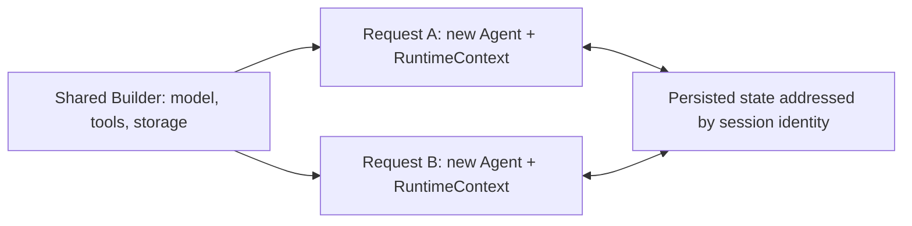

<span id="how-this-page-relates-to-harness-context-construction" />

## How this page relates to context management

This page explains **where session state lives, how it is persisted and restored, and how tools
access the current call's state**. For preparing each model request, adding business information,
tracking tasks, and compacting history, see [Context management](/v2/en/docs/harness/context).

| Concept | Responsibility | Sent directly to the model? |
| --- | --- | --- |
| AgentState | Conversation history, task state, plan mode and permissions | Not as a whole; request construction selects content |
| RuntimeContext | Current call identity, attributes and AgentState reference | Arbitrary attributes are not automatically prompt content |
| Model request context | Instructions, messages, state projections, references and tool schemas for one inference | Yes; not a raw serialization of persisted state |

Harness projects task state into transient TASK_STATE and loads MEMORY.md as reference data.
These generated messages are not thereby appended to durable history. Plain ReActAgent does
not automatically enable the Harness material and budget policies.

## Stateless Agent Engine

`ReActAgent` and `HarnessAgent` separate model/tool configuration from conversation state. Configure a shared Builder at startup and build and close an independent Agent per request. Stable identity and storage continue a conversation without retaining the previous request's Java object. Lifecycle guidance and the shared-instance option are centralized in [Agent](/v2/en/docs/building-blocks/agent#instance-lifecycle).



Instances still own execution gates, caches and background resources, and should be closed after execution. A new instance restores committed state. If a plain Core Agent has no log or state store configured, history held only in the old instance is not transferred.

Tools and middleware access the current session through the injected `RuntimeContext.getAgentState()`, without a global current-state field. Creating an Agent does not copy all business dependencies or replace authorization. Shared dependencies must support concurrent access. The application coordinates execution of the same conversation across instances; see [Concurrent usage](#concurrent-usage).

## AgentState

An [`AgentStateStore`](/v2/en/integration/session/index) persists an **`AgentState`** (`io.agentscope.core.state.AgentState`) — a complete snapshot of everything that makes the agent restartable:

| `AgentState` field | Content |
|---|---|
| `getSessionId()` | The session identifier this state belongs to |
| `getUserId()` | The user identifier (nullable for anonymous sessions) |
| `getContext()` / `contextMutable()` | Current conversation history (user / assistant / tool calls / tool results) |
| `getSummary()` | Compacted summary (when compaction is enabled) |
| `getPermissionContext()` | Tool permission rules — see [Permissions](/v2/en/docs/building-blocks/permission-system) |
| `getPlanModeContext()` | Whether Plan Mode is active, current plan file path |
| `getTasksContext()` | Todo, revision, and optional objective, requirements, evidence-binding versions and verification summaries |
| `getToolContext()` | Active toolkit groups (`activatedGroups`) |

Execution controls are separate from `AgentState`: each invocation owns an independent interrupt signal. See [Per-session interrupt](#per-session-interrupt) below.

In LEGACY or Core agents without native logging, the end of each call writes the entire `AgentState` to the state store under the key `agent_state`, addressed by the call's `(userId, sessionId)`. The next `call()` with the same `(userId, sessionId)` loads it back automatically. A shared store lets other instances load successfully persisted state. It does not guarantee real-time consistency between concurrent calls or recover unsaved progress and external side effects.

### Task state is not automatic business acceptance

Todo is updated by todo_write or the application; the application sets task identity and objective
through beginTask. The optional proposal tool only creates candidates; a trusted caller confirms
or rejects through decide. The application maintains subject versions, and explicit
VerificationService calls produce verification summaries.

Persisting fields does not automatically infer them from user messages, PLAN.md or tool text.
Progress completion, confirmed requirements and passed checks have different meanings; none
automatically establishes overall completion. Harness taskContext options control projection.
See [Optional task information](/v2/en/docs/harness/context#optional-task-information)
for the field/writer mapping and display configuration.

### Session Log and AgentStateStore

`call` / `streamEvents` and `AgentSession` use the same conversation storage configuration. Multi-turn context, history queries and persistence do not require session scheduling. Introduce [AgentSession](/v2/en/docs/harness/session-log) for background tasks, durable queues or coordinated interruption and continuation. For direct calls, start with the [Quick Start](/v2/en/docs/quickstart).

HarnessAgent defaults to EVENT_LOG: existing native checkpoints plus applicable facts restore AgentState, and saves commit checkpoints to the log. AgentStateStore is no longer that session's recovery authority. LEGACY and Core agents without native logging use the state-store flow below.

Native history follows Workspace Filesystem, including distributed backends, or an explicit sessionLogStore. Keep stable agentId, userId, sessionId, namespace and storage consistent. See [Session logs](/v2/en/docs/harness/session-log) for inspection, reconciliation and continuation. StateStore-only examples below explicitly select LEGACY; default EVENT_LOG also needs shared native history.

### The auto-persistence and recovery flow

```
call(msgs, RuntimeContext(userId, sessionId))
  │
  ├─ per-session gate: serialise same (uid, sid), others run in parallel
  │
  ▼
  reload from store on each call if configured; otherwise use slot cache
  │   inject onto RuntimeContext: rc.setAgentState(state)
  │
  ▼
  reasoning loop
  │   messages update context; Plan, Todo and permissions update their own substate
  │   Harness builds transient model views; validates before committing compacted history
  │
  ▼
  save AgentState
  │   stateStore.save(userId, sessionId, "agent_state", state)
  │
  ▼
  return result
```

This wiring lives in `ReActAgent` itself; `HarnessAgent` inherits it for free. The agent instance holds no fixed session — each call reads / writes the slot named by its `RuntimeContext` (falling back to the builder-time `defaultSessionId`).

> Reasoning mainly updates in-memory state. Normal completion, controlled failure/interruption and shutdown paths attempt to save agent_state; forced process termination may prevent saving. Administrative operations such as clearContext can also save explicitly. Execution observations and verification reports write separate state keys, so the store does not necessarily receive only one write per call.

### Built-in and extension implementations

Anything implementing `io.agentscope.core.state.AgentStateStore` works. Pick by deployment shape:

| Implementation | Module | Use case |
|---|---|---|
| `InMemoryAgentStateStore` | `agentscope-core` | Unit tests / single-process demos; lost on exit |
| `JsonFileAgentStateStore` | `agentscope-core` | Local dev with file persistence; not cross-node. **`HarnessAgent` LEGACY default**, rooted at `~/.agentscope/state/<agentId>/` (override the base via the `agentscope.state.home` system property); **single-host** |
| `RedisAgentStateStore` | `agentscope-extensions-redis` | **Production default** for multi-replica deployments; supports Jedis / Lettuce / Redisson (Standalone / Cluster / Sentinel) |
| `JdbcAgentStateStore` | `agentscope-extensions-jdbc` | When state needs to flow into a relational store (audit, reporting) |

Switching is one call at builder time:

```java
// Default (single host) — omit .stateStore(...); a local JsonFileAgentStateStore is used automatically
HarnessAgent agent = HarnessAgent.builder()
    .legacySessionHistory(true)
    .name("MyAgent")
    .model(model)
    .workspace(workspace)
    .build();

// Production multi-replica — use DistributedStore
JedisPooled jedis = new JedisPooled("redis://redis.prod:6379");
HarnessAgent agent = HarnessAgent.builder()
    .legacySessionHistory(true)
        .name("MyAgent")
        .model(model)
        .workspace(workspace)
        .stateStore(new RedisAgentStateStore(jedis))
        .distributedStore(RedisDistributedStore.fromJedis(jedis))
        .build();
```


<Warning>

The built-in `JsonFileAgentStateStore` / `InMemoryAgentStateStore` are single-host only. If you've already chosen `filesystem(SandboxFilesystemSpec)` or `filesystem(RemoteFilesystemSpec)` (distributed workspace), HarnessAgent in LEGACY mode **rejects** a local state store at build time with `IllegalStateException` — sandbox state must be shared across replicas. Configure a distributed store via `.distributedStore(...)` (e.g. `RedisDistributedStore`) or `.stateStore(...)`.

</Warning>


### Resume saved sessions across processes and machines

With a shared store, each call reloads the slot's persisted state. This example assumes node A has finished saving before node B continues, not concurrent execution of the same session:

```java
// Node A — start a conversation
HarnessAgent agentA = HarnessAgent.builder()
    .legacySessionHistory(true)
    .stateStore(redisStore)
    /* ... */ .build();
agentA.call(msg, RuntimeContext.builder()
    .sessionId("alice-2026-06-02-001")
    .userId("alice")
    .build()).block();

// Node B — different physical machine, separate JVM
HarnessAgent agentB = HarnessAgent.builder()
    .legacySessionHistory(true)
    .stateStore(redisStore)
    /* same state store */ .build();

// Node B's first call() with the same (userId, sessionId) loads the AgentState node A left in Redis
agentB.call(nextMsg, RuntimeContext.builder()
    .sessionId("alice-2026-06-02-001")
    .userId("alice")
    .build()).block();
```

This buys you:

- **Recovery**: another node can load the last successfully saved snapshot. Unsaved progress may be lost; reconcile external tool effects before replaying work.
- **Rolling deploys**: graceful shutdown attempts to save, and a new instance loads persisted state. Allow shutdown time and verify that state formats and business configuration remain suitable.
- **Cross-surface continuity**: Web UI and CLI can continue saved sessions with the same store and identity slot; the application must authorize access.

The identity pair selects the state slot. Anonymous/single-tenant calls may omit userId; multi-tenant applications must obtain it from trusted authentication, not arbitrary client input.

Cross-instance concurrency also needs session routing or distributed coordination. Versioned stores use CAS on save, with ConflictPolicy determining conflict handling; unversioned stores lack this protection. CAS does not undo external tool side effects.

### Multi-user isolation

`sessionId` and `userId` solve different problems:

- **`sessionId`** — which conversation this is; independent `AgentState` snapshot.
- **`userId`** — which user owns this conversation; also drives which user's namespace files land in, see [Filesystem](/v2/en/docs/harness/filesystem).

```java
agent.call(msg, RuntimeContext.builder()
    .sessionId("alice-1").userId("alice").build()).block();

agent.call(msg, RuntimeContext.builder()
    .sessionId("bob-1").userId("bob").build()).block();
```

Different identity pairs select different state slots; filesystem sharing separately depends on IsolationScope. Set RuntimeContext.userId after authentication and authorization: the store addresses each slot by `(userId, sessionId)` (with `RedisAgentStateStore` the `userId` becomes part of the Redis key) rather than relying on filesystem path bucketing.

### Reading and writing `AgentState` directly

For out-of-loop reads such as administration or auditing, address state by identity. Do not mutate it concurrently with an active call. Obtaining or changing the object does not itself persist it or provide a transaction or authorization check:

```java
import io.agentscope.core.state.AgentState;

AgentState state = agent.getAgentState("alice", "session-001");
System.out.println("messages: " + state.getContext().size());

String json = state.toJson();
AgentState restored = AgentState.fromJsonString(json);
```

| Method | Description |
|------|------|
| `getContext()` | Current conversation history (immutable view) |
| `contextMutable()` | Writable view, use with care |
| `setSummary(...)` / `getSummary()` | Custom compaction summary (for your own compaction middleware) |
| `toJson()` / `fromJsonString(String)` | Serialize / deserialize |

### Clearing a session's conversation context

In EVENT_LOG mode, `getAgentState()` returns a detached native projection. `clearContext()`, permission changes and `saveAgentState()` commit a native checkpoint with writer leases and version checks. Existing get→mutate→save calls remain supported, but stale snapshots are rejected; prefer `updateAgentState(rc, reason, mutation)` for atomic administration. Clearing working context retains full history. Direct AgentStateStore edits do not affect native sessions.

To let a user start a fresh topic without creating a new session, call `clearContext`. It keeps the
same `(userId, sessionId)` and preserves non-conversation state such as permissions, tools, tasks,
and Plan Mode. It clears the historical message buffer and compaction summary, then immediately
persists a native checkpoint in EVENT_LOG mode, or saves the configured AgentStateStore in LEGACY mode.

```java
agent.clearContext("alice", "session-001");

// Or use the same RuntimeContext used by calls.
agent.clearContext(RuntimeContext.builder()
    .userId("alice")
    .sessionId("session-001")
    .build());
```

Call it after the session's current request has completed; it does not cancel an in-flight call.
The next request can still load System, workspace references and retained task/plan projections.
It is not a complete model-input reset. For a fresh session, use a new sessionId rather than merely clearing history.


<Note>

The 1.0 `Memory` interface (`InMemoryMemory` / `LongTermMemory`, etc.) is `@Deprecated(forRemoval = true)` in 2.0. New code should use `AgentState.getContext()` + an `AgentStateStore`; `Memory` remains only as a source-compat shim.

</Note>


### Per-session interrupt

Each execution owns a runtime-only `InterruptControl`. It is neither stored on `AgentState` nor persisted with conversation history. A session-targeted interrupt resolves the currently admitted execution:

```java
agent.interrupt("alice", "session-001");
agent.interrupt("alice", "session-001", new UserMessage("Please stop."));
```

An idle session is unaffected. Tasks submitted through AgentSession use `session.interrupt()`, or `session.interrupt(runId)` to reject a stale request targeting a newer execution. Continue the original task with `session.resume(turnId)`; see the [session guide](/v2/en/docs/harness/session-log).

The reasoning loop checks its execution's signal at cooperative checkpoints. A user interrupt produces an interrupted recovery reply and saves conversation state. The deprecated no-argument `interrupt()` targets the default session's current execution, never the most recently used context.

`AgentState.shutdownInterrupted` is a separate, persisted recovery marker. Graceful shutdown binds both the execution control and the state resolved for that call; queued calls have no state to save. No interrupt flag is carried into the next run or loaded on another node.

### Concurrent usage

Configure this Builder at startup, then build separate instances for Alice and Bob. The workspace must persist between requests; replicas also need access to the same native log backend.

```java
import io.agentscope.core.agent.RuntimeContext;
import io.agentscope.core.message.Msg;
import io.agentscope.harness.agent.HarnessAgent;
import reactor.core.publisher.Mono;

HarnessAgent.Builder agentBuilder = HarnessAgent.builder()
        .name("Assistant").agentId("assistant")
        .model(model).workspace(workspace);

Mono<Msg> aliceCall = Mono.using(
        agentBuilder::build,
        agent -> agent.call(aliceMsg, RuntimeContext.builder()
                .userId("alice").sessionId("s1").build()),
        HarnessAgent::close);
Mono<Msg> bobCall = Mono.using(
        agentBuilder::build,
        agent -> agent.call(bobMsg, RuntimeContext.builder()
                .userId("bob").sessionId("s2").build()),
        HarnessAgent::close);

Mono.zip(aliceCall, bobCall).block();
```

Different sessions can run concurrently. Order requests to the same conversation in the application, or queue them through an `AgentSession` with a background owner. Per-instance gates do not coordinate other instances. Native journal writer fencing prevents competing commits; it does not guarantee automatic waiting or FIFO order across instances.

Interrupting from another request requires the currently executing instance; a new Agent does not hold the old call's interrupt signal. Close request Agents after execution to release their caches and runtime resources. Close application-owned model clients and pools at application shutdown.

---

## `RuntimeContext` — per-call metadata

`RuntimeContext` (in `io.agentscope.core.agent`) is a lightweight per-call carrier passed to `agent.call(msgs, ctx)`; hooks and tools share it for the duration of one call. Its free-form / typed attributes are **not automatically persisted or included in model messages**; its `sessionId` / `userId` fields select which `AgentState` slot the state store loads and saves for this call. At call entry, the framework injects the call-scoped `AgentState` onto the `RuntimeContext` so that middleware, tools, and hooks can access the correct per-call state via `ctx.getAgentState()`.

```java
import io.agentscope.core.agent.RuntimeContext;

RuntimeContext ctx = RuntimeContext.builder()
        .userId("alice")
        .sessionId("s-001")
        .put("request_id", "req-2026-06-01-abc")
        .put(MyTenantInfo.class, new MyTenantInfo("tenant-7"))
        .build();

Msg result = agent.call(List.of(new UserMessage("Hi")), ctx).block();
```

Available accessors:

| Method | Description |
|------|------|
| `getSessionId()` / `getUserId()` | Built-in fields used to route the state slot and tenant |
| `getRunId()` | Stable per-call correlation id (see [runId correlation](#runid-correlation) below), never null |
| `getAgentState()` / `setAgentState(AgentState)` | Call-scoped `AgentState`, injected by the framework at call entry. Middleware and tools should read state from here, not from `agent.getAgentState()` |
| `resolveAgentState(ctx, agent)` | Static helper: returns `ctx.getAgentState()` if available, falls back to `agent.getAgentState()`. Ensure the current call has injected its state; fallback does not guarantee the intended business session |
| `get(String)` / `put(String, Object)` | String-keyed get/put |
| `get(Class<T>)` / `put(Class<T>, T)` | Typed singleton get/put |
| `getExtra()` | Direct access to the string-attribute map (mutable view) |
| `RuntimeContext.empty()` | Empty context |

### runId correlation

Every `RuntimeContext` carries a never-null `runId`: a non-blank value supplied via `builder().runId(x)` is kept as-is; otherwise (unset or blank) `build()` generates one (32-char hex). Its purpose is to tie a **single execution** together across the execution layer and the product layer:

- Middleware, tools, logs, and tracing can all correlate one invocation via `ctx.getRunId()` — under multi-session concurrency, grepping a single runId recovers the full trace of that call;
- Handles created by `prepareRun` / `prepareCall` adopt the context's runId, so `run.runId() == ctx.getRunId()` — naturally aligned with the `AgentRunRegistry` registration key, the SSE `SESSION_RUN_STARTED` event, and the id the frontend uses to cancel a run;
- Subagent contexts are derived via `RuntimeContext.builder(parentRc)`, which copies the runId, so subagents spawned through `agent_spawn` inherit the parent call's id — even when the subagent gets an independent sessionId, the chain id keeps the whole execution linked.

```java
// Orchestration layer threading an explicit chain id (uniqueness is the caller's job):
RuntimeContext ctx = RuntimeContext.builder()
    .userId("alice")
    .sessionId("s-001")
    .runId("trace-2026-09-25-0001")   // spans the whole multi-agent flow
    .build();

// Correlate this execution from middleware / tools:
log.info("[runId={}] tool executed", ctx.getRunId());

// Handle and execution layer share the same id:
AgentRun<Msg> run = agent.prepareCall(msgs, ctx);
assert run.runId().equals(ctx.getRunId());
```

Create a fresh `RuntimeContext` for each prepared execution. To retain session attributes while starting another run, use `RuntimeContext.builder(previous).runId(null).build()`; this also applies when resuming the same Turn after an external tool result. Derived subagent contexts can retain the parent runId for correlation. With native Session Log enabled, a prepared execution cannot reuse a runId already recorded in that session, and `AgentRunRegistry` rejects concurrent duplicate runIds in the Service.


<Tip>

**The `AgentStateStore` is bound at builder time and cannot be switched per call via `RuntimeContext`.** What *does* vary per call is the `(userId, sessionId)` slot it addresses — set `userId` for per-user isolation (or a custom `keyPrefix` on the store); do not try to hand each call a different state store instance.

</Tip>


<Tip>

**Accessing `AgentState` from middleware and tools:** Always use `RuntimeContext.resolveAgentState(ctx, agent)` rather than `agent.getAgentState()` during call execution. The deprecated no-argument agent.getAgentState() returns the anonymous default-session slot, not the last active session. ctx.getAgentState() is the current call's state. resolveAgentState still falls back when it is absent; fallback is not a session-routing guarantee.

</Tip>


---

## Related pages

- [Context management](/v2/en/docs/harness/context) — organize model input, track task progress, and bound context through summarization and tool-result offloading
- [Agent](/v2/en/docs/building-blocks/agent) — full `ReActAgent` API and builder fields
- [Memory](/v2/en/docs/harness/memory) — long-term memory, background maintenance
- [Permissions](/v2/en/docs/building-blocks/permission-system) — persistence of permission rules
