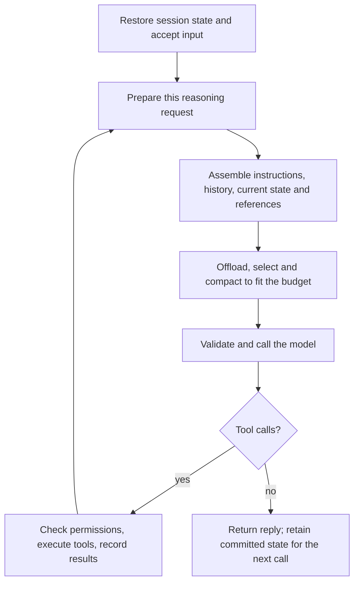

An agent debugging a change may read project rules, inspect code, run tests, and revise its plan many times before replying. At every reasoning step, the model needs the current goal, relevant evidence, available tools, and enough recent conversation to choose its next action. Sending an ever-growing transcript alone does not meet that need.

`ReActAgent` provides the reasoning–tool–result loop. `HarnessAgent` uses that same loop and adds context assembly, workspace materials, task projections, budgeting, and conversation compaction. Use `HarnessAgent` for the configuration below; a plain `ReActAgent` does not install this pipeline. For persistence and the distinction between `RuntimeContext` and `AgentState`, see [Context & AgentState](/v2/en/docs/building-blocks/context).



## Start from the session's working state

At call entry, the Agent restores the session's committed working state and accepts the new input. The conversation can contain earlier user and assistant messages, tool calls, tool results, and a summary from an earlier compaction. New tool results join this working context before the next reasoning step. A single `call()` can therefore prepare many model requests.

Configure a shared Builder at application startup. Build and close an Agent for each direct request, keeping the same identity and storage configuration when continuing a conversation:

```java
import io.agentscope.core.agent.RuntimeContext;
import io.agentscope.core.message.UserMessage;
import io.agentscope.harness.agent.HarnessAgent;
import java.nio.file.Path;

HarnessAgent.Builder agentBuilder = HarnessAgent.builder()
        .name("change-assistant")
        .agentId("change-assistant")
        .model("dashscope:qwen-plus")
        .sysPrompt("Investigate changes, implement fixes, and report supporting evidence.")
        .workspace(Path.of(".agentscope/workspace"));

// Apply the optional Builder settings below before sharing it with request handlers.
// In a request handler, use authenticated and authorized user/session identities.
try (HarnessAgent agent = agentBuilder.build()) {
    RuntimeContext ctx = RuntimeContext.builder()
            .userId("alice").sessionId("change-42").build();
    agent.call(new UserMessage("Fix the report export failure and verify the result."), ctx)
            .block();
}
```

All later snippets configure this same `agentBuilder` before it is shared. Request handlers should only call `build()`, with request data carried in a fresh `RuntimeContext`. For reactive handlers, use `Mono.using` or `Flux.using` to close after execution. Background `AgentSession` execution has a longer-lived owner; see [Instance lifecycle](/v2/en/docs/building-blocks/agent#instance-lifecycle) and [Session operations](/v2/en/docs/harness/session-log).

## Prepare useful input for each reasoning step

After reasoning hooks and middleware have prepared their input, Harness assembles the final model request. It reads the current task and plan state, loads registered business sources, and combines these with the call's workspace materials and conversation. This is the place to make relevant application information visible without requiring the model to discover and call a tool first.

<span id="materials-and-stable-instructions" />
<span id="refresh-lifecycle" />

### Stable instructions and workspace material

Put persistent behavior in `sysPrompt`, project conventions in workspace `AGENTS.md`, and named application rules in `instruction`. Write ordinary Markdown; Harness supplies the wrappers.

```java
agentBuilder.instruction(
        "change-policy",
        "Preserve public API behavior and report which checks support the proposed fix.");
```

Workspace material is loaded once per Agent call. It includes project rules, environment guidance, and reference material such as `MEMORY.md` and knowledge files. Editing one of these files during a tool call does not automatically reload the workspace context for the next reasoning step in that same call. Read a changed file explicitly through a tool when needed; the next Agent call loads workspace material again. Mode rules and current PLAN/BUILD state refresh at model boundaries, including transitions within a call.

<span id="add-dynamic-business-context" />

### Add current business information

Use `contextSource` for information that should be read before **each reasoning request**. For the export fix, this could be the current change record and the applicable report format. The example returns a fixed illustrative snapshot; replace the body with an authorized asynchronous lookup using `request.userId()` and `request.sessionId()`.

```java
import io.agentscope.harness.agent.context.ContextBlock;
import java.util.List;
import reactor.core.publisher.Mono;

agentBuilder.contextSource(
        "change-record",
        request -> Mono.just(List.of(
                ContextBlock.runtime("status", "Change 42: export fix under investigation"),
                ContextBlock.reference("format", "Export columns: date, account, amount"))));
```

Registration and Agent construction do not invoke the source. During request preparation, the source is loaded once, and budgeting and rendering reuse that result. The next reasoning preparation loads it again, including a new preparation for fallback or recovery. A provider SDK's internal transport retry need not create a new preparation.

Sources must be read-only. Run tests and change business records through tools or controlled application actions, then let the source read their current results. This keeps preparing a model request from repeating side effects. A reusable source implements `ContextSource.load(ContextRequest): Mono<List<ContextBlock>>`.

`ContextRequest` supplies `agentId`, `userId`, `sessionId`, `callId`, and `purpose`; it does not expose mutable `AgentState`. These identities may be absent and do not establish authorization. Source instances may be shared across sessions and copied Agents, so keep them thread-safe and avoid storing a current user or session in instance fields. Free-form `RuntimeContext` attributes are not automatically exposed to the model; explicitly select the data it needs.

<span id="what-the-model-receives" />
<span id="example-request-fragments" />

### Control roles and visibility

The final message layout is **one System message → conversation → transient state → references**. Tool schemas travel in separate request fields and also consume the input budget.

| Material | How to supply it | Model placement |
| --- | --- | --- |
| Stable instructions | `sysPrompt`, `instruction`, `AGENTS.md`, framework guidance | System |
| User input and prior actions | Conversation messages and tool results | Conversation |
| Current task, PLAN/BUILD mode, plan path | Task and plan state projections | Transient USER messages |
| Current business state | `ContextBlock.runtime` | Transient USER material |
| Supporting documents | `ContextBlock.reference`, `MEMORY.md`, knowledge files | Reference USER material |

Task, runtime, and reference projections are reconstructed for the request; they are not appended as new durable conversation messages. Dynamic blocks cannot create System instructions. Reserve `instruction` for trusted application configuration. Memory-use guidance can appear in System while the contents of `MEMORY.md` remain reference material.

Tags such as `TASK_STATE`, `RUNTIME_STATE`, and `HARNESS_CONTEXT` identify purpose and origin. They help the model interpret content, but do not authorize an action or isolate untrusted instructions. Tool schemas describe callable tools; [permissions](/v2/en/docs/building-blocks/permission-system) separately decide whether execution may proceed. Filtering tools or omitting a source from the current request does not erase information already present in conversation history.

## Keep the task visible during long work

After many code reads and test runs, the original request can be far back in the transcript. A summary may preserve its intent, but task progress and acceptance criteria should have an explicit owner. For the export fix, track “reproduce, fix, verify” as progress; keep “preserve the public format” and the relevant check results as application-owned requirements and evidence.

Enable Todo when the Agent should maintain its work list:

```java
agentBuilder.enableTaskList();
```

The `todo_write` tool updates `TaskContextState`. Each reasoning request uses the current full Todo receipt if it is still visible. If that receipt is absent or shortened, Harness reconstructs the list from state. Older receipts are shortened in the model view so obsolete progress does not compete with the current list. Todo state survives conversation compaction.

### Optional task information

Enable additional projections when the application maintains a task objective, requirements, or verification results:

```java
import io.agentscope.harness.agent.context.TaskContextOptions;

agentBuilder.taskContext(TaskContextOptions.builder()
        .includeRequirements()
        .includeVerificationResults()
        .build());
```

Both options are off by default. Either option also makes an existing task scope/objective visible. The switches select what the model sees; the application still needs to populate the state and decide when evidence is current:

| State | Who maintains it |
| --- | --- |
| Task identity and objective | Application calls `beginTask` with a `Scope` |
| Todo progress | `todo_write`, or explicit application updates |
| Requirements | `propose`; trusted caller confirms or rejects with `decide` |
| Version of the subject being checked | Application calls `setSubjectVersion` or `invalidateSubject` |
| Verification summaries | Application invokes `VerificationService.verify`; the service stores the report and updates task state |

Perform state changes inside the owning session's controlled execution and use the expected revision checks provided by the mutation APIs. User messages and `PLAN.md` are not automatically parsed into requirements, Markdown checkboxes are not synchronized with Todo, and file changes do not automatically update the checked subject version.

If the model should propose candidate requirements, add `.allowRequirementProposals()` to `TaskContextOptions.builder()`; it also enables requirement projection. `enableTaskList()` alone does not enable that tool. A new `taskContext(...)` call replaces the previous options.

Todo completion reports progress. A confirmed requirement records authorization; a passed verification records a bounded check. Stale evidence cannot establish the current result, and none of these states automatically declares the whole task complete. Your application owns that decision; projections keep the evidence available after history is shortened.

<span id="budgets-and-diagnostics" />
<span id="what-harnessagent-ships" />

## Fit the request within the model's budget

By now the request includes much more than conversation: instructions, tool schemas, current state, and references all need space. Harness budgets the complete request and reserves room for the model's response. Configure an explicit cap when your provider's effective limit differs from the model metadata:

```java
import io.agentscope.harness.agent.context.ContextPolicy;
import io.agentscope.harness.agent.context.ContextTokenEstimator;

agentBuilder.contextPolicy(new ContextPolicy(
        24000, // Maximum input tokens; 0 derives the limit from the model window.
        4096,  // Output reservation; 0 uses the default.
        1024,  // Safety margin; 0 uses the default.
        ContextTokenEstimator.approximate(),
        manifest -> {
            // Optionally record construction metadata in your observability system.
        }));
```

At the final reasoning boundary, Harness first offloads oversized tool results. If the request is still too large, it removes optional memory material, then optional knowledge, then other optional sources. It computes the remaining conversation allowance after fixed material and tool schemas, runs conversation reduction, and projects current task/plan state into the result. It finally validates tool-call/result pairing and the complete request budget.

System instructions and `required()` materials are not directly evicted. If the resulting request still exceeds the allowance, preparation raises `ContextBudgetExceededException`. Reducing history cannot solve a request whose instructions, schemas, or required materials already fill the available space.

<span id="2-large-tool-result-eviction-toolresultevictionmiddleware" />

### Offload a large tool result

An export diagnostic may produce a huge log in a single tool result. Harness's default offloading pass runs **before the next model reasoning call**. It writes oversized text to workspace storage, then replaces it in working context with a head/tail preview and a path the Agent can read on demand. A failed write does not replace the original with a broken pointer.

```java
import io.agentscope.harness.agent.memory.compaction.ToolResultEvictionConfig;

agentBuilder.toolResultEviction(ToolResultEvictionConfig.builder()
        .maxResultChars(80000)
        .previewChars(2000)
        .evictionPath("large_tool_results")
        .build());
```

These are the defaults: results exceeding 80,000 characters are eligible, and the first and last 2,000 characters remain as previews. `read_file`, `write_file`, `edit_file`, `memory_search`, `memory_get`, and `session_search` are excluded by default. Shell `execute`, search, and list outputs remain eligible. Prefer paginated tools and targeted reads so the next step can use the relevant portion without loading the entire file again.

<span id="1-conversation-summarization-compactionmiddleware" />
<span id="4-pre-summary-argument-truncation-optional" />

### Shorten accumulated conversation

Conversation compaction addresses repeated rounds of work. Its lightweight passes first truncate old tool arguments when configured and prune sufficiently large aggregates of older tool output. If the remaining history meets the message or token trigger, it summarizes a prefix and keeps a recent tail, preserving tool-call/result boundaries.

```java
import io.agentscope.harness.agent.memory.compaction.CompactionConfig;

agentBuilder.compaction(CompactionConfig.builder()
        .triggerMessages(30)
        .keepTokens(0) // Use message count for the tail instead of a token allowance.
        .keepMessages(10)
        .truncateArgs(CompactionConfig.TruncateArgsConfig.builder()
                .maxArgLength(2000)
                .truncationText("... [argument truncated] ...")
                .build())
        .build());
```

The standard summary records session intent, decisions, artifacts, and next steps. The working conversation becomes the summary plus recent messages; exact tail boundaries can expand to keep tool exchanges intact. Summarization and truncation are lossy. Keep critical requirements in explicit state, store important artifacts, and retrieve original evidence when needed.

<span id="coordination-with-memory" />

With `flushBeforeCompact(true)`, the compactor also attempts to extract useful facts into long-term memory before summarizing. This is best-effort extraction, not a guarantee that every detail survives. It is separate from native conversation history and from the current task projection. See [Memory](/v2/en/docs/harness/memory) for memory extraction and maintenance.

<span id="what-compaction-does-not-touch" />

Compaction changes the conversation list, not the independently stored task, plan, or permission state. Background subagent work has its own task lifecycle; see [Subagent](/v2/en/docs/harness/subagent) for result delivery and recovery.

<span id="3-overflow-safety-net" />

### Recover from provider overflow

The estimator cannot exactly predict every provider's token accounting. When native session logging is active and the provider reports a recognized context overflow, enabled compaction can force a smaller conversation and retry that reasoning request once within the same execution. Recovery requires reducible history; it is not a guarantee that an oversized request will succeed. If compaction is disabled or recovery cannot reduce the input, the error propagates.

<span id="letting-the-agent-inspect-its-own-history" />

## Continue the loop and retain the right state

Once validation succeeds, Harness commits the candidate working-history changes and sends the model request. If the model calls a tool, the ReAct loop handles permissions and execution, records the result, and returns to context preparation. Business sources and task projections are refreshed; the call's workspace material is reused. If the model replies, the call ends.

Working context and durable history serve different purposes. Native Session Log records committed conversation and execution facts; checkpoints retain the working state used for continuation. Compaction does not rewrite that full conversation history. With the session capability enabled, the Agent can inspect earlier evidence through:

- `session_list agentId="..."` — find prior sessions.
- `session_history agentId="..." sessionId="..." lastN=20` — read recent messages.
- `session_search query="..." agentId="..."` — search conversation history.

Use stable agent/user/session identity and the same storage backend on the next call to restore committed state. Persistence details differ between native logging and legacy state-store mode; see [Context & AgentState](/v2/en/docs/building-blocks/context) and [Session operations, events and recovery](/v2/en/docs/harness/session-log).

## Configuration details and diagnostics

<span id="timeout-and-failure" />

<Accordion title="Source loading, failures, revisions, and priority">

The default source timeout is five seconds; a loading failure fails request preparation. For optional material, configure omission explicitly:

```java
import io.agentscope.harness.agent.context.SourceFailurePolicy;
import java.time.Duration;

agentBuilder.contextSource(
        "release-notes",
        request -> Mono.just(List.of(ContextBlock.reference("notes", "Current release notes"))),
        options -> options.timeout(Duration.ofSeconds(2)).onFailure(SourceFailurePolicy.OMIT));
```

`OMIT` does not reuse old data or automatically tell the model that a source failed. Return an explicit “unavailable” block when that distinction matters. An empty list means no materials; `Mono.empty()` is a loading failure. Duplicate/null blocks are structural errors and are not hidden by `OMIT`. Sources run sequentially, so their latency can accumulate.

Blocks are optional by default. `.required()` prevents budget eviction and cannot be combined with an `OMIT` source. `.withPriority(20)` changes omission order within the same material category; lower values are considered first. `.withRevision("change-v7")` sets a business revision; otherwise the revision is a content hash. Neither establishes freshness or acceptance. Fluent methods return new blocks.

Source names start with a letter or digit and contain only letters, digits, `_`, `.`, or `-`. They must be unique. Block IDs must be nonblank and unique within their source. Manifest IDs look like `source/change-record/status`; avoid secrets in identifiers. Cancellation propagates through Reactor but does not guarantee immediate cancellation of remote or blocking work.

`SUMMARY` preparation does not load dynamic sources or add task projections. Stable instructions remain when using the same compiler; auxiliary summary or memory calls using their own compiler do not implicitly inherit business sources. Copying an Agent retains source registrations and instances without rerunning their options callbacks.

</Accordion>

<Accordion title="Budget and compaction defaults">

Default estimation includes messages, tool schemas, and multimodal placeholders. With a known model window, the default output reservation is one eighth of the window, capped at 4,096; the safety margin is 2%, with each at least one token. A larger explicit output request reserves more space. Unknown windows use a 64,000-token input fallback. Workspace `maxContextTokens` (default 8,000) limits material preparation; it is not the final request budget.

Harness enables compaction and tool-result offloading by default. Use `disableCompaction()` or `disableToolResultEviction()` to disable them independently. Default compaction triggers at 50 messages or the conversation token allowance calculated from the final request. `triggerTokens(0)` selects that dynamic allowance; a positive value can lower the trigger. The dynamic tail targets 25% of the allowance, bounded to 2,000–8,000 tokens and capped at half the available conversation budget. Set `keepTokens(0)` to use `keepMessages` instead.

Argument truncation is off until `truncateArgs(...)` is configured. Its defaults trigger at 25 messages or 40,000 estimated tokens and protect the latest 20 messages. `maxArgLength` is the eligibility threshold; an eligible string is replaced with its first 20 characters and the suffix. Aggregate result pruning is enabled within compaction: it protects the latest 40,000 tokens of tool output, requires 20,000 prunable tokens, and keeps 2,000-character previews. Customize via `CompactionConfig.PruneConfig` or use `.prune(null)` to disable it.

Use `.model(...)` on `CompactionConfig` for a separate summary model and `.summaryPrompt(...)` for a custom template containing `{messages}`. `flushBeforeCompact` defaults to `true`. For custom material selection, `contextSelectionPolicy` returns omission order; it must not return unknown or duplicate IDs, required material, or System instructions.

</Accordion>

<span id="limits-and-troubleshooting" />

## Inspect a request with ContextManifest

When the model appears to miss some information, use `ContextManifest` to check which materials were prepared, how much input budget they used, and what was omitted. Harness generates this **context build manifest** automatically. It contains metadata, not prompt bodies; your application does not need to create it.

One `agent.call()` may involve several reasoning steps and tool executions, each with its own request preparation and Manifest. Inspect the preparation for the step in question. `validation = passed` means preparation passed, not that the provider request succeeded or that the model used every piece of information.

### Read the manifest in your application

Configure a `ContextPolicy` observer before building the Agent. This example retains the budget from earlier in this guide and prints each preparation's result, retained items, and transformations. Once you create an Agent with `agentBuilder.build()`, calling `call` or consuming `streamEvents` triggers the observer.

```java
import io.agentscope.harness.agent.context.ContextManifest;
import io.agentscope.harness.agent.context.ContextPolicy;
import io.agentscope.harness.agent.context.ContextTokenEstimator;

agentBuilder.contextPolicy(new ContextPolicy(
        24000, 4096, 1024,
        ContextTokenEstimator.approximate(),
        (ContextManifest manifest) -> {
            System.out.printf("call=%s purpose=%s validation=%s tokens=%d/%d%n",
                    manifest.callId(), manifest.purpose(), manifest.validation(),
                    manifest.estimatedInputTokens(), manifest.inputLimit());
            manifest.items().forEach(item -> System.out.printf(
                    "  source=%s revision=%s placement=%s%n",
                    item.sourceId(), item.revision(), item.placement()));
            manifest.transforms().forEach(change -> System.out.println("  " + change));
        }));
```

`contextPolicy(...)` replaces the whole policy. If you already customized it, retain your limits and estimator when adding the callback. Agents built from a shared Builder reuse the observer, so make it thread-safe and return quickly. In production, send this metadata to your application's observability system without doing slow work in the callback.

### Diagnose missing material

Start with `validation()` and the budget, then find the material by `sourceId()`.

| Read | Meaning |
| --- | --- |
| `callId()`, `purpose()`, `model()` | Identifies this model request preparation, its purpose, and model. `callId` is separate from session, turn, and run IDs |
| `estimatedInputTokens()`, `inputLimit()` | Estimated size of the entire input and its effective input limit, not provider usage or billing. `countingMethod()` and `exact()` describe the count |
| `items()` | Retained messages, tool schemas, and material metadata. For materials, use `sourceId`, `revision`, and `contentHash` to identify the source and version, and `placement` to check placement. Message and tool entries may have null revisions and placements |
| `transforms()` | Preparation actions, including `tool_result_offload`, `history_compaction`, budget omissions, and source failures |
| `validation()` | `passed`: preparation succeeded; `budget_exceeded`: insufficient budget; `invalid_tool_pairs`: malformed tool exchanges; `state_conflict` / `history_conflict`: state or history changed during preparation; `build_failed`: another build failure |

For example, the `format` block from the earlier `change-record` source has the ID `source/change-record/format`. If it appears in `items()` and validation passed, the material was included in the prepared request. Compare its revision or hash across requests to check which version was used. If the answer still ignores it, inspect the content and instructions themselves.

If the item is absent, check `transforms()`. `omitted_for_budget:source/change-record/format` means it was dropped for budget reasons: shorten it or adjust the budget or priority. `source_unavailable:source/change-record/:...` means a source configured with `OMIT` failed to load; check the source or its timeout. If neither appears, check whether the source returned an empty list, whether it was due to refresh, and whether this request purpose loads it.

An early build failure can leave the item list empty, both token figures at `-1`, and the counting method at `unavailable`. These indicate missing statistics. Inspect the accompanying exception instead of assuming all materials were omitted for budget reasons.

### Read live events and stored logs

If your application already consumes `streamEvents`, handle the `context_build` custom event in that same stream. There is no need to start another Agent call just to obtain a Manifest. This example shows a complete subscription; keep your existing handlers for text and tool events alongside it.

```java
import io.agentscope.core.agent.RuntimeContext;
import io.agentscope.core.event.CustomEvent;
import io.agentscope.core.message.UserMessage;
import io.agentscope.harness.agent.HarnessAgent;
import io.agentscope.harness.agent.context.ContextManifest;

RuntimeContext ctx = RuntimeContext.builder()
        .userId("alice").sessionId("export-fix-001").build();

try (HarnessAgent agent = agentBuilder.build()) {
    agent.streamEvents(new UserMessage("Continue investigating the export issue"), ctx)
            .doOnNext(event -> {
                if (event instanceof CustomEvent custom
                        && "context_build".equals(custom.getName())
                        && custom.getValue().get("context_manifest")
                                instanceof ContextManifest manifest) {
                    System.out.printf("session=%s call=%s validation=%s%n",
                            ctx.getSessionId(), manifest.callId(), manifest.validation());
                }
            })
            .blockLast();
}
```

`context_build` reports both successful and failed preparation, before a provider request. The type check above applies to live, in-process SDK events. After JSON storage or transport, read `context_manifest` as a JSON object.

The default native Session Log stores this as `context/build`. Decode the record's payload with `SessionEvent.data()` and read its `event.value.context_manifest` object. Use `session.log()` or `agent.sessionLog(ctx)` to inspect a past session and correlate the record with its session, turn, and run. See [Session operations, events, and recovery](/v2/en/docs/harness/session-log) for log access. A Manifest cannot replay full prompts or restore a session. Source IDs can contain filenames, so apply your application's access controls when exporting diagnostic records.

<span id="related-pages" />

See [Workspace](/v2/en/docs/harness/workspace) for material loading, [Memory](/v2/en/docs/harness/memory) for durable knowledge, and [Plan mode](/v2/en/docs/harness/plan-mode) for planning state and tools.
