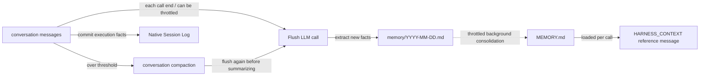

## Role

Lets the agent "remember facts across sessions" while keeping the conversation context bounded. Harness splits memory into two layers:

- **Layer 1 · daily log** `memory/YYYY-MM-DD.md` — append-only each day, raw and not deduped;
- **Layer 2 · curated long-term** `MEMORY.md` — periodically merged + deduped by the LLM; loaded once per Agent call and supplied as HARNESS_CONTEXT reference material, not System.

Three companion mechanisms:

- **Conversation compaction** — summarizes history and keeps a recent tail when context is too long;
- **Overflow safety net** — when the model actually errors, force a compaction and retry;
- **Large tool-result offloading** — offload to disk + placeholder when a single tool returns too much.

## The three LLM calls at a glance

The memory pipeline runs **three independent LLM calls**, each with its own prompt and triggering rules. This is the easiest place to get confused when customizing:

| # | Operation | Writes to | Default prompt | Customize via |
|---|------|----------|---------------|----------|
| 1 | **Flush** — extracts long-term facts from a conversation window | `memory/YYYY-MM-DD.md` (append) | `MemoryFlushManager.DEFAULT_FLUSH_PROMPT` | `MemoryConfig.builder().flushPrompt(...)` |
| 2 | **Consolidation** — merges daily ledgers into `MEMORY.md` | `MEMORY.md` (full rewrite) | `MemoryConsolidator.DEFAULT_CONSOLIDATION_PROMPT` | `MemoryConfig.builder().consolidationPrompt(...)` |
| 3 | **Compaction summary** — distills the conversation prefix into one summary message | Injected into the current context | `CompactionConfig.DEFAULT_SUMMARY_PROMPT` | `CompactionConfig.builder().summaryPrompt(...)` |

The first two are "long-term memory settling" and live on `MemoryConfig`; the third is "in-context compression" and lives on `CompactionConfig`. All three LLM calls share the agent's primary model by default, but `MemoryConfig` and `CompactionConfig` each support a `.model(...)` override so you can use a lighter model for these auxiliary operations.

## How the two layers work



Key points:

- Layer 1 only appends, never dedupes; Layer 2 is periodically rewritten as a whole; **the two layers never overwrite each other**.
- Layer 2 is the only one injected into the prompt; Layer 1 waits to be merged.
- Native Session Log already records messages and execution facts. Compaction changes working context only; `session_history` / `session_search` read full history without duplicate offloading.

## When flush fires

Flush (path 1) is triggered at three different moments:

1. **End of every `call()`** — the default `MemoryFlushMiddleware` behaviour. Can be retuned to `NEVER` or `THROTTLED(Duration)` via `flushTrigger`.
2. **Pre-compaction extraction** — when `CompactionConfig.flushBeforeCompact = true` (default), the conversation prefix is flushed once before being summarized.
3. **Overflow safety net** — when the model actually returns `context_length_exceeded`, the framework runs an emergency compaction that includes a flush.

All three sites share the **same** `flushPrompt`, so customizing it changes all three.

Per-call long-term memory flush runs in the background; pre-compaction flush belongs to the compaction step. Native Session Log commits at execution boundaries: it is not a background copy, and failure to commit required facts stops further execution.

<span id="enable-compaction" />

## Tune context compaction

Harness enables context compaction by default. The following configuration adjusts its triggers and retention policy. See [Context management](/v2/en/docs/harness/context) for how compaction fits into each model request.

```java
HarnessAgent agent = HarnessAgent.builder()
    .name("MyAgent")
    .model(model)
    .workspace(workspace)
    .compaction(CompactionConfig.builder()
        .triggerMessages(30)     // fire at 30 messages
        .keepTokens(0)           // retain the tail by message count
        .keepMessages(10)        // keep the last 10 after compaction
        .build())
    .build();
```

Common options:

| Field | Default | Meaning |
|-------|---------|---------|
| `triggerMessages` | `50` | Trigger by message count (`0` = off) |
| `triggerTokens` | `0` | Trigger by estimated tokens; `0` = dynamic, based on the budget left for conversation history in the final model request |
| `keepMessages` | `20` | Number of tail messages to keep |
| `keepTokens` | `-1` | `-1` = dynamic (based on the remaining conversation budget in the final model request); `0` = use `keepMessages`; `>0` = fixed token budget, overriding `keepMessages` |
| `flushBeforeCompact` | `true` | Extract new facts to the daily log before compacting (path 2) |
| `summaryPrompt` | see `DEFAULT_SUMMARY_PROMPT` | Path-3 summary prompt (must contain `{messages}`) |
| `model` | `null` (uses the agent's primary model) | Dedicated model for the compaction summarization call |

**Auto-recovery on overflow**: when the model returns `context_length_exceeded` or a similar error, the framework attempts forced compaction unless compaction is disabled. In the default `EVENT_LOG` execution mode, it retries the current reasoning step once within the same execution. No explicit `.compaction(...)` call is needed to enable this; a repeated overflow propagates to the caller.

### Want it lighter? Trim arguments first

Tool calls like `write_file` carry huge arguments that nobody reads later. Before LLM summarization you can run a **non-LLM** string truncation:

```java
CompactionConfig.builder()
    .triggerMessages(80)
    .truncateArgs(CompactionConfig.TruncateArgsConfig.builder()
        .maxArgLength(2000)
        .truncationText("... [truncated] ...")
        .build())
    .build();
```

## Customizing the memory pipeline: `MemoryConfig`

`MemoryConfig` is the single place to configure flush / consolidation prompts, throttling, retention, and the per-call flush trigger. Every field has a default; not calling `.memory(...)` reproduces the historical behaviour bit-for-bit.

Per-call flush and background consolidation have independent throttle windows. In both cases, the first eligible `call()` runs the work immediately; a minimum gap limits only subsequent runs and is not an initial delay.

### Example 1: throttle per-call flush to save tokens

A flush LLM call after every agent invocation can add up on long sessions. Throttle it to at most once every 10 minutes:

```java
HarnessAgent.builder()
    ...
    .memory(MemoryConfig.builder()
        .flushTrigger(MemoryConfig.FlushTrigger.throttled(Duration.ofMinutes(10)))
        .build())
    .build();
```

Notes:

- `THROTTLED` only affects **path 1** (per-call flush). The flush embedded in compaction (path 2) and the overflow flush (path 3) still fire on their own triggers — compaction is rare, so those two are infrequent by construction.
- The first eligible call flushes immediately; `Duration.ofMinutes(10)` limits only later per-call flushes.
- **Native history is unaffected**: flush throttling does not disable Session Log, history search or checkpoint recovery.

### Example 2: disable per-call flush entirely

```java
.memory(MemoryConfig.builder()
    .flushTrigger(MemoryConfig.FlushTrigger.never())
    .build())
```

Now flush only happens when compaction does (same cost as raw compaction).

> To turn off flush **and** background maintenance use `.disableMemoryHooks()`; `flushTrigger(NEVER)` only stops the per-call flush — background consolidation still runs.

### Example 3: extend the default prompt with project rules

```java
.memory(MemoryConfig.builder()
    .flushPrompt(MemoryFlushManager.DEFAULT_FLUSH_PROMPT + """

        Additional project rules:
        - Never record customer PII (names, emails, phone numbers).
        - Always use English for project-internal vocabulary.
        """)
    .build())
```

### Example 4: fully custom consolidation prompt

```java
.memory(MemoryConfig.builder()
    .consolidationPrompt("""
        You are merging daily memory ledgers into MEMORY.md.
        Keep within %d tokens (~%d chars). Output the complete file in markdown.
        ... your custom rules ...
        """)
    .build())
```

> **Important**: a custom consolidation prompt **must** contain exactly two `%d` placeholders (max-tokens then max-chars). The Builder rejects anything else at construction time so you don't hit a runtime `MissingFormatArgumentException`.

### Example 5: tune background maintenance

```java
.memory(MemoryConfig.builder()
    .consolidationMinGap(Duration.ofHours(2))   // first call may run; later runs at least 2h apart
    .dailyFileRetentionDays(30)                 // archive daily logs after 30 days
    .consolidationMaxTokens(8_000)              // raise MEMORY.md cap to 8K tokens
    .build())
```

### Example 6: use a smaller model for memory operations

Flush and consolidation don't need the full power of the primary reasoning model — use a cheaper one to save cost:

```java
HarnessAgent.builder()
    .model("openai:o3")                   // primary reasoning model
    .memory(MemoryConfig.builder()
        .model("openai:gpt-4.1-mini")     // lighter model for memory ops
        .build())
    .compaction(CompactionConfig.builder()
        .model("openai:gpt-4.1-mini")     // lighter model for compaction
        .build())
    .build();
```

`model(String)` resolves via `ModelRegistry.resolve()`; you can also pass a `Model` instance. When not set, falls back to the agent's primary model.

### `MemoryConfig` field reference

| Field | Default | Purpose |
|------|------|------|
| `model` | `null` (uses the agent's primary model) | Dedicated model for flush / consolidation; accepts a `Model` instance or a `"provider:model"` string |
| `flushPrompt` | `null` (uses `DEFAULT_FLUSH_PROMPT`) | SYSTEM prompt for path 1 |
| `consolidationPrompt` | `null` (uses `DEFAULT_CONSOLIDATION_PROMPT`) | Template for path 2 (must contain two `%d`) |
| `consolidationMaxTokens` | `4_000` | Token cap for `MEMORY.md` |
| `consolidationMinGap` | `30 min` | Gap between background maintenance runs; the first eligible call runs immediately |
| `dailyFileRetentionDays` | `90` | Days before a daily log moves to `memory/archive/` |
| `flushTrigger` | `FlushTrigger.always()` | `ALWAYS` / `NEVER` / `THROTTLED(Duration)` |

## Large tool-result offloading

Tool-result offloading works independently of conversation summarization and is enabled by default in Harness. While preparing model input, an oversized tool result in history is written to the workspace. The model receives a head/tail preview and a file path, which it can use with `read_file` to retrieve the full text as needed. The following shows the default configuration; see [Context management](/v2/en/docs/harness/context) for tuning and details:

```java
HarnessAgent.builder()
    ...
    .toolResultEviction(ToolResultEvictionConfig.defaults())
    .build();
```

Defaults:

- Triggered at 80K characters
- Keeps ~2K chars at head + tail + a line "full content at `{path}`"
- `read_file` is excluded by default (to avoid re-offloading what was just read back)

Customize threshold or destination via `ToolResultEvictionConfig.builder()...build()`.

## Tools the agent can use itself

When memory is enabled, the agent gets four tools:

- `memory_search query="..."` — keyword scan over `MEMORY.md` + `memory/*.md`
- `memory_get path="memory/2026-06-02.md" startLine=10 endLine=40` — read a specific line range
- `memory_save content="..."` — persist a memory via `MEMORY.md` and the daily ledger
- `session_search query="..."` — search past session transcripts

When the model sees a "MEMORY truncated" note in the prompt, it typically calls `memory_search` to look further back.

`memory_search` and `session_search` accept an optional `matchMode`:

| Mode | Behavior |
| --- | --- |
| `phrase` (default) | Match the entire query as a literal substring, preserving existing behavior |
| `all` | Split on whitespace; every keyword must occur in the same record, in any order |
| `any` | Split on whitespace; at least one keyword must occur in the record |

For example, `query="deploy blue" matchMode="all"` matches `deploy using the blue configuration`, while the default phrase mode does not.
A record is one line for Memory and one entry for Session; keywords are not combined across records.
Matching is case-insensitive and regex metacharacters are literal. There is no automatic Chinese word segmentation or date-expression parsing.
An omitted or `null` mode defaults to `phrase`; other values (including an empty string) return an error. Multi-keyword modes ignore extra whitespace and duplicate terms; whitespace-only queries never match all records.
Result formatting, ordering and limits are unchanged; `any` does not introduce relevance ranking. Existing Java method signatures remain available.

## Background maintenance

When memory is enabled, a throttled background job also runs. The first eligible `call()` runs it immediately; later calls observe the minimum gap (30 minutes by default):

- Archives daily logs older than `dailyFileRetentionDays` (default 90 days) to `memory/archive/`
- Runs one `MEMORY.md` consolidation pass

Entering maintenance does not necessarily call the model: consolidation skips the LLM request when there are no new daily ledger entries since the last successful consolidation. `FlushTrigger.never()` does not disable this maintenance path.

All thresholds are tunable via `.memory(MemoryConfig.builder()...)`, though most projects don't need to touch them.

## Turn it off entirely

If you want to handle memory yourself or wire your own tools:

```java
HarnessAgent.builder()
    ...
    .disableMemoryHooks()      // disables flush + background maintenance (+ auto-extract prompt line)
    .disableMemoryTools()      // skips memory_search / memory_get / memory_save / session_search
                               // and matching Memory Recall / tool Persistence guidance
    .build();
```

Together these also skip memory material in `HARNESS_CONTEXT` (`MEMORY.md`) injection while keeping Domain Knowledge / AGENTS / knowledge context.

`disableMemoryHooks()` is the nuclear option for background memory work; if you only want to throttle, use `.memory(MemoryConfig.builder().flushTrigger(...).build())` instead.

## Related Pages

- [Workspace](/v2/en/docs/harness/workspace) — where `MEMORY.md` / `memory/` live in the workspace
- [Session logs and recovery](/v2/en/docs/harness/session-log) — full history, checkpoints and search
- [Architecture](/v2/en/docs/harness/architecture) — how facts in long conversations settle into `MEMORY.md`

For message placement, refresh timing and final budgeting, see [Context management](/v2/en/docs/harness/context).

Legacy JSONL pruning and `sessionRetentionDays` have been removed. Native history has no automatic retention policy, and memory maintenance no longer deletes old archives.
