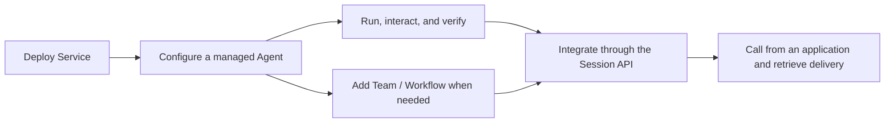

<Note>
The current Service release is `2.1.0-BETA1`, a prerelease.
</Note>

**AgentScope Service is a self-hostable Agent as a Service platform for business applications. Its Managed Agents are built on the AgentScope HarnessAgent core.** Define the work an Agent should do on the platform and configure suitable models and tools. When an application submits a task, Service runs the Agent and preserves execution records so the application can follow progress, handle necessary interaction, and obtain the result.

**Self-hosting is the primary recommended deployment approach today.** A team deploys Service on its infrastructure and lets multiple business applications share its Agent services. Managed execution means the platform handles Agent runtimes for those applications, so application teams do not need to build and operate a separate runtime service for each Agent application. Platform administrators connect models, tools, and business data according to the deployment, providing a shared execution environment.

<CardGroup cols={2}>
<Card title="Deploy your own Service" icon="server" href="/v2/en/service/quickstart">
Start with Docker Compose, then prepare accounts, models, and an execution environment.
</Card>
<Card title="Run your first managed Agent" icon="play" href="/v2/en/service/create-managed-agent">
Already have a Service address and account? Create an Agent, run tools, and check the result.
</Card>
</CardGroup>

## How Service relates to Harness: two ways to use Agents

The Harness SDK and Managed Agents in Service use the same HarnessAgent core. Choose between them according to how you want to develop your application and manage execution. The table summarizes the responsibilities of each approach.

| Approach | How you develop | Runtime ownership |
| --- | --- | --- |
| Harness SDK | Embed HarnessAgent in Java / Spring Boot and compose business logic in code | Your application team owns processes, deployment, and operations |
| Managed Agents in Service | Configure Agents built on HarnessAgent and use them through Console or APIs | Service manages Agent execution and sessions; the platform team operates shared infrastructure |

If you need to embed an Agent deeply in your Java or Spring Boot application and control execution in code, start with the [Harness SDK](/v2/en/docs/quickstart), with your application team owning deployment and operations. To delegate runtime management to a shared platform, configure a Managed Agent directly in Service and use it through APIs or Console without first developing a separate SDK application. An Agent already built with the SDK can also connect as an External Agent, preserving your existing implementation.

Start with [Docker Compose](/v2/en/service/quickstart) for local evaluation. Use the published [Helm Chart](/v2/en/service/kubernetes) for a Kubernetes production installation. Install the CLI and Runtime Host with [Go](/v2/en/service/runtime-host) when connecting a Hosted Agent.

## From deployment to business delivery

Using Service begins with preparing a working platform. Once you have deployed it and connected a model and tool execution environment, you can create a Managed Agent and use a session to check whether it understands the task, uses tools correctly, and delivers an acceptable result. As the requirements become clearer, add the knowledge and capabilities it needs, using actual execution results to guide configuration changes.

Once the Agent can do the intended work, applications create Sessions for it and submit Turns through the same API. Adding a Team or Workflow later changes the target selected for a new Session, while the application continues to follow Sessions, Turns, and events. Start with [Deploy Service](/v2/en/service/quickstart) and [Your first Managed Agent](/v2/en/service/create-managed-agent), then follow [Delegate work and interact](/v2/en/service/service-api) to give the Agent work from your application.

## Understand Agents, Sessions and Turns

An Agent defines a reusable capability, including instructions, models, tools and execution configuration. A Session records an application’s work with an Agent, Team or Workflow. Creating the Session selects the target and freezes its configuration so subsequent execution has a clear basis.

Each task submitted inside a Session is a Turn. Service executes it in the background while the application reads its state and result or restores the interaction from a snapshot and event stream. Managed Agents retain conversational context within a Session. Team and Workflow Turns start separate collaboration tasks or process runs. They share the calling interface while their execution context and available interactions depend on the target’s capabilities.

Issue, Run, Task and Attempt records describe collaborative work, execution graphs, member assignments and physical attempts. They support investigation and platform operations. Application integration can begin with Session, Turn and Events, opening those execution details when diagnosis is needed.

## Applications it serves

AgentScope Service is for development teams that want to embed Agent capabilities in existing products and business processes. The work in these applications often requires an Agent to act on accumulated context and use tools to gather information or perform operations until it can deliver a result. The application needs to know how far the work has progressed and help it continue when a user supplies more information. By delegating this execution to Service, the application can organize interactions around its business goals and use the platform’s task records to follow the work.

In a user-facing product, an Agent can help a user work through an ongoing task while the application presents progress and requests for decisions where they belong in the interface. For background work triggered by business events or schedules, the application is more concerned with tracking the task and bringing its result back into the business process. Both approaches can use the same Agent services, allowing teams to decide when to call them, how to interact, and how to use the results. See [Use cases](/v2/en/service/usecases) for integration details.

## Expand to other Agents and collaboration

Managed Agents are the main starting point for using Service; the approach to collaboration depends on how the work can be divided. When one Agent remains responsible for a task and needs to delegate a portion of it, a HarnessAgent Subagent lets it incorporate the delegated result and continue execution. As specialist capabilities become independently maintained Agents, a Team can establish their responsibilities and let a lead coordinate them toward a shared goal. Service preserves task and delivery records so that this collaboration can continue over time.

Once responsibilities are clear, a business process may also need to constrain the order in which work proceeds. A Workflow expresses these requirements as an explicit process, calling Agents or Teams at defined steps and waiting for human approval where required. Team collaboration and workflow orchestration can therefore work together: the team fulfills its assigned goal, while the workflow determines when that work starts and what must be satisfied before the next step. See [Multi-agent orchestration](/v2/en/service/orchestration) for guidance on choosing and combining these approaches.

The participating Agents can all be managed by Service, or they can reuse implementations your team already maintains. An Agent built with an SDK or another framework can connect as an [External Agent](/v2/en/service/register-agentscope-agent), retaining its deployment and runtime while accepting platform tasks and reporting results. An existing Coding Agent can connect as a [Hosted Agent](/v2/en/service/connect-hosted-agent) through Runtime Host, which starts and manages its execution. The platform can then assign work through a common interface within each Agent’s supported capabilities. These Agents can join Teams or accept direct Session calls, allowing existing capabilities to become part of the platform gradually.

## What Service and your application own

Service provides Agent runtime management as a capability shared by business applications. After an application submits work, the platform coordinates execution and preserves its records. The application can use the API to follow progress and return user feedback to the execution when needed. This lets the interface organize the experience around ongoing work while the backend follows the result through the same Session and Turn records, without each application implementing its own Agent session and task management.

The business application still determines what work the Agent should do and how its result will be used. It translates user needs into appropriate task inputs and provides business tools or data interfaces that let the Agent act within the current user’s permissions. Credentials for calling Service control access to Agent services; authorization for business data remains with the relevant business systems. When execution finishes, the application determines whether the result meets business requirements and how it should enter the next stage of the process. Defining these expectations is part of designing the Agent’s capabilities.

In the recommended self-hosted setup, this division also extends to deployment and operations. A platform team maintains Service and its runtime resources centrally, providing an environment in which application teams can configure and improve their Agents before integrating them into products. Multiple applications can share the platform’s runtime management while retaining their own business logic and user experience.

After configuring the Agent, follow the [Session API integration guide](/v2/en/service/service-api) in “Delegate work and interact”. By recording the relationship between business objects and Sessions, your application can show progress, involve users when an Agent needs confirmation, and retrieve the actual deliverables when execution ends. When users return to the page, it can load the existing records and continue the same work.

## Where to start

Choose a small task whose result you can judge. [Deploy Service](/v2/en/service/quickstart), then [create your first managed Agent](/v2/en/service/create-managed-agent) and follow the task from submission through execution to checking the result. If your team already has a working Service deployment, start with Agent creation. For a walkthrough using the interface, follow [Visual Console](/v2/en/service/console/index).
