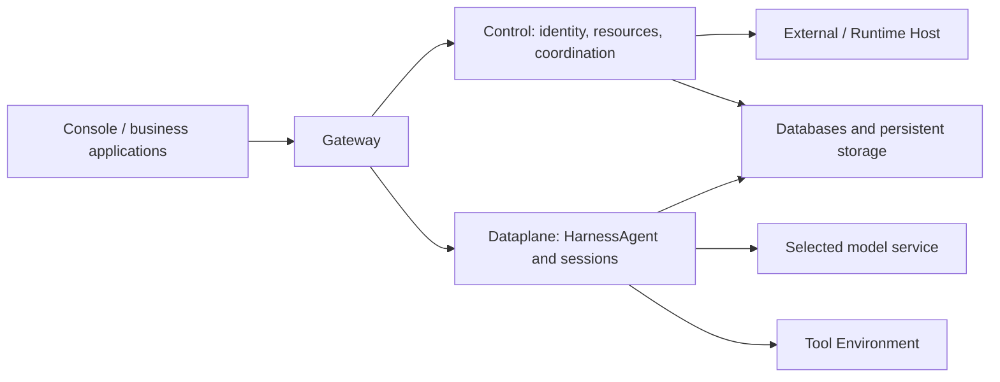

<Note>
The current release is `2.1.0-BETA1`, a prerelease. Validate your deployment before using it in production.
</Note>

This guide covers production deployment with Kubernetes and Helm. The published Service Chart installs Gateway, Control, Dataplane and Scheduler. You manage PostgreSQL, storage, domain and TLS. Components default to one replica with Recreate updates; plan maintenance windows.

## 1. Prepare dependencies

Prepare Kubernetes, Helm and reachable PostgreSQL. Workspaces need an RWX StorageClass or an existing shared PVC because several components mount them. Artifacts default to RWO. Single-node RWO behavior does not establish shared access across nodes.

You can install the Chart directly from the public Helm repository, without cloning the source. Download the matching configuration template and initialization SQL:

```bash
curl -fLO https://chickenlj.github.io/helm-charts/examples/2.1.0-BETA1/kubernetes.env.example
curl -fLO https://chickenlj.github.io/helm-charts/examples/2.1.0-BETA1/postgres-init.sql
```

Execute the SQL in the target database as its application owner to create `cp`, `rt` and `dp`. Plan backups for the database, files and keys. For an offline installation, download `agentscope-service-2.1.0-BETA1-kubernetes.tar.gz` and `SHA256SUMS` from the [GitHub Release](https://github.com/agentscope-ai/agentscope-java/releases/tag/v2.1.0-BETA1), verify the checksum and extract the bundle. It includes the Chart and the same configuration files.

## 2. Create a Secret

Copy `kubernetes.env.example` to a private file and replace every placeholder: database connections, random JWT/internal/Vault secrets, bootstrap password and required model credentials. URL-encode URI passwords and provide the raw JDBC password separately. Configure TLS according to database certificates.

```bash
kubectl create namespace agentscope
kubectl -n agentscope create secret generic agentscope-service --from-env-file=/private/path/service.env
```

Keep plaintext configuration and rendered Secrets out of the repository.

## 3. Configure values

Use this `production-values.yaml` starting point. Replace domain, storage classes, Ingress class and TLS Secret. Provision the TLS Secret beforehand or through your certificate controller.

```yaml
existingSecret: agentscope-service
allowLocalEnvironment: false
publicURL: https://agentscope.example.com
persistence:
  workspaces:
    storageClass: shared-rwx
    size: 20Gi
  artifacts:
    storageClass: standard
    size: 20Gi
ingress:
  enabled: true
  className: nginx
  host: agentscope.example.com
  tls:
    - hosts: [agentscope.example.com]
      secretName: agentscope-service-tls
```

Use `existingClaim` for retained PVCs. Configure `imagePullSecrets` for private images and controller-specific annotations for SSE timeouts and buffering. Tune requests and limits under `control`, `dataplane`, `scheduler` and `gateway` using measured workload requirements.

## 4. Install a pinned version

Add the public Helm repository and refresh its index. Repository access needs no login:

```bash
helm repo add agentscope https://chickenlj.github.io/helm-charts
helm repo update agentscope
helm search repo agentscope/agentscope-service --versions --devel
```

The published [Helm repository](https://github.com/chickenlj/helm-charts) hosts the index and archives on GitHub Pages. Pin `--version 2.1.0-BETA1`; `--devel` in the search command includes prereleases. The Chart supplies the matching image tag through `appVersion`.

Install a specific Chart version with the matching image namespace:

```bash
helm upgrade --install service agentscope/agentscope-service \
  --version 2.1.0-BETA1 \
  --namespace agentscope \
  --set imageRepository=sca-registry.cn-hangzhou.cr.aliyuncs.com/agentscope \
  -f production-values.yaml \
  --wait --timeout 10m
```

For an offline installation, replace `agentscope/agentscope-service` and `--version 2.1.0-BETA1` with the downloaded `./agentscope-service-2.1.0-BETA1.tgz`. Keep Chart and component image versions aligned. The Chart creates workloads in your cluster; Helm repository publication does not deploy a running Service.

## 5. Verify user workflows

```bash
kubectl -n agentscope get pods,pvc,svc,ingress
kubectl -n agentscope port-forward service/service-agentscope-gateway 18080:8080
```

Confirm Bound PVCs and Ready Pods. Sign in through the public domain with the bootstrap administrator and change its password. Verify the model, Environment, first Chat, Issue delivery and streaming. Port-forwarding helps diagnosis but does not validate public callbacks.

## Maintain the installation

Restart affected Deployments after Secret updates. Follow [operations](/v2/en/service/operations) before upgrading and retain prior Charts, values and image versions. PVCs are retained on uninstall; explicitly select them with existingClaim on reinstall.

This Chart runs complete Service standalone HTTP. Kubernetes-native ControlPlane/ASDP is a separate deployment mode, requiring deliberate SDK connectivity planning rather than blindly combining Charts. The single-replica installation does not guarantee zero-downtime migrations or multi-replica HA.

<span id="self-hosting"></span>
<span id="three-deployment-boundaries"></span>
<span id="choose-a-deployment-path"></span>
<span id="hand-over-a-usable-platform"></span>
<span id="operate-the-platform"></span>

## Deployment boundaries and production planning

The Compose commands in [quickstart](/v2/en/service/quickstart) deploy the complete Service. Users access it through Gateway; Control manages identity and resources and coordinates work; Dataplane runs HarnessAgent and sessions; and Scheduler handles scheduling work. Databases and persistent storage preserve the data these services need. Operating this shared installation is the responsibility that comes with self-hosting the platform.

Tool execution resources can be prepared separately from platform services. Even when file or Shell tools use a sandbox, remote file backend, or `self_hosted` Worker, Dataplane still runs Managed Agent reasoning. Connecting External or Hosted Agents also involves the existing application or Runtime Host. These resources connect to the deployed Service to provide their respective execution capabilities.



After choosing deployment locations, check where each component actually connects. A self-hosted Service can still call a remote model, and its tools may access external systems through MCP or other interfaces. Plan networking around the selected model, tools, and storage to understand where data travels, and provide incoming routes for callbacks such as OAuth when needed.

For local evaluation, use the Compose [quickstart](/v2/en/service/quickstart). A platform team maintaining a longer-term installation can choose Kubernetes to suit its infrastructure. The table below summarizes the resources required by each path; users of an existing team platform normally need only account and execution-environment setup.

| Path | Current use | Prerequisites |
| --- | --- | --- |
| Docker Compose | Local evaluation, development, and integration | Release bundle, Docker, model credentials, persistent disk |
| Kubernetes / Helm | Installation operated by a platform team | PostgreSQL, shared Workspace storage, Artifact storage, Secrets, domain, and TLS |
| Existing team platform | Direct use by application developers | Service address, account, authorized scope, available model and Environment |

The current complete Service Chart configures one replica per component and uses Recreate updates, so upgrades require a maintenance window. Do not assume this installation provides multi-replica high availability or upgrades without downtime. Kubernetes-native ControlPlane/ASDP is a separate deployment mode for the corresponding SDK and runtime transport requirements; it is not an additional set of mandatory components to install over the complete Service Chart.

When handing the platform over to an application team, administrators provide an accessible Service address and account and explain which Namespace the account can use. Users also need to know whether the default model is ready, which tool environment to select, and where business materials reside and how to access them. With this information, they can verify the model and file tools through [Their first managed Agent](/v2/en/service/create-managed-agent), then check application calls through the [Session API integration guide](/v2/en/service/service-api).

Before production use, verify that users can receive execution events continuously, restore existing content after a page refresh, and download delivered files with the appropriate permissions. If the application relies on Webhooks, confirm that the receiving endpoint gets notifications. Pair database and file backups with recovery exercises, including how unfinished work will be handled. These checks establish that the platform behaves as intended during normal use and recovery.

## Network surfaces

By default, Compose exposes only Gateway at the host address `127.0.0.1:18080`. User requests enter there and are forwarded to internal services, while the other components communicate over the internal network. Their container ports and exposure are listed below.

| Component | Container port | Exposure |
| --- | --- | --- |
| Gateway | 8080 | Host `127.0.0.1:18080` by default |
| Control | 8081 | Internal network |
| Dataplane | 8082 | Internal network |
| Scheduler | 8083 | Internal network |
| PostgreSQL | 5432 | Internal network |

A reverse proxy on the same host can forward requests to `127.0.0.1:18080`. If it runs in another container, its `localhost` refers to the proxy container itself, so configure a shared network or a host address reachable from that container. The public entry point should still target Gateway, with internal services and the database available through the private network.

## Enable remote access

To access the deployment from another device or test public OAuth or Channel callbacks, configure an HTTPS entry point for Gateway. Prepare a domain and TLS certificate, then forward requests through a reverse proxy. Set `BUILDER_OAUTH_PUBLIC_URL` in `.env` to the actual external address, such as `https://agentscope.example.com`. If Gateway also needs a different listening address or port, change `BIND_ADDRESS` and `GATEWAY_PORT`, then recreate the containers to apply the configuration.

Execution progress travels over a long-lived SSE connection, so the proxy needs to forward events promptly, disable event-stream caching, and allow sufficiently long read timeouts. After configuration, verify login and run a task that produces content over time. Check that events arrive incrementally, the page can reconnect after a refresh, and the callbacks your application uses are working.
