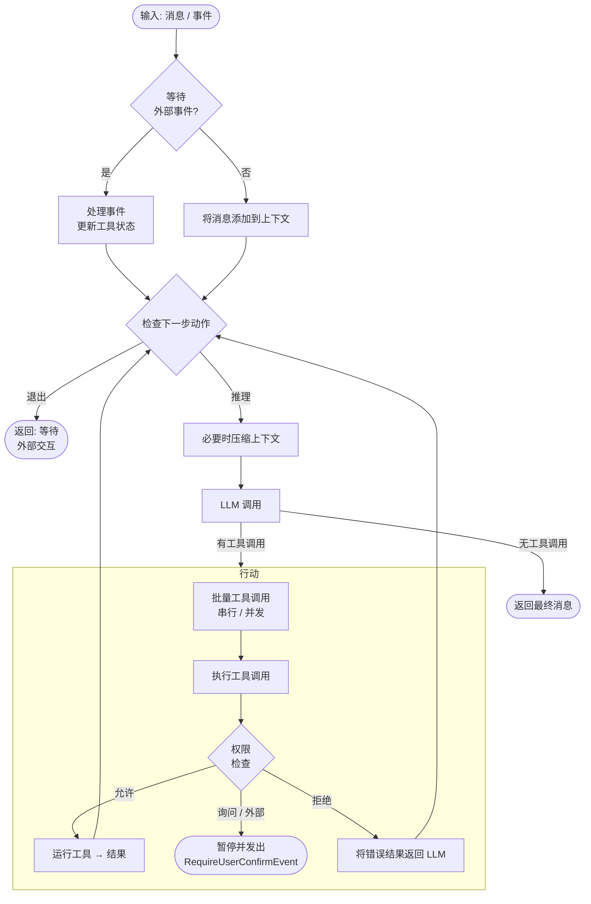

## 概述

AgentScope 通过 `Agent` 接口统一智能体的调用方式，提供底层的 `ReActAgent` 和在其基础上封装的 `HarnessAgent`。**业务 Agent 开发推荐优先使用 `HarnessAgent`**，也可以直接使用 `ReActAgent`，自行组合应用所需的能力。

**ReAct 是 AgentScope Harness 的执行基础。** `ReActAgent` 负责“模型推理 → 执行工具 → 将结果交回模型”的循环，直到返回结果或等待外部交互。权限检查、人机交互、上下文与状态管理、中间件、实时事件等基础能力都围绕这一循环工作。

`HarnessAgent` 内部封装 `ReActAgent`，沿用同一套推理与执行循环，并进一步内置工作区、长期记忆、上下文压缩、技能、子 Agent、沙箱以及会话日志与恢复等能力。因此，使用 Harness 后，**整体的推理、执行循环本质上没有变化**；更多运行能力由 Harness 统一装配，业务开发者可以直接配置使用。

从[快速开始](/v2/zh/docs/quickstart)可以直接上手 `HarnessAgent`。本页以 `ReActAgent` 为例说明两者共有的基础配置与调用方式；Harness 的内置能力和组合方式见 [Harness 架构](/v2/zh/docs/harness/architecture)。

### 核心接口

`Agent` 接口常用的方法如下：

| 方法 | 描述 |
|------|------|
| `call(List<Msg>)` / `call(List<Msg>, RuntimeContext)` | 运行推理-行动循环，返回 `Mono<Msg>` |
| `streamEvents(List<Msg>)` / `streamEvents(Msg)` | 同 `call`，但以流式方式逐一产出 `AgentEvent` 对象 |
| `observe(Msg)` / `observe(List<Msg>)` | 将消息添加到上下文，不触发推理（返回 `Mono<Void>`） |

`ReActAgent` 和 `HarnessAgent` 在此之上还提供 `call(msgs, structuredOutputClass, runtimeContext)` 等结构化输出重载，以及通过 `RuntimeContext` 传递本次调用元数据的便捷入口。

### 按业务场景选择调用方式

| 你要实现什么 | 使用方式 |
| --- | --- |
| 获取回复、提取结构化数据、执行工作流中的一个步骤 | `agent.call(input, ctx)` |
| 在当前请求中逐步展示文本和工具进度 | `agent.streamEvents(input, ctx)` |
| 后台持续执行、忙时排队、运行中补充要求、中断后继续原任务 | `agent.session(ctx)` 的会话操作，仅 HarnessAgent 提供 |

`call` 和 `streamEvents` 都可以用于多轮对话；每次调用可包含多次推理和工具执行。使用默认配置的 HarnessAgent 时，两者也会保存 Session Log 和 checkpoint。仅需要记住上一轮或查询历史时，可以继续直接调用。

先按下文完成直接调用。有后台任务管理需求时，再阅读[会话操作、事件与恢复](/v2/zh/docs/harness/session-log)。通过 HTTP 使用托管 Agent 时，阅读 [Service Agent API](/v2/zh/service/session-event-log)。

### 主循环

`ReActAgent` 和 `HarnessAgent` 都通过下面的推理-行动循环执行一次 `call`。Harness 的内置能力在相应阶段参与工作：



## 实例生命周期

**推荐共享配置 Builder，每次请求 `builder.build()` 创建新的 Agent，执行结束后关闭。** Builder 在应用启动时配置完成，请求期间只负责构建；用户、会话、请求参数通过新建的 `RuntimeContext` 传入，不修改共享 Builder。

同步调用用 `try-with-resources` 包住执行和等待；响应式调用用 `Mono.using` / `Flux.using`，让实例在订阅结束、报错或取消时释放。模型客户端、连接池、存储、技能仓库等依赖可以由应用统一管理，应用退出时再关闭；共享工具与中间件应保证线程安全，不能把当前用户或上下文保存在成员字段里。

新实例与新会话是两个概念。Harness 使用稳定的 `agentId`、`userId`、`sessionId` 和相同日志后端恢复已提交状态；普通 ReActAgent 若未配置会话日志或 `stateStore`，仅保留在旧实例内的上下文不会带到新实例。

**也可以共享同一个 Agent 实例。** Agent 采用无状态执行引擎设计，会话状态按身份管理；共享实例由应用在退出时关闭。同一实例内，相同用户与会话的直接调用由执行门串行化，不同会话可并行。实例仍有缓存、执行门和后台资源，因此这里的“无状态”不表示没有生命周期。后续示例统一采用每请求创建的推荐方式。

后台 `AgentSession`、Channel 或托管运行时的生命周期由其管理器持有，不能套用“提交请求返回就关闭”的方式。中断一次直接调用也必须定位到正在执行的实例；临时构建另一个实例不能中断旧实例中的请求。

## 配置智能体

先通过 `ReActAgent.builder()` 定义共享配置，再在每次请求中调用 `agentBuilder.build()`。`.model(...)` 既接受 `ModelRegistry` 解析的字符串 id（最常用、自动读取 env），也接受手动 builder 构造的 `Model` 实例（需要精细控制超时、自定义 endpoint 时用）。


<Tabs>


<Tab title="字符串 model id（推荐）">

```java
import io.agentscope.core.ReActAgent;
import io.agentscope.core.tool.Toolkit;

ReActAgent.Builder agentBuilder =
        ReActAgent.builder()
                .name("my_agent")
                .sysPrompt("你是一个有帮助的助手。")
                // 由 ModelRegistry 解析；自动读取 DASHSCOPE_API_KEY
                // 切换其他厂商时改成 "openai:gpt-5.5" / "anthropic:claude-sonnet-4-5"
                // / "deepseek:deepseek-v4-flash" / "gemini:gemini-2.0-flash" / "ollama:llama3" 即可。
                .model("dashscope:qwen-plus")
                .toolkit(new Toolkit());
```

</Tab>


<Tab title="显式 Model builder">

```java
import io.agentscope.core.ReActAgent;
import io.agentscope.extensions.model.dashscope.formatter.DashScopeChatFormatter;
import io.agentscope.extensions.model.dashscope.DashScopeChatModel;
import io.agentscope.core.tool.Toolkit;

ReActAgent.Builder agentBuilder =
        ReActAgent.builder()
                .name("my_agent")
                .sysPrompt("你是一个有帮助的助手。")
                .model(
                        DashScopeChatModel.builder()
                                .apiKey("YOUR_API_KEY")
                                .modelName("qwen-max")
                                .stream(true)
                                .formatter(new DashScopeChatFormatter())
                                .build())
                .toolkit(new Toolkit());
```

</Tab>


<Tab title="配置 Toolkit / MCP">

```java
import io.agentscope.core.ReActAgent;
import io.agentscope.core.tool.Toolkit;
import io.agentscope.core.tool.builtin.TodoTools;
import io.agentscope.core.tool.mcp.McpClientBuilder;
import io.agentscope.core.tool.mcp.McpClientWrapper;

Toolkit toolkit = new Toolkit();
toolkit.registerTool(new TodoTools());          // 通过反射注册带 @Tool 的方法
toolkit.registerTool(new MyCustomTools());      // 自定义工具类（带 @Tool 注解的方法）

McpClientWrapper amap =
        McpClientBuilder.create("amap")
                .streamableHttpTransport(
                        "https://mcp.amap.com/mcp?key=" + System.getenv("AMAP_API_KEY"))
                .buildAsync()
                .block();
toolkit.registerMcpClient(amap).block();

ReActAgent.Builder agentBuilder =
        ReActAgent.builder()
                .name("my_agent")
                .sysPrompt("你是一个有帮助的助手。")
                .model("dashscope:qwen-max")
                .toolkit(toolkit);
```

</Tab>


</Tabs>


<Tip>

`ModelRegistry` 的字符串形式（`<provider>:<model>`）需要对应的模型扩展模块在 classpath 中。它支持 `dashscope` / `openai` / `openai-official` / `deepseek` / `anthropic` / `gemini` / `ollama`，会自动从环境变量读取 API key（`DASHSCOPE_API_KEY` / `OPENAI_API_KEY` / `DEEPSEEK_API_KEY` / `ANTHROPIC_API_KEY` / `GEMINI_API_KEY`）。需要在长期运行场景下同时获得工作区、会话持久化、记忆压缩、子 agent 等能力，请改用 [`HarnessAgent`](/v2/zh/docs/harness/architecture) —— 它对 `ReActAgent` 做了一层薄包装，builder 接口大体一致。

</Tip>

### 参数说明

| 参数 | 类型 | 默认值 | 描述 |
|------|------|--------|------|
| `name` | `String` | 必填 | 智能体标识符，用于消息和日志 |
| `sysPrompt` | `String` | 必填 | 智能体的基础系统提示词 |
| `model` | `Model` | 必填 | 用于推理的大语言模型（继承自 `ChatModelBase`） |
| `toolkit` | `Toolkit` | `new Toolkit()` | 管理工具、MCP 客户端、技能和工具组 |
| `middlewares` | `List<? extends MiddlewareBase>` | `List.of()` | 应用于 agent / reasoning / acting / model call / system prompt 钩子 |
| `stateStore` | `AgentStateStore` | `null`（不持久化） | 配置后 agent 在每次 `call` 后自动加载/保存 `AgentState`，按该次调用 `RuntimeContext` 的 `(userId, sessionId)` 寻址 |
| `defaultSessionId` | `String` | agent `name` | 当某次调用的 `RuntimeContext` 没带 `sessionId` 时的兜底值 |
| `permissionContext` | `PermissionContextState` | 默认 `DEFAULT` 模式 | 工具执行的细粒度规则，参见 [权限系统](/v2/zh/docs/building-blocks/permission-system) |
| `maxIters` | `int` | `10` | ReAct 主循环最大迭代次数 |

## 运行智能体

下文中的 `agentBuilder` 是应用配置好的共享 Builder；未展示完整作用域的片段中，`agent` 指当前请求内创建、执行结束后关闭的实例。

`call` 和 `streamEvents` 都接受相同的输入消息列表，驱动相同的推理-行动循环，区别在于结果的交付方式。

`call` 返回 `Mono<Msg>`，`streamEvents` 返回 `Flux<AgentEvent>`，都在订阅后开始执行。命令行可用 `block()` / `blockLast()` 等待；WebFlux handler 可以返回这个响应式结果，由框架订阅。调用方控制这次执行的订阅，取消它会取消该次执行。

同一请求选一个入口、订阅一次。`streamEvents` 用于发起一次带实时事件的执行；查询已提交历史使用日志读取 API。

### call

`call` 在内部消费所有事件，当智能体完成或因外部交互暂停时返回最终 `Msg`。

```java
import io.agentscope.core.agent.RuntimeContext;
import io.agentscope.core.message.Msg;
import io.agentscope.core.message.UserMessage;
import java.util.List;

UserMessage msg = new UserMessage("当前目录有哪些文件？");
RuntimeContext ctx = RuntimeContext.builder().userId("alice").sessionId("session-001").build();
try (ReActAgent agent = agentBuilder.build()) {
    Msg result = agent.call(List.of(msg), ctx).block();
    System.out.println(result.getTextContent());
}
```

### streamEvents

`streamEvents` 逐一产出 `AgentEvent` 对象，让你实时将文本输出、工具调用进度和生命周期事件流式传输给用户。按 `event.getType()` 分发即可针对每类事件做不同处理：

```java
import io.agentscope.core.event.AgentEventType;
import io.agentscope.core.event.TextBlockDeltaEvent;
import io.agentscope.core.event.ToolCallStartEvent;

try (ReActAgent agent = agentBuilder.build()) {
    agent.streamEvents(new UserMessage("总结一下 README 的内容。"), ctx)
            .doOnNext(event -> {
                if (event.getType() == AgentEventType.TEXT_BLOCK_DELTA) {
                    // 模型返回的流式文本片段 —— 追加到界面或标准输出
                    System.out.print(((TextBlockDeltaEvent) event).getDelta());
                } else if (event.getType() == AgentEventType.TOOL_CALL_START) {
                    // 智能体即将调用工具 —— 展示调用信息
                    System.out.println("\n[tool] " + ((ToolCallStartEvent) event).getToolCallName());
                }
                // 其他事件：思考块、工具结果、回复结束等
            })
            .blockLast();
}
```

完整事件类型与字段参考 [消息与事件](/v2/zh/docs/building-blocks/message-and-event)。

### observe

使用 `observe` 将消息注入智能体上下文而不触发 reply——适用于多智能体场景中，一个智能体需要观察另一个智能体输出的情况。

```java
agent.observe(otherAgentMsg).block();
```

## 多用户 / 多会话并发

共享 Builder 的不同请求各自创建实例和 `RuntimeContext`。下面的 WebFlux handler 表达式使用前面配置好的 `agentBuilder`：

```java
import reactor.core.publisher.Mono;

RuntimeContext ctx = RuntimeContext.builder()
        .userId(userId).sessionId(sessionId).build();
return Mono.using(
        agentBuilder::build,
        agent -> agent.call(new UserMessage(userInput), ctx),
        ReActAgent::close);
```

流式 HTTP 响应可用 `Flux.using(agentBuilder::build, agent -> agent.streamEvents(input, ctx), ReActAgent::close)`。由 Web 框架订阅，不要在 handler 中提前关闭实例。

不同会话可以并行。每请求创建实例后，单个实例内的执行门不会协调其他实例；同一会话由业务队列串行调度，或交给持有后台生命周期的 `AgentSession`。原生日志的写入隔离防止并发写入，但不提供跨实例 FIFO 排队；只配置旧 `stateStore` 也不会获得分布式执行锁。

Spring Boot 完整示例见 `agentscope-examples/documentation/.../streaming/StreamingWebExample.java`。

## 会话应用的执行控制

当聊天产品需要关闭页面后继续执行、保存排队任务或统一处理恢复和待办时，使用 `AgentSession` 管理这些操作。普通问答、流式展示或自行处理 HITL 的应用可以继续使用直接调用。

会话方式通过 `submit` 接收新任务，以 `steer` / `inject` 补充信息，以 `respond` / `resume` 继续原任务；框架持有后台执行。前端从快照与持久事件读取进度。完整流程见[会话使用指南](/v2/zh/docs/harness/session-log)。

同一个会话选择直接调用或会话操作来驱动任务；只读历史查询可以共用。已经 `submit` 的任务应通过读取事件观察，不能再调用 `streamEvents` 来订阅它，否则会发起另一次执行。

<Accordion title="高级：自行管理单次执行">

`ReActAgent` 和 `HarnessAgent` 提供 `prepareRun(messages, context)`（事件流）与 `prepareCall(messages, context)`（最终回复），返回带有唯一 `runId()` 的 `AgentRun<T>`。创建句柄不会执行 Agent；订阅一次 `stream()` 才开始执行。

```java
AgentRun<AgentEvent> run = agent.prepareRun(List.of(new UserMessage("你好")), context);
String runId = run.runId(); // 先在应用的运行管理器中登记句柄。
run.stream().subscribe(this::onEvent, this::onError);

// 另一条请求链路可根据 runId 找到这个句柄。
run.cancel();
```

- `cancel()` 立即取消响应式执行，支持订阅前和 session 排队期间取消。订阅者收到 `CancellationException`。取消排队中的 B 不会中断正在执行的 A，也不会让 C 越过 A 提前执行。
- `interrupt()` / `interrupt(message)` 请求已获得执行位置的调用在协作检查点中断。ReActAgent 返回中断恢复消息后，句柄正常完成；若尚未获得执行位置，则只取消这次排队调用。
- `status()` 返回 `CREATED`、`QUEUED`、`RUNNING`、`COMPLETED`、`FAILED` 或 `CANCELLED`。`QUEUED` 包含进入 Core 生命周期前的准备阶段。`termination()` 可观察终态而不启动执行。订阅者主动取消订阅也会取消句柄。
- 一个句柄只允许一次订阅；下一次执行需要新句柄，重复订阅会被拒绝。已结束的句柄不能中断后续调用。

运行管理器负责查找、鉴权及终态清理，Agent 不登记 RuntimeContext 对象。取消不会回滚外部副作用，也不能强行终止不响应取消的阻塞工具；立即取消不保证走协作中断的恢复回复和状态保存路径。

</Accordion>

## 中断执行（Interrupt）

下面针对通过 `call` / `streamEvents` 启动的执行。跨请求发起中断时，应用应保存并找到目标执行对应的 Agent 实例，执行结束后移除并关闭。需要从外部协作中断时，使用 `agent.interrupt`；通过 AgentSession 提交的任务使用 `session.interrupt()`，再按[会话指南](/v2/zh/docs/harness/session-log#中断后继续原任务)继续：

```java
import io.agentscope.core.agent.RuntimeContext;

// 构造标识目标 session 的 RuntimeContext
RuntimeContext target = RuntimeContext.builder()
        .userId("alice")
        .sessionId("session-001")
        .build();

// 中断该 session 正在进行的 call
agent.interrupt(target);

// 将消息附加到中断上下文
agent.interrupt(target, new UserMessage("用户已取消操作"));
```

这个便捷 API 选择指定 `(userId, sessionId)` 中当前正在执行的调用，不能选择排队中的某次调用；精确操作请使用该次执行的句柄。中断空闲 session 不产生效果。中断信号本身属于执行，不保存在 AgentState 中。

**中断后的行为：**
- 当前推理/工具执行在下一个检查点（reasoning 开始、acting 开始、streaming 每个 chunk）被拦截
- agent 返回一个带 `GenerateReason.INTERRUPTED` 标记的 Msg
- 按已配置的后端保存状态；下次调用读取已保存的上下文。继续挂起的工具请求仍需提供相应答案，不会恢复工具内部的执行进度

也可以直接用 `(userId, sessionId)` 字符串：

```java
agent.interrupt("alice", "session-001");
agent.interrupt("alice", "session-001", interruptMsg);
```

## RuntimeContext (per-call 上下文)

`RuntimeContext`（`io.agentscope.core.agent.RuntimeContext`）是 **per-call 元数据袋**。每次调用传入独立实例，工具和 middleware 通过参数接收上下文。Agent 不提供共享的当前上下文 getter，也不向共享 hook 字段注入上下文。技能仓库操作及 `HarnessAgent.promoteSkill(name, reviewerId, ctx)` 同样显式接收上下文；不带上下文的仓库操作使用默认命名空间。

它**不是**持久化状态——`AgentState`（聊天上下文、压缩摘要、权限规则、tool state）才是。`RuntimeContext` 的作用是承载「当前这一次调用」相关的瞬态数据：tenant / userId / request-id、DB 连接、审计 logger、特性开关，等等。

### 内置字段与属性层

`RuntimeContext` 有三类「槽位」：

| 槽位 | 设置方式 | 读取方式 |
|------|---------|---------|
| 会话字段 | `sessionId(String)` / `userId(String)` | `getSessionId()` / `getUserId()` |
| 字符串属性（任意 key-value） | `put(String key, Object value)` | `<T> T get(String key)` |
| 类型化属性（按 `Class<T>` 注入业务 POJO） | `put(Class<T> type, T value)` / `put(String key, Class<T> type, T value)` | `<T> T get(Class<T> type)` / `<T> T get(String key, Class<T> type)` |

类型化属性是给 tool 用的——`@Tool` 方法里声明同类型参数即可被框架自动注入，详见 [Tool — 接收 Context](/v2/zh/docs/building-blocks/tool#接收-context)。字符串属性通常用于内部协调（例如 middleware 之间传值）。两层互不串扰：类型化层放进去的对象不会出现在 `getExtra()` 里，反之亦然。

### 构造并传入

```java
import io.agentscope.core.agent.RuntimeContext;
import io.agentscope.core.message.Msg;
import io.agentscope.core.message.UserMessage;
import java.util.List;

RuntimeContext ctx =
        RuntimeContext.builder()
                .userId("alice")                           // 可选；null 表示匿名
                .sessionId("session-001")                  // 选择状态槽位
                .put("request_id", "req-abc-123")          // 字符串层
                .put(UserContext.class, new UserContext("alice", "en"))  // 类型层（业务 POJO）
                .build();

Msg result = agent.call(List.of(new UserMessage("Hi.")), ctx).block();
```

`ReActAgent` 为 `call` 和 `streamEvents` 提供 `RuntimeContext` 重载（另有为兼容保留的已弃用 `stream` 重载）。事件流使用 `streamEvents(msgs, ctx)` 显式传入上下文。不传 context 时框架使用 `RuntimeContext.empty()`，会话字段为 `null`，属性表为空，此时 agent 回退到 builder 上配置的 `defaultSessionId`。

### 谁能读到

- **Tool**（`@Tool` 方法或 `ToolBase.callAsync`）—— 见 [Tool — 接收 Context](/v2/zh/docs/building-blocks/tool#接收-context)。
- **Middleware**（`MiddlewareBase` 所有 hook）—— 作为第二个参数 `ctx` 直接传入。详见 [Middleware — 读取 RuntimeContext](/v2/zh/docs/building-blocks/middleware#读取-runtimecontext)。
- **同一次调用的所有线程**—— `RuntimeContext` 内部使用 `ConcurrentMap`，middleware / tool 之间可以读写同一实例做协调。

### 与持久化的关系

- `RuntimeContext` 的自由 / 类型属性**不会**进 `AgentState`，也不会被 `AgentStateStore` 写回磁盘。
- `sessionId` / `userId` 字段**会**驱动持久化：每次调用激活对应的 `(userId, sessionId)` 状态槽位，因此在 `RuntimeContext` 上传不同身份就会切换加载/保存的 `AgentState`。不传时回退到 builder 上配置的 `defaultSessionId`。

完整示例：`agentscope-examples/documentation/.../context/RuntimeContextExample.java`、`tool/ToolExecutionContextExample.java`。


<Note>

存在一个旧的 `ToolExecutionContext`（`io.agentscope.core.tool`），已标记 `@Deprecated`，新代码统一使用 `RuntimeContext`。它在底层会被自动桥接到 `RuntimeContext.asToolExecutionContext()`，老代码不会立即失效。

</Note>


## 人机交互

下文展示直接调用时如何处理工具确认与外部结果；发起请求与交回答案时沿用同一个 `ctx`。业务自己管理交互界面和后续调用；需要持久待办和自动关联原任务时，可使用 [AgentSession.respond](/v2/zh/docs/harness/session-log#回复-agent-的问题或确认请求)。

当智能体遇到以下两种情况时，会暂停执行并发出特殊事件：需要**用户确认**的工具调用（权限系统返回 ASK），或标记为**外部执行**的工具（结果必须来自智能体外部）。两种情况下，都可以通过把结果事件再次喂给 agent 的下一次 `call` 来恢复执行。

### 用户确认

当权限系统判断某个工具调用需要用户批准时，智能体会发出 `RequireUserConfirmEvent` 并暂停。

**1. 接收 `RequireUserConfirmEvent`** —— 用 `streamEvents` 监听暂停。事件携带 `getReplyId()`（用于恢复）和 `getToolCalls()` —— 一组 `ToolUseBlock`，每个暴露 `getId()` / `getName()` / `getInput()`。

```java
import io.agentscope.core.event.RequireUserConfirmEvent;

agent.streamEvents(msg, ctx)
        .doOnNext(event -> {
            if (event instanceof RequireUserConfirmEvent confirm) {
                confirm.getToolCalls()
                        .forEach(
                                tc ->
                                        System.out.println(
                                                "工具: " + tc.getName() + ", 输入: " + tc.getInput()));
            }
        })
        .blockLast();
```

**2. 构建确认结果** —— 为每个待处理工具调用构造一个 `ConfirmResult`。可以在传回前修改工具输入；如果想让今后相同的调用自动放行，在 `rules` 参数里显式传入 `PermissionRule`（建议规则挂在权限引擎的 `PermissionDecision` 上，而不是工具调用上）：

```java
import io.agentscope.core.event.ConfirmResult;
import java.util.ArrayList;
import java.util.List;

List<ConfirmResult> confirmResults = new ArrayList<>();
for (var tc : confirmEvent.getToolCalls()) {
    confirmResults.add(
            new ConfirmResult(
                    /* confirmed = */ true, // false 表示拒绝
                    /* toolCall  = */ tc)); // 传回（可选择修改）
}
```

**3. 恢复智能体** —— 将 `confirmResults` 通过 metadata 传给下一次 `call`：

```java
import io.agentscope.core.message.Msg;
import io.agentscope.core.message.UserMessage;
import java.util.Map;

UserMessage resumeMsg =
        UserMessage.builder()
                .metadata(Map.of(
                        Msg.METADATA_CONFIRM_RESULTS, confirmResults))
                .build();

Msg result = agent.call(List.of(resumeMsg), ctx).block();
```

- **已确认**的工具调用立即执行，智能体继续推理。
- **已拒绝**的工具调用会产生 LLM 可见的错误结果，LLM 可能会用不同方式重试。
- **已接受的规则**会持久化到权限引擎中——匹配的未来调用将自动允许，无需再次提示。

### 外部工具执行

当智能体调用 `isExternalTool() == true` 的工具时，会发出 `RequireExternalExecutionEvent` 并暂停。工具的逻辑在智能体外部运行——通常由人工操作员或外部系统执行。

**1. 接收 `RequireExternalExecutionEvent`** —— 结构与用户确认一致：`getReplyId()` 加一组等待外部执行的 `getToolCalls()`。

```java
import io.agentscope.core.event.RequireExternalExecutionEvent;

agent.streamEvents(msg, ctx)
        .doOnNext(event -> {
            if (event instanceof RequireExternalExecutionEvent ext) {
                ext.getToolCalls().forEach(tc ->
                        System.out.println("外部执行: " + tc.getName() + "(" + tc.getInput() + ")"));
            }
        })
        .blockLast();
```

**2. 外部执行并构建结果** —— 在智能体外部完成操作，把每个结果封装为 `ToolResultBlock`：

```java
import io.agentscope.core.message.TextBlock;
import io.agentscope.core.message.ToolResultBlock;
import io.agentscope.core.message.ToolResultState;
import java.util.ArrayList;
import java.util.List;

List<ToolResultBlock> executionResults = new ArrayList<>();
for (var tc : externalEvent.getToolCalls()) {
    String output = runExternalOperation(tc.getName(), tc.getInput());
    executionResults.add(
            ToolResultBlock.builder()
                    .id(tc.getId())
                    .name(tc.getName())
                    .output(List.of(TextBlock.builder().text(output).build()))
                    .state(ToolResultState.SUCCESS)
                    .build());
}
```

**3. 恢复智能体** —— 将结果作为下一次 `call` 的输入消息回传。结果校验通过后会被注入智能体上下文，agent 会先发出 `ExternalExecutionResultEvent`，其 `getReplyId()` 与之前的 `RequireExternalExecutionEvent#getReplyId()` 相同，然后从中断处继续推理。


<Tip>

构建交互式 UI 时使用 `streamEvents`——它可以实时检测暂停事件并立即提示用户。以编程方式处理事件的自动化流程则使用 `call`。完整可运行示例见 `agentscope-examples/documentation/.../hitl/PermissionHITLExample.java`。

</Tip>


## 配置状态持久化（AgentStateStore）

下面是直接构建 `ReActAgent` 时配置状态存储的方式。`HarnessAgent` 默认使用 Session Log 保存历史和 checkpoint，无需额外设置 `stateStore`；其日志后端配置见[存储参考](/v2/zh/docs/harness/session-log#存储位置与后端配置)。两者的关系见[上下文文档](/v2/zh/docs/building-blocks/context#session-log-与-agentstatestore-的关系)。

`AgentState` 是 agent 的全部可恢复状态——对话上下文、压缩摘要、权限规则、工具状态和当前 reply 位置。[`AgentStateStore`](/v2/zh/integration/session/index) 是它的存储抽象。

**只需在 builder 上配 `stateStore(...)`，agent 就会自动持久化与恢复**：每次 `call` 结束把 `AgentState` 写回，下次用同一 `(userId, sessionId)` 调用时自动加载。Agent 实例本身对 session 无状态——具体读写哪个槽位由该次调用的 `RuntimeContext` 决定（缺省回退到 `defaultSessionId`）。

```java
import io.agentscope.core.agent.RuntimeContext;
import io.agentscope.core.state.JsonFileAgentStateStore;
import java.nio.file.Paths;

ReActAgent agent = ReActAgent.builder()
        .name("my_agent")
        .sysPrompt("你是一个有帮助的助手。")
        .model(model)
        .toolkit(new Toolkit())
        .stateStore(new JsonFileAgentStateStore(
                Paths.get(System.getProperty("user.home"), ".agentscope/sessions")))
        .build();

// 选定本次会话的槽位；userId 可选（null 表示匿名）
RuntimeContext rc = RuntimeContext.builder()
        .userId("user_123")
        .sessionId("session_789")
        .build();

// 若 (user_123, session_789) 有历史数据会自动加载；调用结束自动持久化
agent.call(List.of(new UserMessage("继续之前的任务。")), rc).block();
```

内置与扩展实现：

| 实现 | 模块 | 适用 |
|------|------|------|
| `InMemoryAgentStateStore` | `agentscope-core` | 单元测试 / 单进程 demo |
| `JsonFileAgentStateStore` | `agentscope-core` | 单机开发，按 `(userId, sessionId)` 分目录落 JSON |
| `RedisAgentStateStore` | `agentscope-extensions-redis` | 多副本生产，跨进程跨机器共享 |
| `JdbcAgentStateStore` | `agentscope-extensions-jdbc` | 需要落关系型库（审计 / 报表） |

大多数场景只用一个 `sessionId` 就够；要按用户分桶就在 `RuntimeContext` 上同时设置 `userId`，存储会按 `(userId, sessionId)` 二元组寻址每个槽位。

通过 `agent.getAgentState(userId, sessionId)` 或 `agent.getAgentState(runtimeContext)` 可读取指定会话的状态快照：

```java
AgentState state = agent.getAgentState("alice", "session-001");
state.getContext().size();                  // 当前对话消息数
String json = state.toJson();               // 序列化为 JSON
```

完整字段、跨节点接续见[上下文与 AgentState](/v2/zh/docs/building-blocks/context)；压缩 / Plan Mode / 子 agent 的协作细节见[上下文管理](/v2/zh/docs/harness/context)。

## 结构化输出

结构化输出让智能体按照你指定的 JSON Schema 返回结果，而不是自由文本。适用于需要程序化消费 agent 输出的场景——表单填写、数据提取、决策分类等。

### 基本用法

传一个 Java 类（或 `JsonNode` schema）给 `call` 即可：

```java
import io.agentscope.core.message.Msg;
import io.agentscope.core.message.UserMessage;

// 定义输出结构
public record WeatherResponse(String location, String temperature, String condition) {}

Msg result = agent.call(List.of(new UserMessage("旧金山天气如何？")), WeatherResponse.class).block();

// 从结果中取出强类型数据
WeatherResponse weather = result.getStructuredData(WeatherResponse.class);
System.out.println(weather.location());      // "San Francisco"
System.out.println(weather.temperature());   // "18°C"
```

结构化输出与工具可以同时使用——智能体会先调用工具完成任务，最后以指定 schema 输出最终结果。

### 工作原理

框架根据模型能力自动选择实现路径：

| 路径 | 条件 | 行为 |
|------|------|------|
| **原生路径** | 模型支持 `response_format` + tools 并行（OpenAI、DashScope 等） | 将 JSON Schema 通过 `response_format` 直接传给模型 API，模型保证输出合法 JSON，循环自然结束 |
| **降级路径** | 模型不支持原生结构化输出（Anthropic、Ollama 等） | 注入 `generate_response` 合成工具 + 指令提示，模型以 tool call 方式输出结构化结果 |

无论哪条路径，调用方的代码完全相同——路径选择对用户透明。

```
┌─── call(msgs, Schema.class) ───┐
│                                │
│   model.supportsNative...?     │
│      ├─ yes → response_format  │  ← 零额外开销，模型原生保证
│      └─ no  → generate_response│  ← 合成工具 + instruction
│                                │
└──── 返回带 schema 数据的 Msg ──┘
```

### 从结果中读取数据

`call` 返回的 `Msg` 在 metadata 中携带解析后的结构化数据：

```java
// 方式一：强类型提取
WeatherResponse data = result.getStructuredData(WeatherResponse.class);

// 方式二：作为 Map 读取
@SuppressWarnings("unchecked")
Map<String, Object> map = (Map<String, Object>) result.getMetadata().get("_structured_output");
```

### 使用 JsonNode Schema

如果不想定义 Java 类，可以直接传 JSON Schema：

```java
import com.fasterxml.jackson.databind.JsonNode;
import com.fasterxml.jackson.databind.ObjectMapper;

ObjectMapper om = new ObjectMapper();
JsonNode schema = om.readTree("""
    {
      "type": "object",
      "properties": {
        "sentiment": { "type": "string", "enum": ["positive", "negative", "neutral"] },
        "confidence": { "type": "number" }
      },
      "required": ["sentiment", "confidence"]
    }
    """);

Msg result = agent.call(List.of(new UserMessage("分析这段评论的情感")), schema).block();
```

## 更多能力

以下能力均通过 builder 配置，详情参见各自的文档页面：

### 模型容错

```java
ReActAgent.builder()
        .model("dashscope:qwen-plus")
        .maxRetries(3)                              // 模型调用失败时自动重试
        .fallbackModel("dashscope:qwen-max")        // 主模型连续失败后切换到备用模型
        .failoverListener((primary, error) ->       // 观察切换：哪个模型失败、因何失败
                metrics.recordFailover(primary.getModelName(), error))
        .build();
```

failover 监听器在切换现场同步回调并携带原始错误——这是切换唯一的进程内信号，主模型的错误不会到达事件流或中间件。实现须非阻塞、线程安全；实现抛出的异常仅记录日志，不影响切换。

### 技能系统（Skills）

技能是可热加载的 Markdown 提示词模块，运行时由 LLM 按需激活：

```java
ReActAgent.builder()
        .skillRepository(new MysqlSkillRepository(dataSource))
        .build();
```

### 内置工具

| Builder 方法 | 说明 |
|---|---|
| `enableMetaTool(true)` | 注册 `list_tools` / `activate_group` 元工具，让 LLM 能发现和切换工具组 |
| `enableTaskList()` | 注册任务列表工具，让 LLM 拆解复杂任务为步骤并逐步完成 |

## 延伸阅读


<CardGroup cols={2}>


<Card title="权限系统" href="/v2/zh/docs/building-blocks/permission-system">


控制智能体可以调用哪些工具以及在什么条件下调用。

</Card>


<Card title="中间件" href="/v2/zh/docs/building-blocks/middleware">


在 agent、reasoning、acting 和 model call 钩子处拦截和修改智能体行为。

</Card>


</CardGroup>
