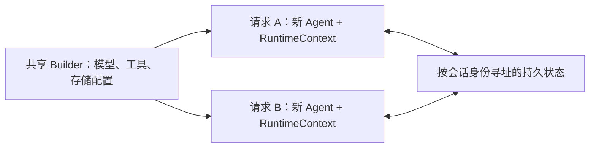

<span id="本页与-harness-上下文构建的关系" />

## 本页与上下文管理的关系

本页介绍 **会话状态放在哪里、如何保存恢复，以及工具如何访问本次调用状态**。
每轮推理如何组织模型输入、接入动态业务材料、跟进任务和压缩历史，见
[上下文管理](/v2/zh/docs/harness/context)。

| 概念 | 职责 | 是否直接发给模型 |
| --- | --- | --- |
| AgentState | 保存会话历史、任务、计划模式和权限等可变状态 | 不会整体发送；由请求构建过程选择内容 |
| RuntimeContext | 携带本次调用身份、属性和当前 AgentState 引用 | 任意属性不会自动成为提示内容 |
| 模型请求上下文 | 本次推理的指令、消息、状态投影、参考资料及工具 Schema | 是；不等于持久化状态的原样序列化 |

例如，Harness 从任务状态生成临时 TASK_STATE，从 MEMORY.md 加载参考材料，
但这些临时消息不会因此追加到持久化会话历史。普通 ReActAgent 不自动启用
Harness 的材料组织与预算策略。

## 无状态 Agent 引擎

`ReActAgent` 和 `HarnessAgent` 将模型、工具等执行配置与会话状态分开。推荐在应用启动时配置共享 Builder，每次请求构建并关闭独立的 Agent；同一会话通过稳定身份与存储延续，不依赖保留上一次请求的 Java 对象。实例生命周期和共享实例的说明集中在[智能体](/v2/zh/docs/building-blocks/agent#实例生命周期)。



Agent 实例仍持有执行门、状态缓存和后台资源，应在执行结束后关闭。新实例只能恢复已成功提交的状态；如果普通 Core Agent 没有配置日志或状态存储，旧实例里的内存上下文不会自动传给新实例。

工具和中间件通过框架注入的 `RuntimeContext.getAgentState()` 访问当前会话，不保存全局“当前状态”引用。新建 Agent 不会复制所有业务依赖，也不替代权限检查；共享依赖应支持并发访问。同一会话跨实例执行需要应用调度协调，详见下方[并发使用](#并发使用)。

## AgentState

[`AgentStateStore`](/v2/zh/integration/session/index) 持久化的是一份 **`AgentState`**(`io.agentscope.core.state.AgentState`),它是 agent 当前"瞬时"运行状态的完整快照:

| `AgentState` 字段 | 内容 |
|---|---|
| `getSessionId()` | 本份状态所属的会话标识 |
| `getUserId()` | 所属用户标识(匿名会话为 null) |
| `getContext()` / `contextMutable()` | 当前对话历史(用户输入、assistant 回复、工具调用、工具结果) |
| `getSummary()` | 压缩后的摘要(如果开了压缩) |
| `getPermissionContext()` | 工具权限规则,见[权限系统](/v2/zh/docs/building-blocks/permission-system) |
| `getPlanModeContext()` | Plan Mode 当前是否激活、计划文件路径 |
| `getTasksContext()` | Todo、修订号，以及可选的任务目标、需求、证据绑定版本和验证摘要 |
| `getToolContext()` | 工具组激活状态(`activatedGroups`) |

执行控制与 `AgentState` 分离，每次调用拥有独立中断信号，详见下方[Per-session 中断](#per-session-中断)。

在 LEGACY 或未启用原生日志的 Core Agent 中，一次 `call()` 结束,框架把整份 `AgentState` 以 `agent_state` 这个键写进状态存储,按该次调用的 `(userId, sessionId)` 寻址。下次同 `(userId, sessionId)` 的 `call()` 会自动从存储读回——配置共享状态存储后，其他实例可以加载已成功保存的状态；这不保证并发调用间实时一致，也不恢复尚未保存的进度或外部副作用。

### 任务状态不是自动业务判定

TaskContextState 的 Todo 由 todo_write 或应用更新；任务目标由应用调用 beginTask 设置。
可选候选工具只提出要求，确认/拒绝由可信调用方执行 decide。
被校验对象版本由应用维护；验证摘要由显式 VerificationService 调用产生。

框架保存这些字段，不代表会自动从用户消息、PLAN.md 或工具文本推断它们。
Todo 完成、要求已确认、限定检查通过是不同含义，都不自动代表整体完成。
Harness 是否展示这些信息由 taskContext 配置控制；字段与更新入口的完整对照见
[可选任务信息](/v2/zh/docs/harness/context#可选任务信息)。

### Session Log 与 AgentStateStore 的关系

`call` / `streamEvents` 与 `AgentSession` 使用相同的会话存储配置。多轮对话、历史查询和状态持久化不要求启用会话调度；需要后台任务、持久排队或会话级中断续做时，再使用 [AgentSession](/v2/zh/docs/harness/session-log)。直接调用的入门用法见[快速开始](/v2/zh/docs/quickstart)。

HarnessAgent 默认 EVENT_LOG：已有原生日志时，AgentState 从日志 checkpoint 及后续可应用事实重建，保存时向日志提交 checkpoint；AgentStateStore 不再是该会话的恢复权威。LEGACY 和未启用日志的 Core Agent 使用下文的状态存储链路。

原生日志默认复用 Workspace Filesystem（也支持分布式），或用 sessionLogStore 指定。稳定 agentId、userId、sessionId、namespace 与存储都要保持一致。SDK 历史查询、未知工具核对和 checkpoint 接续见 [会话日志与恢复](/v2/zh/docs/harness/session-log)。下面仅配置 stateStore 的跨节点示例显式选择 LEGACY；默认 EVENT_LOG 还须共享原生日志。

### 自动持久化与恢复链路

```
call(msgs, RuntimeContext(userId, sessionId))
  │
  ├─ 实例内 per-session 门: 相同 (uid, sid) 串行, 不同会话并行
  │
  ▼
  配置 store 时每次 call 重新加载；否则使用槽位缓存
  │   注入到 RuntimeContext: rc.setAgentState(state)
  │
  ▼
  推理循环
  │   对话写入 context；Plan、Todo、权限更新各自子状态
  │   Harness 构建临时模型视图；通过检查后才提交候选压缩历史
  │
  ▼
  保存 AgentState
  │   stateStore.save(userId, sessionId, "agent_state", state)
  │
  ▼
  返回结果
```

这套机制是 **`ReActAgent` 自带**的,`HarnessAgent` 直接继承,无需额外配置。Agent 实例不绑定固定 session——每次调用读写的是其 `RuntimeContext` 指定的槽位(缺省回退到 builder 上的 `defaultSessionId`)。

> 推理期间主要更新内存状态；正常结束、受控失败/中断和停机路径会尝试保存 agent_state。强制终止进程不保证完成保存。clearContext 等管理操作也可显式保存；执行观察、验证结果还会独立写入其他 State key，不能据此假设整个存储每次 call 只写一次。

### 内置与扩展实现

只要实现 `io.agentscope.core.state.AgentStateStore` 接口,任何后端都能接进来。选择哪一种,取决于你的部署形态:

| 实现 | 模块 | 适用场景 |
|---|---|---|
| `InMemoryAgentStateStore` | `agentscope-core` | 单元测试 / 单进程演示;进程退出全部丢失 |
| `JsonFileAgentStateStore` | `agentscope-core` | 单机开发、文件落盘即可恢复;不能跨节点共享。**`HarnessAgent` LEGACY 模式默认值**,落在 `~/.agentscope/state/<agentId>/`(可通过 `agentscope.state.home` 系统属性改根目录);**单机** |
| `RedisAgentStateStore` | `agentscope-extensions-redis` | **生产首选**,多副本共享;支持 Jedis / Lettuce / Redisson(Standalone / Cluster / Sentinel) |
| `JdbcAgentStateStore` | `agentscope-extensions-jdbc` | 需要把状态沉淀进关系型库(审计、报表)时使用 |

切换非常简单——只在构造期 `.stateStore(...)` 一次:

```java
// 默认(单机):省略 .stateStore(...) 即可,自动用本地 JsonFileAgentStateStore
HarnessAgent agent = HarnessAgent.builder()
    .legacySessionHistory(true)
    .name("MyAgent")
    .model(model)
    .workspace(workspace)
    .build();

// 多副本生产:使用 DistributedStore
JedisPooled jedis = new JedisPooled("redis://redis.prod:6379");
HarnessAgent agent = HarnessAgent.builder()
    .legacySessionHistory(true)
        .name("MyAgent")
        .model(model)
        .workspace(workspace)
        .stateStore(new RedisAgentStateStore(jedis))
        .distributedStore(RedisDistributedStore.fromJedis(jedis))
        .build();
```


<Warning>

内置的 `JsonFileAgentStateStore` / `InMemoryAgentStateStore` 仅适合单机。如果你已经在用 `filesystem(SandboxFilesystemSpec)` 或 `filesystem(RemoteFilesystemSpec)`(分布式工作区),LEGACY 模式的 HarnessAgent 会**强制要求**状态存储也换成分布式后端,否则 `build()` 直接抛 `IllegalStateException`——因为 sandbox 状态必须跨副本共享。请通过 `.distributedStore(...)` 或 `.stateStore(...)` 配置分布式后端(例如 `RedisDistributedStore`)。

</Warning>


### 同 (userId, sessionId) 跨进程、跨机器接续

配置共享状态存储后，每次 call 会重新加载该槽位已保存的状态。以下示例假设节点 A 已完成保存，再由节点 B 接续，不是两个节点同时执行同一会话：

```java
// 节点 A:开了一段对话
HarnessAgent agentA = HarnessAgent.builder()
    .legacySessionHistory(true)
    .stateStore(redisStore)
    /* ... */ .build();
agentA.call(msg, RuntimeContext.builder()
    .sessionId("alice-2026-06-02-001")
    .userId("alice")
    .build()).block();

// 节点 B:不同物理机,完全独立的 JVM
HarnessAgent agentB = HarnessAgent.builder()
    .legacySessionHistory(true)
    .stateStore(redisStore)
    /* 同一份存储后端 */ .build();

// 节点 B 第一次用相同 (userId, sessionId) 的 call() 会自动从 Redis 拉到节点 A 之前留下的 AgentState
agentB.call(nextMsg, RuntimeContext.builder()
    .sessionId("alice-2026-06-02-001")
    .userId("alice")
    .build()).block();
```

这意味着:

- **故障恢复**：另一节点可恢复最近成功保存的快照；未保存进度可能丢失，工具外部副作用需业务核对，不能盲目重放。
- **滚动发布**：优雅停机路径尝试保存，新实例可加载已保存状态；仍需预留停机时间，并确认状态格式及业务配置适用。
- **跨入口接续**：Web UI 与 CLI 使用同一状态存储及相同身份槽位，可以接续已保存的会话；调用方必须验证用户访问权限。

`(userId, sessionId)` 决定状态槽位。匿名/单租户可使用空 userId；多租户应从可信认证上下文取得 userId，不能信任客户端任意指定的身份。

跨实例并发还需会话路由或分布式协调。支持版本控制的 StateStore 保存时使用 CAS，冲突结果由 ConflictPolicy 决定；不支持版本控制的后端没有该保护。CAS 也不回滚已经发生的工具副作用。

### 多用户隔离

`sessionId` 和 `userId` 解决的不是同一件事:

- **`sessionId`** —— 决定哪段对话是哪段,独立的 `AgentState` 快照。
- **`userId`** —— 决定这段对话归谁,也决定文件落到谁的命名空间下,详见[文件系统](/v2/zh/docs/harness/filesystem)。

```java
agent.call(msg, RuntimeContext.builder()
    .sessionId("alice-1").userId("alice").build()).block();

agent.call(msg, RuntimeContext.builder()
    .sessionId("bob-1").userId("bob").build()).block();
```

不同身份对使用不同的状态槽位；文件共享范围另由 filesystem 的 IsolationScope 决定。生产部署需要在认证和授权后设置 RuntimeContext.userId：存储会按 `(userId, sessionId)` 寻址每个槽位(配合 `RedisAgentStateStore` 时 `userId` 就是 Redis key 的一部分),而不是依赖文件路径分桶。

### 直接读写 AgentState

需要旁路读取（例如管理台、审计）时，可按身份取得状态。不要与正在执行的同会话调用并发修改；取得或修改对象不代表已经持久化，也不提供事务或授权校验：

```java
import io.agentscope.core.state.AgentState;

AgentState state = agent.getAgentState("alice", "session-001");
System.out.println("messages: " + state.getContext().size());

String json = state.toJson();
AgentState restored = AgentState.fromJsonString(json);
```

| 方法 | 说明 |
|------|------|
| `getContext()` | 当前对话历史(不可变视图) |
| `contextMutable()` | 可写入视图,谨慎使用 |
| `setSummary(...)` / `getSummary()` | 自定义压缩摘要(自行实现压缩 middleware 时用) |
| `toJson()` / `fromJsonString(String)` | 序列化与反序列化 |

### 清空会话对话上下文

EVENT_LOG 模式下，`getAgentState()` 返回原生日志投影的独立快照；`clearContext()`、权限修改和 `saveAgentState()` 均以 writer 租约和版本检查提交原生 checkpoint。旧的 get→修改→save 调用可继续使用，但过期快照会被拒绝；并发管理操作推荐 `updateAgentState(rc, reason, mutation)`。清空的是工作上下文，完整 Session Log 历史仍然保留；直接改 AgentStateStore 不影响原生会话。

若要让用户在不创建新会话的情况下开始新话题，可调用 `clearContext`。该方法保留相同的
`(userId, sessionId)`，也保留权限、工具、任务和 Plan Mode 等非对话状态；它会清空模型可见的
历史消息缓冲和压缩摘要，并立即持久化结果：原生模式提交 checkpoint，LEGACY 使用配置的 AgentStateStore。

```java
agent.clearContext("alice", "session-001");

// 也可以传入与调用时相同的 RuntimeContext。
agent.clearContext(RuntimeContext.builder()
    .userId("alice")
    .sessionId("session-001")
    .build());
```

请在该会话当前请求完成后调用。它不会取消正在执行的调用。
下一次请求仍会加载 System、工作区材料及保留状态的投影，因此不等于清除全部模型输入。
旧 Todo、需求或计划状态仍可能出现；完整的新会话应使用新的 sessionId，而不是仅清空历史。


<Note>

1.0 中的 `Memory` 接口(`InMemoryMemory` / `LongTermMemory` 等)在 2.0 已 `@Deprecated(forRemoval = true)`。新代码请使用 `AgentState.getContext()` + `AgentStateStore` —— `Memory` 仅作为源代码兼容层保留。

</Note>


### Per-session 中断

每次执行拥有独立、仅在运行时存在的 `InterruptControl`，不存放在 `AgentState` 上，也不随会话历史持久化。按 session 中断时，框架定位该 session 当前已获得执行位置的调用：

```java
agent.interrupt("alice", "session-001");
agent.interrupt("alice", "session-001", new UserMessage("请停止。"));
```

空闲 session 不受影响。通过 AgentSession 提交的任务使用 `session.interrupt()`；界面已绑定某次执行时可传入 `session.interrupt(runId)`，拒绝误中断后续执行。中断后用 `session.resume(turnId)` 继续原任务，见[会话使用指南](/v2/zh/docs/harness/session-log)。

推理循环在协作检查点读取本次执行的信号。用户中断会生成带中断标记的恢复回复并保存会话状态。已废弃的无参 `interrupt()` 定位默认 session 的当前执行，不读取最近一次调用的上下文。

`AgentState.shutdownInterrupted` 是单独持久化的恢复标记。优雅停机会绑定本次执行控制以及该次调用解析出的状态；排队调用没有待保存的会话状态。中断信号不会传给后续执行，也不会被另一节点加载。

### 并发使用

以下 Builder 由应用启动时配置，分别为 Alice 和 Bob 的请求创建实例。这里的 `workspace` 应指向可持久保留的工作区；多副本部署还需共享原生日志后端。

```java
import io.agentscope.core.agent.RuntimeContext;
import io.agentscope.core.message.Msg;
import io.agentscope.harness.agent.HarnessAgent;
import reactor.core.publisher.Mono;

HarnessAgent.Builder agentBuilder = HarnessAgent.builder()
        .name("Assistant").agentId("assistant")
        .model(model).workspace(workspace);

Mono<Msg> aliceCall = Mono.using(
        agentBuilder::build,
        agent -> agent.call(aliceMsg, RuntimeContext.builder()
                .userId("alice").sessionId("s1").build()),
        HarnessAgent::close);
Mono<Msg> bobCall = Mono.using(
        agentBuilder::build,
        agent -> agent.call(bobMsg, RuntimeContext.builder()
                .userId("bob").sessionId("s2").build()),
        HarnessAgent::close);

Mono.zip(aliceCall, bobCall).block();
```

不同会话可以并行；同一会话的多个请求应由应用按顺序调度，或交给持有后台生命周期的 `AgentSession` 排队。单实例的执行门不会协调其他实例；原生日志的 writer 隔离避免并发提交，不保证跨实例请求自动等待或按 FIFO 执行。

跨请求中断必须找到正在执行的实例；新建实例不持有旧调用的中断信号。请求结束后关闭 Agent，释放该实例的缓存与运行资源；模型、连接池等应用级共享依赖在应用退出时统一关闭。

---

## `RuntimeContext` —— per-call 元数据

`RuntimeContext`(位于 `io.agentscope.core.agent`)是一个轻量容器,在 `agent.call(msgs, ctx)` 中传入,hook 与 tool 在本次调用期间共享。其自由 / 类型属性**不自动持久化，也不自动注入模型消息**;而 `sessionId` / `userId` 字段决定本次调用状态存储读写哪个 `AgentState` 槽位。在 call 入口,框架会把 call-scoped 的 `AgentState` 注入到 `RuntimeContext` 上,中间件和工具通过 `ctx.getAgentState()` 获取正确的 per-call 状态。

```java
import io.agentscope.core.agent.RuntimeContext;

RuntimeContext ctx = RuntimeContext.builder()
        .userId("alice")
        .sessionId("s-001")
        .put("request_id", "req-2026-06-01-abc")
        .put(MyTenantInfo.class, new MyTenantInfo("tenant-7"))
        .build();

Msg result = agent.call(List.of(new UserMessage("Hi")), ctx).block();
```

可用字段:

| 方法 | 说明 |
|------|------|
| `getSessionId()` / `getUserId()` | 内置字段,用于路由状态槽位与租户 |
| `getRunId()` | 每次调用的稳定关联 ID(见下方[runId 关联](#runid-关联)),恒非 null |
| `getAgentState()` / `setAgentState(AgentState)` | call-scoped 的 `AgentState`,由框架在 call 入口注入。中间件和工具应从这里读状态,而非 `agent.getAgentState()` |
| `resolveAgentState(ctx, agent)` | 静态辅助方法:优先返回 `ctx.getAgentState()`,回退到 `agent.getAgentState()`。执行期间应确保当前调用已注入状态；回退不保证选中正确业务会话 |
| `get(String)` / `put(String, Object)` | 字符串键存取 |
| `get(Class<T>)` / `put(Class<T>, T)` | 按类型存取(typed singleton) |
| `getExtra()` | 直接拿到字符串属性 map(可变视图) |
| `RuntimeContext.empty()` | 空上下文 |

### runId 关联

`RuntimeContext` 上有一个恒非 null 的 `runId`:`builder().runId(x)` 显式传入非空白值时原样保留,否则(未设置或为空白)在 `build()` 时自动生成(32 位 hex)。它的用途是把**一次执行**在执行层和产品层串起来:

- 中间件、工具、日志、tracing 都能用 `ctx.getRunId()` 关联同一次调用——多会话并发时,grep 一个 runId 即可还原某次调用的完整链路;
- `prepareRun` / `prepareCall` 创建的 `AgentRun` 句柄直接采纳 ctx 的 runId,因此 `run.runId() == ctx.getRunId()`,与 `AgentRunRegistry` 注册键、SSE 的 `SESSION_RUN_STARTED` 事件、前端取消运行所用的 id 天然同源;
- 子代理上下文经 `RuntimeContext.builder(parentRc)` 派生时拷贝 runId,`agent_spawn` 触发的子代理自动继承父调用的 id——即使子代理有独立 sessionId,链路 id 也能把整条执行串起来。

```java
// 编排层显式贯穿业务链路 id(唯一性由调用方负责):
RuntimeContext ctx = RuntimeContext.builder()
    .userId("alice")
    .sessionId("s-001")
    .runId("trace-2026-09-25-0001")   // 贯穿整个多 agent 流程
    .build();

// 中间件 / 工具中关联本次执行:
log.info("[runId={}] tool executed", ctx.getRunId());

// 句柄与执行层同 id:
AgentRun<Msg> run = agent.prepareCall(msgs, ctx);
assert run.runId().equals(ctx.getRunId());
```

每次创建新的执行句柄时，都应使用一个新的 `RuntimeContext`。如果需要保留上一次调用的 Session 和其他属性，可以使用 `RuntimeContext.builder(previous).runId(null).build()`，为新执行生成新的 runId。外部工具返回结果后，即使仍在继续同一个 Turn，也需要遵循这一规则。子 Agent 的派生上下文可以继承父调用的 runId 来关联调用链路。启用原生 Session Log 后，如果执行句柄重复使用该 Session 已记录的 runId，执行会被拒绝；Service 中的 `AgentRunRegistry` 也会拒绝并发注册重复的 runId。


<Tip>

**`AgentStateStore` 后端在 builder 时绑定,不能通过 RuntimeContext per-call 切换**。per-call 变化的是它寻址的 `(userId, sessionId)` 槽位——按用户隔离时设置 `userId`(或在存储上自定义 `keyPrefix`),不要试图给每次 call 传不同的存储实例。

</Tip>


<Tip>

**在中间件和工具中访问 `AgentState`:** 在 call 执行期间,始终使用 `RuntimeContext.resolveAgentState(ctx, agent)` 而非 `agent.getAgentState()`。无参 `agent.getAgentState()` 已弃用，返回匿名用户的默认 session 槽位，不是最后活跃会话。`ctx.getAgentState()` 才是本次调用的状态；resolveAgentState 在该值缺失时仍会回退，不能把回退当成会话路由保证。

</Tip>


---

## 相关文档

- [上下文管理](/v2/zh/docs/harness/context) —— 组织模型输入、跟进任务进度，并通过摘要和工具结果卸载控制上下文大小
- [智能体（Agent）](/v2/zh/docs/building-blocks/agent) —— `ReActAgent` 完整接口与 Builder 参数
- [记忆](/v2/zh/docs/harness/memory) —— 长期记忆与后台维护
- [权限系统](/v2/zh/docs/building-blocks/permission-system) —— 权限规则的持久化
