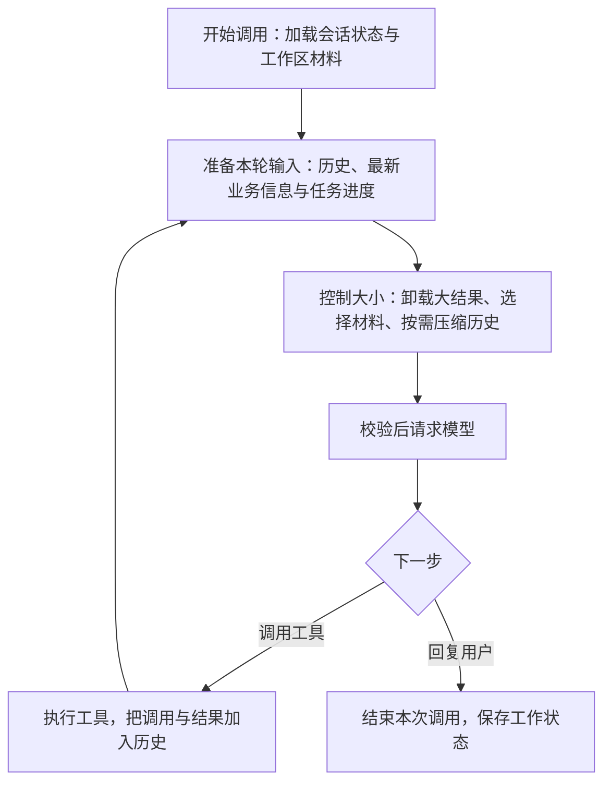

用户让 Agent 修复一个问题时，Agent 往往需要先读代码、拟定方案、修改文件，再运行测试。每次决定下一步之前，模型都需要知道：用户要什么、已经做过什么、刚才的工具返回了什么，以及还有哪些工作没完成。任务越长，这些信息越多；把全部内容一直放进请求，既增加开销，也可能超出模型的上下文窗口。

上下文管理就是在这个过程中，持续为模型准备**足以继续工作的输入**。`HarnessAgent` 以 `ReActAgent` 的推理与工具执行循环为基础，内置了材料加载、任务状态展示、预算控制和历史压缩。普通 `ReActAgent` 的循环相同，但不会自动安装这套 Harness 策略。

大多数应用可以先使用默认配置。本页沿着一次任务的执行过程，说明什么时候需要补充业务信息、如何让 Agent 跟进长程任务，以及上下文变长后框架如何处理。

## 从一次推理开始理解上下文

一次 `call` 可能包含多轮模型推理和工具调用。Harness 在**每次请求模型之前**重新准备上下文，而不是在任务开始时拼一次提示词，之后一直沿用。



这里需要区分“保存的状态”和“发给模型的内容”。`AgentState` 保存会话历史、任务、计划模式等工作状态；模型收到的是从这些状态和外部材料中组织出的本轮输入。`RuntimeContext` 则携带用户、会话等调用信息，其中任意一个属性都不会自动变成模型提示。关于状态如何保存和恢复，见[上下文与 AgentState](/v2/zh/docs/building-blocks/context)。

下面以修复问题的助手为例。应用启动时配置共享 Builder，每次请求创建一个 Agent；保持稳定的用户、Agent 和会话身份，才能延续同一段对话。`model` 是已经配置好的[模型](/v2/zh/docs/building-blocks/model)。

```java
import io.agentscope.core.agent.RuntimeContext;
import io.agentscope.core.message.Msg;
import io.agentscope.core.message.MsgRole;
import io.agentscope.harness.agent.HarnessAgent;
import java.nio.file.Path;

HarnessAgent.Builder builder = HarnessAgent.builder()
        .name("项目助手")
        .agentId("project-assistant")
        .model(model)
        .workspace(Path.of("/data/project-workspace"));

// 每次请求创建实例，执行结束后关闭。
try (HarnessAgent agent = builder.build()) {
    RuntimeContext ctx = RuntimeContext.builder()
            .userId("alice").sessionId("fix-login-001").build();
    Msg input = Msg.builder().role(MsgRole.USER)
            .textContent("修复登录失败的问题，完成后运行相关测试。").build();
    Msg reply = agent.call(input, ctx).block();
    System.out.println(reply.getTextContent());
}
```

后续示例都是对这个 `builder` 的配置，应在应用启动时、第一次 `build()` 之前完成。上下文管理不要求使用 `AgentSession`；需要任务在页面关闭后继续执行、运行中补充要求或中断后续做时，再参考[会话操作、事件与恢复](/v2/zh/docs/harness/session-log)。

<span id="材料与稳定指令" />

## 开始调用：准备规则与已有材料

修复问题之前，Agent 首先要了解项目约定。稳定的角色和行为规则可以写在 `sysPrompt` 或工作区的 `AGENTS.md` 中，也可以通过 `instruction` 添加可信的业务指令：

```java
builder.instruction("test-policy", "修改代码后运行相关测试；无法运行时说明原因。");
```

这些规则进入 System。Harness 还会加入内置工作原则、环境信息，以及当前模式的行为规则。工作区中的 `MEMORY.md`、知识材料和额外上下文文件则作为**参考资料**提供，不会因为来自文件就成为 System 指令。

工作区材料在一次 Agent 调用开始时加载。因此，执行期间修改 `AGENTS.md` 或 `MEMORY.md`，不会自动改变本次调用已经加载的材料；下一次调用才会重新读取。若某项业务数据需要在工具执行后立即刷新，应使用下一节的动态来源。

<span id="模型会看到什么" />
<span id="请求内容示例" />

## 每轮推理：让模型看到当前需要的信息

假设 Agent 已经读过代码，并得到一次失败的测试结果。下一轮请求模型时，Harness 会按照下面的顺序组织输入：

| 顺序 | 内容 | 修复问题时的例子 |
| --- | --- | --- |
| System | 合并后的稳定指令、项目规则和模式规则 | 项目编码约定、修改后需要运行测试 |
| 对话历史 | 用户输入、Assistant 消息、工具调用与结果；必要时包含历史摘要 | 用户报告的问题、已读代码、刚才的测试结果 |
| 当前状态 | 从任务、计划和动态来源生成的临时消息 | 当前待办、计划模式、最新构建状态 |
| 参考材料 | 工作区记忆、知识资料和动态参考资料 | 项目背景、相关文档片段 |

工具 Schema 随请求单独提供，也占用上下文预算。模型能否选择某个工具，取决于这一轮暴露的工具集合；工具能否真正执行，还由权限系统检查。

任务与计划状态分别以 `TASK_STATE`、`RUNTIME_STATE` 等标记展示，业务材料和参考资料放在 `HARNESS_CONTEXT` 中。它们是临时组织出的模型输入，不会每轮重复追加到持久化对话历史。应用通过 API 提供内容即可，不需要自行拼接这些标记。

这也给出了控制模型可见内容的几个入口：稳定规则放进指令，最新业务事实由动态来源读取，长篇资料按相关性选择片段，工具则通过工具配置和权限控制。**来源读取时仍应按用户和会话校验访问权限。** 将内容标为“参考资料”、设置优先级或关闭某项状态展示，都不会清除已经写入历史的内容，也不能替代权限检查。

<span id="接入动态业务信息" />

### 接入会变化的业务信息

例如，修复助手需要在每次推理时了解当前构建状态。可以注册一个 `contextSource`；下面先用固定值演示返回结构，实际应用中将它替换为按当前用户和会话查询业务服务的逻辑：

```java
import io.agentscope.harness.agent.context.ContextBlock;
import java.util.List;
import reactor.core.publisher.Mono;

builder.contextSource("build-status", request -> Mono.just(List.of(
        ContextBlock.runtime("latest", "当前构建：测试失败，登录模块有 2 项失败。")
)));
```

注册和 `build()` 不会执行查询。Harness 在每次推理请求准备时调用来源，因此工具完成工作后，下一轮可以读到更新的数据。来源收到的 `ContextRequest` 包含 `agentId`、`userId`、`sessionId`、模型调用 `callId` 和用途 `purpose`，可以据此选择数据，但业务服务仍需自行鉴权。

使用 `ContextBlock.runtime` 提供当前事实，例如审批状态或剩余额度；使用 `ContextBlock.reference` 提供文档、检索片段等参考材料。动态来源不能创建 System 指令。需要稳定业务规则时，使用前面的 `instruction`。

对于参考资料，可以附上版本并设置取舍优先级：

```java
builder.contextSource("project-guide", request -> Mono.just(List.of(
        ContextBlock.reference("login", "登录接口约定：会话过期后返回 401。")
                .withRevision("guide-v3")
                .withPriority(20)
)));
```

预算不足时，同一类可选材料中较低优先级的内容先被省略。如果某块材料缺失就不能正确工作，可以调用 `.required()`，要求构建时保留它；但过大的必需材料仍可能导致整个请求超出预算。优先传入精简、相关的内容，不要将整份业务数据库标为必需上下文。

<span id="超时与失败" />

### 来源失败时如何处理

如果构建状态是作出决定的必要依据，查询失败就应停止准备请求。动态来源默认采用这一行为，超时为 5 秒。对于可有可无的推荐材料，可以允许失败时跳过：

```java
import io.agentscope.harness.agent.context.SourceFailurePolicy;
import java.time.Duration;

builder.contextSource("related-notes", request -> Mono.just(List.of(
        ContextBlock.reference("note", "历史排查记录：优先检查会话过期处理。")
)), options -> options
        .timeout(Duration.ofSeconds(2))
        .onFailure(SourceFailurePolicy.OMIT));
```

`OMIT` 会省略这次失败的来源，不会悄悄沿用上次读取的旧值；它也不能用于包含 `required` 块的来源。重复 ID、非法块等结构错误仍会报错。

来源应只读，并能安全地重复调用。一次执行可能准备多个模型请求，回退或重新准备请求时也可能再次读取；不要在这里扣费、更新订单或执行其他业务动作。共享 Builder 中的来源回调和它依赖的客户端，也应支持并发访问。

<Accordion title="动态来源的返回约定">

`ContextSource.load(ContextRequest)` 返回 `Mono<List<ContextBlock>>`。没有相关内容时返回空列表；`Mono.empty()` 不等同于“没有材料”，会作为来源加载失败处理。

来源名必须唯一，同一来源中的块 ID 也必须唯一。未指定 `revision` 时使用内容哈希，便于诊断同一块资料是否发生变化。多个来源按注册顺序加载；取消后的外部查询能否及时结束，取决于业务客户端的取消支持。

</Accordion>

<span id="可选任务信息" />

## 工具执行之后：持续跟进长程任务

修复登录问题可能经历“定位原因、调整实现、补充测试、验证结果”多个步骤。仅靠很早以前的一条用户消息或一段计划，模型容易忘记哪些已经完成。可以开启任务列表，让 Agent 用 `todo_write` 更新工作进度：

```java
builder.enableTaskList();
```

Todo 保存在结构化任务状态中。最新的完整 Todo 工具回执仍在历史里时，Harness 会避免重复展示同一份列表；旧回执被裁剪或摘要后，会从当前任务状态重新生成 `TASK_STATE`。这样，即使早期对话不再逐字发送，模型仍能看到当前进度。

如果工作需要先确定方案再执行，可以结合 [Plan Mode](/v2/zh/docs/harness/plan-mode)：计划文件保存较完整的方案，Todo 跟踪正在做的步骤，当前模式和计划文件路径帮助模型知道接下来应如何行动。框架不会自动把 `PLAN.md` 中的段落同步成 Todo，二者需要由 Agent 的工具操作或应用明确维护。

业务对完成标准有更严格要求时，还可以展示任务目标、已确认要求和验证结果：

```java
import io.agentscope.harness.agent.context.TaskContextOptions;

builder.taskContext(TaskContextOptions.builder()
        .includeRequirements()
        .includeVerificationResults()
        .build());
```

这两个开关默认关闭，彼此独立；开启任意一个后也会展示已设置的任务范围和目标。它们决定模型能看到什么，并不会自动从用户消息中提取要求或自动执行验证。应用通过 `TaskContextState.beginTask` 设置目标，可信业务逻辑确认或拒绝要求，并显式调用 `VerificationService` 记录检查结果。需要模型提出候选要求时，可以额外使用 `allowRequirementProposals()`；提出候选不等于批准。

例如，“补充登录测试”这一条 Todo 已完成，只能说明该工作项被标记完成；测试是否通过，应看实际验证结果。代码之后再次变化，旧的验证结论也可能不再适用，需要应用更新被验证对象的版本并重新检查。不要仅根据 Todo 全部完成就判定整个业务任务成功。

## 请求变长时：先减少负担，再压缩历史

随着代码片段和测试输出不断累积，上下文大小也会增长。Harness 默认启用大工具结果卸载与对话压缩，并在最终模型请求中一起计算消息、工具 Schema 等内容的预算。通常不需要先写配置，遇到明确的成本、窗口或保留需求时再调整。

<span id="harnessagent-内置的几种策略" />
<span id="2-大工具结果卸载-toolresultevictionmiddleware" />

### 把大工具结果留在文件中，按需读取

一次测试可能输出很长的日志。准备下一轮模型请求时，Harness 会把超大的工具结果写入 Workspace Filesystem，在上下文中保留首尾预览和文件位置，模型需要细节时再通过 `read_file` 分段读取。这个文件可以位于本地或分布式后端，取决于 [Filesystem 配置](/v2/zh/docs/harness/filesystem)。

默认阈值为 80,000 字符，预览保留首尾各 2,000 字符，文件位于工作区逻辑路径 `large_tool_results/` 下。需要更小的预览时，可以调整：

```java
import io.agentscope.harness.agent.memory.compaction.ToolResultEvictionConfig;

builder.toolResultEviction(ToolResultEvictionConfig.builder()
        .maxResultChars(40000)
        .previewChars(1000)
        .build());
```

`read_file`、`write_file`、`edit_file`、`memory_search`、`memory_get` 和 `session_search` 默认不参与这种卸载。`execute` 等工具仍可卸载；读取工具本身应合理分页，避免一次读回全部内容又占满窗口。

<span id="配置预算与观测" />

### 为必要信息和模型输出留出空间

处理大结果后，Harness 会检查整体预算。空间不足时，先省略可选的记忆和知识材料，再省略其他可选材料；保留 System 与标为 `required` 的块，并为任务状态和工具 Schema 等内容计入开销。剩下的空间才是对话历史可以使用的预算。

默认预算根据模型报告的窗口大小，为输出和安全余量预留空间；模型没有报告窗口时，输入预算回退到 64,000 token。估算不是供应商的精确计数，尤其是包含图片等内容时，应给实际请求留有余量。若希望主动限制输入成本，可以配置：

```java
import io.agentscope.harness.agent.context.ContextPolicy;
import io.agentscope.harness.agent.context.ContextTokenEstimator;

builder.contextPolicy(new ContextPolicy(
        24000,  // 最大输入预算
        4096,   // 为模型输出预留
        1024,   // 安全余量
        ContextTokenEstimator.approximate(),
        manifest -> System.out.println("本轮估算 token：" + manifest.estimatedInputTokens())));
```

最终输入上限还会受到模型窗口与输出设置约束。`maxContextTokens` 是工作区材料的加载预算，不是整个模型请求的总上限，不要用它替代 `contextPolicy`。

<span id="1-对话摘要压缩-compactionmiddleware" />

### 保留近期工作，把早期对话整理成摘要

选定材料后，Harness 根据留给历史的空间处理对话。它会先做不需要模型的轻量处理，例如裁剪较旧的大量工具输出；如果仍满足压缩条件，再调用模型将较早的对话整理为摘要，保留近期消息供后续推理使用。

默认摘要包含会话目标、重要结论、文件或其他产物、下一步工作。对于修复任务，模型可以据此知道之前定位了什么、修改过哪些文件、还需要验证什么，而不必每轮重新阅读完整的早期日志。

默认在对话达到 50 条消息，或达到当前可用的对话 token 预算时触发摘要检查；近期保留范围按对话预算动态计算。若希望更早压缩，并按消息条数保留近期内容，可以这样配置：

```java
import io.agentscope.harness.agent.memory.compaction.CompactionConfig;

builder.compaction(CompactionConfig.builder()
        .triggerMessages(30)
        .keepTokens(0)       // 使用消息条数决定保留范围
        .keepMessages(10)
        .build());
```

`keepMessages` 仅在 `keepTokens(0)` 时生效。压缩还会维护工具调用与结果的配对，保留范围不能把一次工具交互随意切开。摘要默认使用 Agent 主模型，也可以通过 `CompactionConfig.builder().model(summaryModel)` 指定辅助模型；自定义 `summaryPrompt` 时需保留 `{messages}` 占位符。

<span id="4-预压缩参数截断-可选" />

<Accordion title="进一步减少旧工具参数和结果的开销">

默认的工具结果裁剪会保护最近约 40,000 token 的工具输出；更早的可裁剪内容累计达到约 20,000 token 时，将旧结果缩为预览。这与单个大结果写入文件是两种处理：裁剪不会为每条旧结果额外生成可回读文件，需要完整事实时应查询 Session Log。

对于 `write_file` 等参数很长的工具，还可以在摘要前开启参数截断：

```java
import io.agentscope.harness.agent.memory.compaction.CompactionConfig.TruncateArgsConfig;

builder.compaction(CompactionConfig.builder()
        .truncateArgs(TruncateArgsConfig.builder()
                .maxArgLength(2000)
                .truncationText("... [truncated] ...")
                .build())
        .build());
```

它只处理保留范围之外的旧消息，不改变已经执行的工具参数。`maxArgLength` 是触发替换的长度阈值；超过阈值的字符串会保留前 20 个字符并附加截断提示，而不是保留完整的 2,000 个字符。此项默认关闭，开启前应确认应用不依赖模型逐字回看这些旧参数。

</Accordion>

<span id="3-上下文溢出兜底" />

### 超出窗口时如何继续

发送前，Harness 会检查最终预算以及工具调用与结果的配对。检查通过、准备期间状态也没有发生冲突，才会采用压缩后的工作历史并发出请求。如果 System、必需材料或其他内容仍然放不下，会抛出 `ContextBudgetExceededException`，此时需要缩小材料、工具定义或调整预算。

估算通过后，供应商仍可能报告上下文溢出。压缩未禁用时，默认原生 Session Log 模式会尝试强制压缩，并在**同一次执行中重新发起这一轮推理一次**；它不会因此重新提交用户任务，也不会把之前已经完成的工具从头再执行。如果无法进一步压缩或重试仍失败，错误会返回给调用方。

<span id="什么时候刷新" />

## 继续任务：哪些信息会重新读取

完成一次工具执行后，新的调用与结果进入对话历史，下一轮重新走上面的准备过程。不同内容的更新时间取决于它的来源：

| 内容 | 何时更新 |
| --- | --- |
| `AGENTS.md`、`MEMORY.md` 和工作区知识材料 | 下一次 Agent 调用开始时重新加载 |
| `contextSource` 业务来源 | 每次准备推理请求时重新读取 |
| Todo、要求、验证和计划模式 | 工具或应用先更新状态，下一轮准备时读取当前快照 |
| 工具调用与结果 | 执行后加入历史，供下一轮推理使用 |

模型回退或重试如果重新经过请求准备，也会重新读取动态来源；不能把这一点等同于所有底层网络重试都会重新加载。摘要和长期记忆提取使用辅助模型请求，不会递归加载这套动态业务来源或重复展示任务状态。

<span id="压缩与-memory-的联动" />
<span id="压缩不会触碰的内容" />
<span id="用-agent-自己查历史会话" />

### 摘要、长期记忆和完整历史各用在什么地方

压缩后的工作历史用于“接着做”。Todo、计划模式和权限等结构化状态独立保存，不会被当作普通对话一起摘要掉；子 Agent 的任务记录也独立保存，但已经进入对话的子 Agent 工具结果仍会参与上下文处理。

长期记忆用于“以后还值得记住”。默认摘要前会尝试从待压缩部分提取长期事实到 Memory，供后续会话使用。摘要和记忆提取都可能遗漏细节，不能代替完整记录，具体配置见[记忆](/v2/zh/docs/harness/memory)。

完整执行历史用于“回看当时发生了什么”。默认原生 Session Log 保存消息与执行事实，压缩只改变模型继续工作的上下文，不会删除这些已提交记录。需要精确回看一段输出时，Agent 可以在工具已启用且权限允许的情况下使用 `session_history`、`session_search`，也可以通过 `session_list` 查找历史会话。应用展示历史、恢复页面或从 checkpoint 继续时，应使用[会话日志 API](/v2/zh/docs/harness/session-log)，而不是把摘要当成完整聊天记录。

<span id="当前边界与排查" />

## 检查模型实际拿到了什么

当模型似乎没看到某条信息时，可以用 `ContextManifest` 检查这次请求准备了哪些材料、用了多少预算，以及哪些内容被省略。它是 Harness 自动生成的**上下文构建清单**，不包含提示词正文，也不需要业务代码自行创建。

一次 `agent.call()` 可能经历多轮推理和工具执行；每次准备模型请求都会产生各自的 Manifest。因此，要检查的是出现问题的那一轮，而不是只看整个任务的最后一条记录。`validation = passed` 表示上下文准备通过，并不表示模型请求已成功，或模型一定采用了其中的信息。

### 在应用中获取清单

最直接的方式是在构建 Agent 前，为 `ContextPolicy` 配置观察回调。下面沿用前文的预算，打印每轮结果、保留的材料以及处理记录；用该 `builder.build()` 创建 Agent 后，正常调用 `call` 或消费 `streamEvents` 即会触发回调。

```java
import io.agentscope.harness.agent.context.ContextManifest;
import io.agentscope.harness.agent.context.ContextPolicy;
import io.agentscope.harness.agent.context.ContextTokenEstimator;

builder.contextPolicy(new ContextPolicy(
        24000, 4096, 1024,
        ContextTokenEstimator.approximate(),
        (ContextManifest manifest) -> {
            System.out.printf("call=%s purpose=%s validation=%s tokens=%d/%d%n",
                    manifest.callId(), manifest.purpose(), manifest.validation(),
                    manifest.estimatedInputTokens(), manifest.inputLimit());
            manifest.items().forEach(item -> System.out.printf(
                    "  source=%s revision=%s placement=%s%n",
                    item.sourceId(), item.revision(), item.placement()));
            manifest.transforms().forEach(change -> System.out.println("  " + change));
        }));
```

`contextPolicy(...)` 会替换整份配置；已有自定义预算时，请保留原来的数值和估算器，只替换回调。共享 Builder 时回调也会被复用，应保证线程安全、尽快返回；生产环境可将这些元数据交给应用的观测系统，不要在回调中执行耗时操作。

### 从清单定位问题

先看 `validation()` 和预算，再按 `sourceId()` 找具体材料，通常就能区分“没有加载”和“加载后被省略”。

| 读取什么 | 如何理解 |
| --- | --- |
| `callId()`、`purpose()`、`model()` | 标识这次模型请求准备及其用途、模型。`callId` 不是 `sessionId`、`turnId` 或 `runId` |
| `estimatedInputTokens()`、`inputLimit()` | 整个请求的估算输入量与最终可用输入上限；不是供应商账单中的实际 token 用量。`countingMethod()` 和 `exact()` 说明计数方式及是否精确 |
| `items()` | 本轮保留的消息、工具 Schema 和材料元数据。材料可通过 `sourceId`、`revision`、`contentHash` 核对来源与版本，通过 `placement` 查看放置位置；消息和工具条目的版本、位置可能为空 |
| `transforms()` | 准备期间做过的处理，例如 `tool_result_offload`（大结果卸载）、`history_compaction`（历史压缩处理），以及材料省略或来源失败记录 |
| `validation()` | `passed` 为准备通过；`budget_exceeded` 为超出预算；`invalid_tool_pairs` 为工具调用与结果配对异常；`state_conflict` / `history_conflict` 为准备期间状态或历史发生冲突；`build_failed` 为其他构建失败 |

例如，前文注册的 `project-guide` 来源返回了 `login` 块，它在清单中的 ID 是 `source/project-guide/login`。如果在 `items()` 中找到它，版本是 `guide-v3`，且校验通过，说明这份约定已经纳入本轮准备好的请求；若回答仍不符合约定，应进一步检查内容和指令是否清晰。

如果没有找到它，就看 `transforms()`：出现 `omitted_for_budget:source/project-guide/login`，说明材料因预算不足被省略，可以缩短材料或调整预算、优先级；出现 `source_unavailable:source/project-guide/:...`，说明配置为 `OMIT` 的来源读取失败，应检查数据源或超时。两种记录都没有时，再检查来源是否返回空列表、是否到了刷新时机，以及本轮请求是否会加载该来源。

构建过早失败时，清单可能没有条目，token 数和上限为 `-1`、计数方式为 `unavailable`，表示尚未获得统计结果。这时应结合调用抛出的异常排查，不能据此认定所有材料都被预算策略省略了。

### 在事件流和会话日志中查看

如果应用已经消费 `streamEvents`，也可以直接在现有流中处理 `context_build` 自定义事件，无需额外发起一次 Agent 调用。下面展示一次完整的订阅；业务中的文本、工具等事件仍按原来的方式处理。

```java
import io.agentscope.core.agent.RuntimeContext;
import io.agentscope.core.event.CustomEvent;
import io.agentscope.core.message.UserMessage;
import io.agentscope.harness.agent.HarnessAgent;
import io.agentscope.harness.agent.context.ContextManifest;

RuntimeContext ctx = RuntimeContext.builder()
        .userId("alice").sessionId("fix-login-001").build();

try (HarnessAgent agent = builder.build()) {
    agent.streamEvents(new UserMessage("继续排查登录问题"), ctx)
            .doOnNext(event -> {
                if (event instanceof CustomEvent custom
                        && "context_build".equals(custom.getName())
                        && custom.getValue().get("context_manifest")
                                instanceof ContextManifest manifest) {
                    System.out.printf("session=%s call=%s validation=%s%n",
                            ctx.getSessionId(), manifest.callId(), manifest.validation());
                }
            })
            .blockLast();
}
```

`context_build` 在上下文准备成功或失败时都会发出，先于实际模型请求。上面的类型判断适用于 SDK 进程内的实时事件；事件经过 JSON 存储或传输后，应按 JSON 对象读取 `context_manifest`。

默认原生 Session Log 会把它保存为 `context/build`。通过 `SessionEvent.data()` 解码记录载荷后，清单位于其中的 `event.value.context_manifest`。需要事后排查某个会话时，通过 `session.log()` 或 `agent.sessionLog(ctx)` 读取记录，并结合日志中的会话、turn 和 run 信息定位，具体见[会话操作、事件与恢复](/v2/zh/docs/harness/session-log)。Manifest 只保存元数据，不能用来重放完整提示词或恢复会话；来源 ID 也可能包含文件名，导出诊断记录时应按业务需要控制访问范围。

如果可选材料的默认取舍顺序不适合业务，可以进一步配置 `contextSelectionPolicy`；它只决定可省略材料的顺序，不能移除 System 或 `required` 内容。通常先精简来源返回值、减少无关工具 Schema，再调整这类策略，会更容易理解和维护。

## 相关文档

- [工作区](/v2/zh/docs/harness/workspace)：组织项目规则、知识和记忆文件。
- [计划模式](/v2/zh/docs/harness/plan-mode)：先形成方案，再推进执行。
- [上下文与 AgentState](/v2/zh/docs/building-blocks/context)：访问、保存和恢复结构化状态。
- [记忆](/v2/zh/docs/harness/memory)：跨会话积累长期事实。
- [会话操作、事件与恢复](/v2/zh/docs/harness/session-log)：后台任务、完整历史与中断续做。
