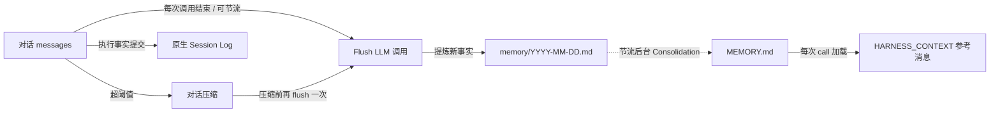

## 作用

让 agent "记住跨会话的事实"，同时避免对话上下文无限增长。Harness 把记忆拆成两层：

- **第一层·日流水账** `memory/YYYY-MM-DD.md` —— 每天追加，原始且未去重；
- **第二层·策划后长期记忆** `MEMORY.md` —— 周期性 LLM 合并去重的产物；每次 Agent call 加载，在模型请求中作为参考资料进入 HARNESS_CONTEXT，而不是 System。

围绕这两层，还有三个常用机制：

- **对话压缩** —— 上下文太长时摘要历史、保留尾部；
- **上下文溢出兜底** —— 模型真的报错时强制压缩并重试；
- **大工具结果卸载** —— 单次工具返回过大时落盘 + 占位符。

## 三处 LLM 调用的全景

记忆管线里有 **三处独立的 LLM 调用**，每一处都有自己的 prompt 和触发时机。这是定制时最容易混淆的地方：

| # | 操作 | 写入目标 | Prompt 默认值 | 定制入口 |
|---|------|----------|---------------|----------|
| 1 | **Flush** —— 从对话窗口抽取长期事实 | `memory/YYYY-MM-DD.md`（追加） | `MemoryFlushManager.DEFAULT_FLUSH_PROMPT` | `MemoryConfig.builder().flushPrompt(...)` |
| 2 | **Consolidation** —— 把每日流水账合并到 `MEMORY.md` | `MEMORY.md`（整体重写） | `MemoryConsolidator.DEFAULT_CONSOLIDATION_PROMPT` | `MemoryConfig.builder().consolidationPrompt(...)` |
| 3 | **Compaction summary** —— 把对话前缀蒸馏成一条摘要消息 | 注入到当前上下文 | `CompactionConfig.DEFAULT_SUMMARY_PROMPT` | `CompactionConfig.builder().summaryPrompt(...)` |

前两个是"沉淀长期记忆"，由 `MemoryConfig` 管；第三个是"压缩当下上下文"，由 `CompactionConfig` 管。三处 LLM 调用默认共享 agent 主模型，但 `MemoryConfig` 和 `CompactionConfig` 各自支持 `.model(...)` 覆盖，允许用更轻量的模型执行这些辅助操作。

## 两层记忆是怎么工作的



要点：

- 第一层只追加，不去重；第二层周期性整体重写；**两层互不覆盖**。
- 第二层永远是 LLM 注入提示的来源；第一层等待被合并。
- 原生 Session Log 已记录完整消息与执行事实；压缩只改变模型工作上下文，历史由 `session_history` / `session_search` 读取，不再重复落盘。

## Flush 的三个触发点

Flush（路径 1）会在以下三个时机被触发：

1. **每次 `call()` 结束** —— `MemoryFlushMiddleware` 的默认行为。可以用 `flushTrigger` 改成 `NEVER` 或 `THROTTLED(Duration)`。
2. **压缩前的预提取** —— `CompactionConfig.flushBeforeCompact = true`（默认）时，压缩对话前缀前先 flush 一次。
3. **上下文溢出兜底** —— 模型真的报 `context_length_exceeded` 时，框架做一次紧急压缩，连带 flush。

这三处用的是 **同一份** `flushPrompt`，定制后三处行为一致。

每轮结束后的长期记忆 Flush 在后台执行；压缩前 Flush 属于压缩步骤。原生 Session Log 在执行边界提交，不能把它当作异步日志副本：关键事实提交失败会阻止继续执行。

<span id="开启压缩" />

## 调整上下文压缩

Harness 默认启用上下文压缩，下面的配置用于调整触发和保留策略。它如何参与每次模型请求的构建，见[上下文管理](/v2/zh/docs/harness/context)。

```java
HarnessAgent agent = HarnessAgent.builder()
    .name("MyAgent")
    .model(model)
    .workspace(workspace)
    .compaction(CompactionConfig.builder()
        .triggerMessages(30)     // 消息条数到 30 触发
        .keepTokens(0)           // 按消息条数保留尾部
        .keepMessages(10)        // 压缩后保留最近 10 条
        .build())
    .build();
```

常用配置项：

| 参数 | 默认 | 含义 |
|------|------|------|
| `triggerMessages` | `50` | 按条数触发（`0` 表示关闭） |
| `triggerTokens` | `0` | 按 token 估算触发（`0` 表示动态计算，依据最终模型请求为对话历史留下的预算） |
| `keepMessages` | `20` | 保留尾部条数 |
| `keepTokens` | `-1` | `-1` 表示动态计算（基于最终模型请求的对话剩余预算）；`0` 表示使用 `keepMessages`；`>0` 表示固定 token 预算并覆盖 `keepMessages` |
| `flushBeforeCompact` | `true` | 压缩前先把新事实写入日流水账（路径 2） |
| `summaryPrompt` | 见 `DEFAULT_SUMMARY_PROMPT` | 路径 3 的摘要 prompt（必须含 `{messages}` 占位符） |
| `model` | `null`（使用 agent 主模型） | 压缩摘要使用的独立模型 |

**上下文溢出自动恢复**：模型返回 `context_length_exceeded` 等错误时，只要没有禁用压缩，框架就会尝试强制压缩。默认的 `EVENT_LOG` 执行模式会在本次执行内重试当前推理一次，无需手工调用 `.compaction(...)` 开启；如果仍然溢出，错误会返回调用方。

### 想再轻一些？预处理参数截断

`write_file` 这种工具调用，参数体量很大但后期没人再看。在 LLM 摘要之前，可以先做一个**不走 LLM** 的字符串截断：

```java
CompactionConfig.builder()
    .triggerMessages(80)
    .truncateArgs(CompactionConfig.TruncateArgsConfig.builder()
        .maxArgLength(2000)
        .truncationText("... [truncated] ...")
        .build())
    .build();
```

## 定制 Memory pipeline：`MemoryConfig`

`MemoryConfig` 集中管理 flush / consolidation 两条路径的 prompt、节流、保留时长，以及 per-call flush 的触发策略。所有字段都有默认值，不调 `.memory(...)` 时与历史行为完全一致。

Per-call flush 与后台 consolidation 使用两套独立的节流窗口。两者第一次符合条件的 `call()` 都会立即放行；最小间隔只限制后续运行，不表示首次运行前需要等待。

### 例 1：节流 per-call flush，省 token

每次 agent 调用结束都做一次 flush LLM 调用，对长会话来说成本不低。把它节流到「最多每 10 分钟一次」：

```java
HarnessAgent.builder()
    ...
    .memory(MemoryConfig.builder()
        .flushTrigger(MemoryConfig.FlushTrigger.throttled(Duration.ofMinutes(10)))
        .build())
    .build();
```

注意：

- `THROTTLED` 只影响**路径 1**（per-call flush）。压缩内嵌的 flush（路径 2）和兜底 flush（路径 3）按各自的触发条件照常跑——压缩很少发生，那两条本来就不频繁。
- 第一次符合条件的 call 会立即 flush；`Duration.ofMinutes(10)` 只限制后续的 per-call flush。
- **原生日志不受影响**：Flush 节流不会停用 Session Log、历史检索或 checkpoint 恢复。

### 例 2：完全关掉 per-call flush

```java
.memory(MemoryConfig.builder()
    .flushTrigger(MemoryConfig.FlushTrigger.never())
    .build())
```

这样只有压缩发生时才会 flush（成本和原始压缩成本一致）。

> 想把 flush + 后台维护**全部**关掉用 `.disableMemoryHooks()`；`flushTrigger(NEVER)` 只关 per-call flush，后台 consolidation 仍跑。

### 例 3：在默认 prompt 上追加项目规则

```java
.memory(MemoryConfig.builder()
    .flushPrompt(MemoryFlushManager.DEFAULT_FLUSH_PROMPT + """

        Additional project rules:
        - Never record customer PII (names, emails, phone numbers).
        - Always use Chinese for project-internal vocabulary.
        """)
    .build())
```

### 例 4：完全自定义 consolidation prompt

```java
.memory(MemoryConfig.builder()
    .consolidationPrompt("""
        You are merging daily memory ledgers into MEMORY.md.
        Keep within %d tokens (~%d chars). Output the complete file in markdown.
        ... your custom rules ...
        """)
    .build())
```

> **重要**：自定义 consolidation prompt **必须** 包含恰好两个 `%d` 占位符（依次是 max-tokens 和 max-chars），否则 Builder 构造时就会拒绝。这是为了让错误尽早暴露，而不是等到运行时才抛 `MissingFormatArgumentException`。

### 例 5：调整后台维护节奏

```java
.memory(MemoryConfig.builder()
    .consolidationMinGap(Duration.ofHours(2))   // 首次可立即运行，之后至少间隔 2 小时
    .dailyFileRetentionDays(30)                 // 30 天就归档
    .consolidationMaxTokens(8_000)              // MEMORY.md 上限放宽到 8K tokens
    .build())
```

### 例 6：用小模型跑记忆操作

flush 和 consolidation 不需要主推理模型那么强，用更便宜的模型省成本：

```java
HarnessAgent.builder()
    .model("openai:o3")                   // 主推理模型
    .memory(MemoryConfig.builder()
        .model("openai:gpt-4.1-mini")     // 记忆操作用小模型
        .build())
    .compaction(CompactionConfig.builder()
        .model("openai:gpt-4.1-mini")     // 压缩摘要也用小模型
        .build())
    .build();
```

`model(String)` 走 `ModelRegistry.resolve()`，也可以传 `Model` 实例。不设则 fallback 到 agent 主模型。

### `MemoryConfig` 字段速查

| 字段 | 默认 | 作用 |
|------|------|------|
| `model` | `null`（使用 agent 主模型） | flush / consolidation 使用的独立模型；支持 `Model` 实例或 `"provider:model"` 字符串 |
| `flushPrompt` | `null`（使用 `DEFAULT_FLUSH_PROMPT`） | 路径 1 的 SYSTEM prompt |
| `consolidationPrompt` | `null`（使用 `DEFAULT_CONSOLIDATION_PROMPT`） | 路径 2 的 prompt 模板（必须含两个 `%d`） |
| `consolidationMaxTokens` | `4_000` | `MEMORY.md` token 上限 |
| `consolidationMinGap` | `30 min` | 后台维护运行间隔；第一次符合条件的 call 立即放行 |
| `dailyFileRetentionDays` | `90` | 多少天后把日流水账归档到 `memory/archive/` |
| `flushTrigger` | `FlushTrigger.always()` | `ALWAYS` / `NEVER` / `THROTTLED(Duration)` |

## 大工具结果卸载

工具结果卸载与对话摘要独立，Harness 默认已启用。在准备模型输入时，如果历史中的某条工具结果超过阈值，全文会写入工作区，上下文中只保留首尾预览和文件位置；agent 需要原文时可通过 `read_file` 按需读取。下面展示默认配置，调整阈值和更多说明见[上下文管理](/v2/zh/docs/harness/context)：

```java
HarnessAgent.builder()
    ...
    .toolResultEviction(ToolResultEvictionConfig.defaults())
    .build();
```

默认行为：

- 超过 80K 字符触发
- 上下文里只保留首尾各约 2K 字符 + 一行"完整内容见 `{path}`"
- 默认排除 `read_file`（避免回读完又被卸载）

需要自己定阈值或卸载根目录用 `ToolResultEvictionConfig.builder()...build()`。

## 给 agent 自己用的记忆工具

启用记忆能力时，agent 自动获得四个工具：

- `memory_search query="..."` —— 关键词扫 `MEMORY.md` + `memory/*.md`
- `memory_get path="memory/2026-06-02.md" startLine=10 endLine=40` —— 读指定行范围
- `memory_save content="..."` —— 通过 `MEMORY.md` 与每日台账持久化记忆
- `session_search query="..."` —— 搜索过往会话记录

模型在看到 `MEMORY.md` 已被截断的提示时通常会自己调 `memory_search` 找老内容。

`memory_search` 和 `session_search` 支持可选参数 `matchMode`：

| 模式 | 行为 |
| --- | --- |
| `phrase`（默认） | 按完整 query 做字面子串匹配，保持原有行为 |
| `all` | 按空白拆分 query，同一条记录必须包含所有关键词，顺序不限 |
| `any` | 按空白拆分 query，同一条记录包含任意关键词即可 |

例如，记录为 `部署决定：使用蓝鲸方案` 时，`query="部署 蓝鲸" matchMode="all"` 可以命中，而默认短语模式不会命中。
Memory 的记录边界为一行，Session 的记录边界为一条 entry，不跨记录组合关键词。
匹配不区分大小写，关键词中的正则特殊字符按字面值处理；不自动拆分连续中文，也不解析“昨天”等日期表达式。
`matchMode` 省略或为 `null` 时使用 `phrase`；其他值（包括空字符串）返回错误。多关键词模式忽略多余空白和重复关键词，纯空白查询不会匹配所有记录。
结果格式、顺序和上限保持不变，`any` 不额外按命中词数排序。原有 Java 方法仍可调用。

## 后台维护

启用记忆能力时还会跑一个后台节流任务。第一次符合条件的 `call()` 会立即运行，后续调用遵守最小间隔（默认 30 分钟）：

- 把超过 `dailyFileRetentionDays`（默认 90 天）的日流水账归档到 `memory/archive/`
- 跑一次 `MEMORY.md` 合并（consolidation）

进入维护流程不一定会调用模型：如果自上次成功合并以来没有新增日流水账内容，consolidation 会跳过 LLM 请求。`FlushTrigger.never()` 不会关闭这条维护路径。

所有阈值都可以通过 `.memory(MemoryConfig.builder()...)` 调，绝大多数项目不需要碰。

## 完全关掉

如果你想自己接管记忆 / 自己写工具：

```java
HarnessAgent.builder()
    ...
    .disableMemoryHooks()      // 关掉 flush + 后台维护（并去掉「对话结束自动抽取」引导）
    .disableMemoryTools()      // 不注册 memory_search / memory_get / memory_save / session_search
                               // 同时去掉对应的 Memory Recall / 工具 Persistence 引导
    .build();
```

两者一起用时，还会跳过 `HARNESS_CONTEXT` 中的 memory 材料（`MEMORY.md`）注入，但保留 Domain Knowledge / AGENTS / knowledge 上下文。

`disableMemoryHooks()` 是核选项；只想节流不想关，用 `.memory(MemoryConfig.builder().flushTrigger(...).build())`。

## 相关文档

- [工作区](/v2/zh/docs/harness/workspace) — `MEMORY.md` / `memory/` 在工作区的位置
- [会话日志与恢复](/v2/zh/docs/harness/session-log) — 完整历史、checkpoint 与历史检索
- [架构](/v2/zh/docs/harness/architecture) — 长会话事实如何沉淀进 `MEMORY.md`

消息位置、刷新时机和最终预算见 [上下文管理](/v2/zh/docs/harness/context)。

旧 JSONL 清理任务及 `sessionRetentionDays` 已移除；原生日志目前没有自动清理策略，已有旧档案也不会由记忆维护任务删除。
