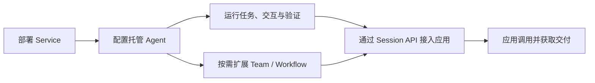

<Note>
当前 Service 版本为 `2.1.0-BETA1`，属于预发布版本。
</Note>

**AgentScope Service 是面向业务应用、可自托管的 Agent as a Service 平台。平台上的托管 Agent（Managed Agent）基于 AgentScope HarnessAgent 内核。** 你在平台中定义 Agent 要完成的工作，并为它配置合适的模型和工具。应用提交任务后，由 Service 运行 Agent 并保存执行过程，使应用能够跟踪进展、参与必要的交互，直到获得结果。

**自托管是目前主要推荐的部署方式。** 团队先在自己的基础设施上部署 Service，再让多个业务应用共享它提供的 Agent 服务。这里的“托管”是指平台替应用管理 Agent 运行时，因此业务团队无需为每个 Agent 应用分别建设和维护运行服务。平台管理员可以根据实际部署接入模型、工具和业务数据，为这些应用提供共用的执行环境。

<CardGroup cols={2}>
<Card title="部署自己的 Service" icon="server" href="/v2/zh/service/quickstart">
从 Docker Compose 开始，完成登录、模型和执行环境准备。
</Card>
<Card title="运行第一个托管 Agent" icon="play" href="/v2/zh/service/create-managed-agent">
已有 Service 地址与账号？直接创建 Agent，执行工具并核对结果。
</Card>
</CardGroup>

## 与 AgentScope Harness 的关系：两种使用方式

Harness SDK 和 Service 托管 Agent 使用同一个 HarnessAgent 内核，你可以根据应用需要选择如何开发和管理运行。下面的对照表概括了两种方式各自需要承担的工作。

| 方式 | 你如何开发 | 谁管理运行 |
| --- | --- | --- |
| Harness SDK | 将 HarnessAgent 嵌入 Java / Spring Boot 应用，用代码组合业务逻辑 | 应用团队负责应用进程、部署与运维 |
| Service 托管 Agent | 在平台配置基于 HarnessAgent 内核的 Agent，通过 Console 或 API 使用 | Service 管理 Agent 执行与会话；平台团队统一维护基础设施 |

如果需要将 Agent 深度嵌入自己的 Java 或 Spring Boot 应用，并在代码中控制运行逻辑，可以从 [Harness SDK](/v2/zh/docs/quickstart) 开始，由应用团队负责部署和运维。如果希望把运行管理交给共享平台，则可以直接在 Service 中配置 Managed Agent，通过 API 或 Console 使用它，而无需先开发一个独立 SDK 应用。已经用 SDK 开发好的 Agent 也有接入路径，可以作为 External Agent 纳入平台，继续复用原有实现。

本机快速体验默认使用 [Docker Compose](/v2/zh/service/quickstart)；Kubernetes 生产安装使用已发布的 [Helm Chart](/v2/zh/service/kubernetes)。接入 Hosted Agent 时，通过 [Go 安装 CLI 与 Runtime Host](/v2/zh/service/runtime-host)。

## 从部署到业务交付

使用 Service 从准备一个可运行的平台开始。完成部署并接通模型和工具执行环境后，你就可以创建 Managed Agent，通过会话验证它是否理解任务、能否正确使用工具，以及交付是否符合预期。随着任务要求逐渐清晰，再为它补充所需的专业知识和能力，让配置的调整有实际执行结果作为依据。

验证完成后，业务应用可以直接使用同一个 Agent，通过 Session API 创建会话并提交任务。后来即使需要增加 Team 或 Workflow，应用仍然使用 Session 和 Turn 来跟踪工作，只需在创建新 Session 时选择合适的执行目标。文档从[部署服务](/v2/zh/service/quickstart)和[运行第一个托管 Agent](/v2/zh/service/create-managed-agent)开始，再进入[分派任务与交互](/v2/zh/service/service-api)，了解如何把工作交给 Agent 并接入自己的应用。

## 理解 Agent、Session 和 Turn

Agent 描述一项可以反复使用的能力，包括指令、模型、工具以及运行所需的配置。Session 则代表应用围绕一项工作建立的交互记录。创建 Session 时，应用选择要使用的 Agent、Team 或 Workflow，Service 会保存当时的配置，使后续工作有明确的执行依据。

应用在 Session 中提交的每一轮任务称为 Turn。Service 接收输入后会在后台执行，应用可以读取这一轮的状态与结果，也可以通过 Session 的快照和事件流恢复完整交互。Managed Agent 会在同一个 Session 内保留对话上下文；Team 和 Workflow 的 Turn 则分别启动协作任务或流程执行。它们共用调用方式，但内部如何延续上下文以及支持哪些中途操作，仍取决于执行目标的能力。

平台还会用 Issue、Run、Task 和 Attempt 保存协作目标、执行图、成员任务和具体尝试。这些记录帮助使用者定位问题、处理工作和运营平台。应用接入时可以先围绕 Session、Turn 和 Events 完成提交、观察、交互与交付，在需要诊断时再进入这些执行详情。

## 面向哪些应用场景

AgentScope Service 面向希望将 Agent 能力嵌入现有产品和业务流程的开发团队。这些应用中的工作往往需要 Agent 根据上下文持续处理，并通过工具获取信息或执行操作，直到形成可以交付的结果。应用需要知道工作进行到了哪里，也需要在用户补充信息后继续推进。将这类执行交给 Service 后，应用可以围绕业务目标组织交互，并通过平台保留的任务记录了解执行过程。

在面向用户的产品中，Agent 可以伴随用户持续处理一项工作，应用负责把执行进展和待确认事项呈现在合适的位置。对于由业务事件或定时计划发起的后台工作，应用则更关注任务能否被追踪，以及完成后如何接回原有业务流程。这两种使用方式都可以建立在同一套 Agent 服务之上，让团队根据产品需要决定何时调用、如何交互和怎样使用结果。具体的接入方式见[场景案例](/v2/zh/service/usecases)。

## 扩展到其他 Agent 与协作

Managed Agent 是使用 Service 的主要起点，协作方式则取决于工作如何分解。当一项工作仍由单个 Agent 负责，只需要将其中一部分委派出去时，可以使用 HarnessAgent 内部的 Subagent，由主 Agent 汇总结果并继续执行。随着不同专业能力逐渐成为独立维护的 Agent，就可以通过 Team 建立明确的分工，由负责人协调成员共同完成目标。Service 会保留协作中的任务和交付记录，使团队能够围绕同一项工作持续推进。

在明确分工之后，有些业务还需要约束工作的推进顺序。Workflow 可以将这种要求表达为明确的流程，让 Agent 或 Team 在指定步骤中执行，并在需要人工审批时等待处理。因此，团队协作与流程编排可以配合使用：团队负责完成分派给它的目标，流程决定何时开始这项工作，以及满足什么条件后才能进入下一步。如何选择和组合这些方式，见[多 Agent 编排](/v2/zh/service/orchestration)。

参与协作的 Agent 可以全部由 Service 托管，也可以复用团队已有的实现。通过 SDK 或其他框架开发的 Agent，可以作为 [External Agent](/v2/zh/service/register-agentscope-agent) 接入，在保留原有部署和运行方式的同时接受平台任务并回报结果。对于已有的 Coding Agent，Service 则通过 Runtime Host 将其连接为 [Hosted Agent](/v2/zh/service/connect-hosted-agent)，由 Host 启动和管理执行。接入后，平台可以在它们实际支持的能力范围内统一分派工作。这些 Agent 既可以参与 Team，也可以独立接受 Session 调用，让已有能力逐步融入平台。

## Service 与应用各自负责什么

Service 将 Agent 的运行管理作为多个业务应用共用的基础能力。应用提交工作后，平台负责协调执行并保留相应记录，应用可以通过 API 了解进展，并在需要时把用户的反馈交回执行过程。这样，用户界面就能围绕一项持续的工作组织体验，后端也可以根据同一份调用记录跟进结果，无需每个应用分别实现 Agent 的会话和任务管理。

业务应用仍然决定 Agent 要完成什么工作，以及结果如何被使用。它需要将用户需求转化为合适的任务输入，并通过业务工具或数据接口，让 Agent 在当前用户获准的范围内开展工作。调用 Service 的凭据用于控制 Agent 服务的访问，业务数据本身的授权仍应落实在相应的业务系统中。Agent 完成执行后，应用还需要依据业务标准判断结果是否可以采用，并决定如何进入后续流程；这也是应用团队定义 Agent 能力时需要一起考虑的部分。

在推荐的自托管模式下，这种分工也延伸到部署和运维。平台团队集中维护 Service 及其依赖的运行资源，为业务团队提供可用的 Agent 服务环境。业务团队在这一环境中配置和改进自己的 Agent，再把它接入产品。多个应用由此可以共享平台的运行管理能力，同时保留各自的业务逻辑和使用体验。

完成 Agent 配置后，可以按“分派任务与交互”分组中的[Session API 接入指南](/v2/zh/service/service-api)连接业务应用。应用保存业务对象与 Session 的关联后，就能持续展示这项工作的进展，在 Agent 需要确认时让用户参与，并在执行结束后取得实际交付。用户离开页面再返回时，应用也可以读取已有记录，继续同一段工作。

## 从哪里开始

从一个你能判断结果是否合格的小任务开始。先[部署服务](/v2/zh/service/quickstart)，再[创建第一个托管 Agent](/v2/zh/service/create-managed-agent)，跑通提交、执行和检查结果的过程。如果团队已有可用的 Service，直接从创建 Agent 开始；希望通过页面完成操作，可以跟随 [可视化Console](/v2/zh/service/console/index)。
