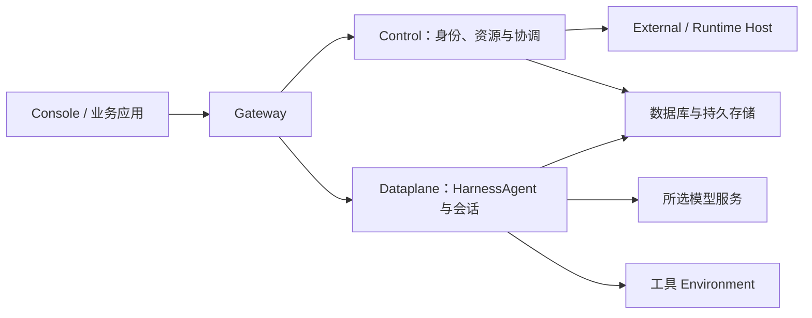

<Note>
当前发布版本为 `2.1.0-BETA1`，属于预发布版本。用于生产前请验证实际部署。
</Note>

本页介绍面向生产环境的 Kubernetes 与 Helm 安装。正式 Service Chart 安装 Gateway、Control、Dataplane 和 Scheduler。PostgreSQL、持久存储、入口域名和 TLS 由你管理。应用每组件默认单副本并采用 Recreate 更新，部署和升级需要维护窗口。

## 1. 准备依赖

准备 Kubernetes、Helm、可达的 PostgreSQL，以及 Workspace 所需的 RWX StorageClass 或已有共享 PVC。Artifact 默认使用 RWO。工作目录会被多个组件挂载；只在单节点可用的 RWO 卷不能替代跨节点共享存储。

可以直接从公开 Helm 仓库安装 Chart，无需下载源码。先下载与版本配套的配置模板和初始化 SQL：

```bash
curl -fLO https://chickenlj.github.io/helm-charts/examples/2.1.0-BETA1/kubernetes.env.example
curl -fLO https://chickenlj.github.io/helm-charts/examples/2.1.0-BETA1/postgres-init.sql
```

用应用数据库所有者在目标数据库执行 SQL，创建 `cp`、`rt`、`dp` 三个 schema。为数据库、文件和密钥建立备份策略。如需离线安装，从 [GitHub Release](https://github.com/agentscope-ai/agentscope-java/releases/tag/v2.1.0-BETA1) 下载 `agentscope-service-2.1.0-BETA1-kubernetes.tar.gz` 和 `SHA256SUMS`，核对校验和后解压；包中包含 Chart 和相同的配置文件。

## 2. 创建 Secret

复制 `kubernetes.env.example` 到私有文件并替换全部占位值：数据库连接、随机 JWT/internal/Vault 密钥、初始管理员密码及需要的模型凭据。URI 中的密码 URL 编码，JDBC 密码单独提供原值。根据数据库证书设置 TLS。

```bash
kubectl create namespace agentscope
kubectl -n agentscope create secret generic agentscope-service --from-env-file=/private/path/service.env
```

Secret 是运行配置；不要把明文文件或含 Secret 的渲染结果提交到仓库。

## 3. 准备 values

以下是 `production-values.yaml` 起点，替换域名、StorageClass、Ingress class 和 TLS Secret。TLS Secret 必须预先存在或由你的证书控制器创建。

```yaml
existingSecret: agentscope-service
allowLocalEnvironment: false
publicURL: https://agentscope.example.com
persistence:
  workspaces:
    storageClass: shared-rwx
    size: 20Gi
  artifacts:
    storageClass: standard
    size: 20Gi
ingress:
  enabled: true
  className: nginx
  host: agentscope.example.com
  tls:
    - hosts: [agentscope.example.com]
      secretName: agentscope-service-tls
```

已有 PVC 时设置对应 `existingClaim`。私有镜像配置 `imagePullSecrets`；Ingress annotations 按实际控制器设置 SSE 超时和缓冲行为。资源 requests/limits 可分别通过 `control`、`dataplane`、`scheduler`、`gateway` 调整，按实际任务负载压测定容。

## 4. 安装指定版本

添加公开 Helm 仓库并更新索引，无需登录仓库：

```bash
helm repo add agentscope https://chickenlj.github.io/helm-charts
helm repo update agentscope
helm search repo agentscope/agentscope-service --versions --devel
```

已发布的 [Helm 仓库](https://github.com/chickenlj/helm-charts) 在 GitHub Pages 托管索引与安装包。使用 `--version 2.1.0-BETA1` 固定版本；查询命令的 `--devel` 会包含预发布版本。Chart 通过 `appVersion` 使用配套的镜像版本。

安装指定 Chart 版本，并配置对应的镜像命名空间：

```bash
helm upgrade --install service agentscope/agentscope-service \
  --version 2.1.0-BETA1 \
  --namespace agentscope \
  --set imageRepository=sca-registry.cn-hangzhou.cr.aliyuncs.com/agentscope \
  -f production-values.yaml \
  --wait --timeout 10m
```

离线安装时，将 `agentscope/agentscope-service` 和 `--version 2.1.0-BETA1` 替换为下载的 `./agentscope-service-2.1.0-BETA1.tgz`。保持 Chart 与组件镜像版本配套。Chart 会在你的集群创建工作负载；发布 Helm 仓库本身不会部署运行中的 Service。

## 5. 验证用户路径

```bash
kubectl -n agentscope get pods,pvc,svc,ingress
kubectl -n agentscope port-forward service/service-agentscope-gateway 18080:8080
```

确认 PVC Bound、Pod Ready，使用初始管理员登录公开域名并修改密码。验证模型连接、执行 Environment、第一次 Chat、Issue 交付和长连接。port-forward 用于排障，不替代公开回调地址验证。

## 升级、卸载与运行模式

Secret 更新后重启相关 Deployment；升级前按[运维手册](/v2/zh/service/operations)备份，并保留原 Chart、values 和镜像版本。Chart 保留 PVC；重新安装时显式指定保留的 existingClaim。

此 Chart 提供完整 Service standalone HTTP。Kubernetes-native ControlPlane/ASDP 是另外的部署模式，应按 SDK 网络契约规划，不把两个 Chart 直接叠装为同一服务。当前 Chart 的单副本安装不提供无停机迁移或多副本 HA 保证。

<span id="self-hosting"></span>
<span id="三个不同的部署对象"></span>
<span id="选择部署路径"></span>
<span id="部署后的交接"></span>
<span id="持续运营"></span>

## 部署边界与生产规划

[快速开始](/v2/zh/service/quickstart)中的 Compose 命令部署了完整 Service。用户通过 Gateway 访问平台，Control 管理身份和资源并协调工作，Dataplane 运行 HarnessAgent 和会话，Scheduler 承担调度相关工作。数据库和持久存储则保存平台运行所需的数据。维护这套共享服务，是平台自托管时需要承担的运维工作。

工具执行环境可以与平台服务分开准备。即使文件或 Shell 工具运行在沙箱、远端文件后端或 `self_hosted` Worker 中，Managed Agent 的推理过程仍由 Dataplane 承担。接入 External Agent 或 Hosted Agent 时，执行工作还会涉及原有应用或 Runtime Host。这些资源连接到已部署的 Service，分别提供对应的执行能力。



部署位置确定后，还需要检查各组件实际连接到哪里。自托管 Service 仍然可以调用远程模型，工具也可能通过 MCP 或其他接口访问外部系统。规划网络时，应结合所选模型、工具和存储逐一确认数据流向，并为需要从外部到达平台的 OAuth 等回调准备入口。

本地体验可以使用[快速开始](/v2/zh/service/quickstart)中的 Compose 部署；由平台团队长期维护的环境，可以根据基础设施选择 Kubernetes。下表列出各条路径需要准备的资源，已有团队平台的使用者通常只需完成账号和执行环境的准备。

| 路径 | 当前用途 | 需要准备 |
| --- | --- | --- |
| Docker Compose | 本机体验、开发与集成验证 | 发布包、Docker、模型凭据、持久磁盘 |
| Kubernetes / Helm | 由平台团队管理的安装 | PostgreSQL、共享 Workspace 存储、Artifact 存储、Secret、域名与 TLS |
| 已有团队平台 | 应用开发者直接使用 | 服务地址、账号、授权空间、可用模型与 Environment |

当前完整 Service Chart 为每个组件配置一个副本，并采用 Recreate 方式更新，所以升级时需要安排维护窗口，不能据此假定服务具备多副本高可用或无停机升级能力。Kubernetes-native ControlPlane/ASDP 是为相应 SDK 和运行传输提供的另一种部署模式，应根据接入要求选择；它并不是需要叠加到完整 Service Chart 上的一组必装组件。

平台交付给业务团队时，管理员需要提供可访问的 Service 地址和账号，并说明该账号可以使用哪个 Namespace。使用者还需要知道默认模型是否可用、应选择哪个工具环境，以及业务资料放在哪里、如何获得访问权限。有了这些信息，就可以按[第一个托管 Agent](/v2/zh/service/create-managed-agent)完成模型与文件工具验证，再通过[应用接入指南](/v2/zh/service/service-api)检查业务应用的调用过程。

进入生产使用前，应进一步验证用户能否持续接收执行事件、刷新页面后能否恢复已有内容，以及交付文件是否可以按权限下载。如果业务依赖 Webhook，还需确认接收端能够收到通知。数据库和文件备份则需要配合恢复演练，并覆盖未完成工作如何继续处理。这样才能确认平台在实际使用和故障恢复时都能按预期工作。

## 入口与网络

Compose 默认只将 Gateway 暴露在宿主机的 `127.0.0.1:18080`，用户请求由这个入口转发到内部服务。其余组件通过内部网络通信，容器端口及暴露方式如下。

| 组件 | 容器端口 | 暴露方式 |
| --- | --- | --- |
| Gateway | 8080 | 默认宿主 `127.0.0.1:18080` |
| Control | 8081 | 内部网络 |
| Dataplane | 8082 | 内部网络 |
| Scheduler | 8083 | 内部网络 |
| PostgreSQL | 5432 | 内部网络 |

如果反向代理运行在同一台宿主机上，可以将请求转发到 `127.0.0.1:18080`。如果代理运行在另一个容器中，它看到的 `localhost` 指向代理容器自身，因此需要配置共享网络，或使用该容器能够到达的宿主地址。对外入口仍应指向 Gateway，内部组件和数据库通过私网提供服务。

## 启用远程访问

需要从其他设备访问这套部署，或联调 OAuth、Channel 的公网回调时，可以为 Gateway 配置 HTTPS 入口。先准备域名和 TLS 证书，再让反向代理将请求转发到 Gateway。随后在 `.env` 中把 `BUILDER_OAUTH_PUBLIC_URL` 设置为实际的外部地址，例如 `https://agentscope.example.com`；如果 Gateway 还需要调整监听地址或端口，再修改 `BIND_ADDRESS` 和 `GATEWAY_PORT`，并重建容器使配置生效。

执行进度通过 SSE 长连接传输，因此代理需要及时转发事件，关闭事件流缓存，并允许足够长的读取超时。配置完成后，除了确认能够登录，还应运行一次持续生成内容的任务，检查事件是否陆续到达、刷新后能否重新连接，以及业务所需的回调是否正常。
